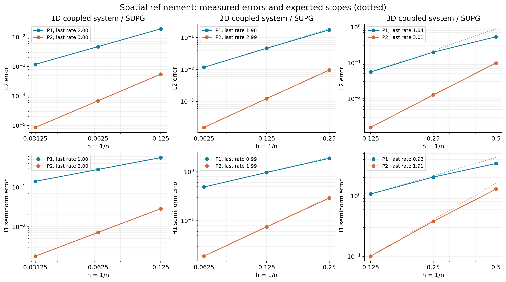
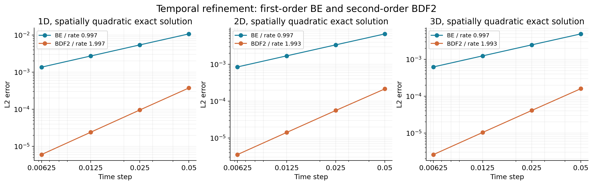
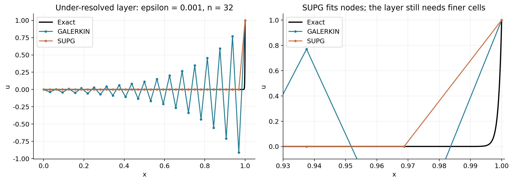

# 多维向量含时 CDR 求解器：任务报告

## 项目结果

项目实现了 1、2、3 维的向量耦合对流–扩散–反应方程，支持随空间和时间变化的系数、P1/P2 有限元、BDF2 时间离散及一致 SUPG 稳定化。平滑问题的空间与时间收敛、强对流边界层、分量耦合和 VTU 数据均有可复现验证。代码通过 FEALPy 3.4.0 安装版和本机源码检出版本的接口测试。


## 1. 方程和交付范围

在单位盒（接口允许一般轴对齐盒）上，对每个分量 $i=1,\ldots,m$ 求解

$$
d(\boldsymbol x,t)\partial_tu_i-\nabla\cdot(a(\boldsymbol x,t)\nabla u_i)
+\boldsymbol b(\boldsymbol x,t)\cdot\nabla u_i+\sum_{j=1}^m C_{ij}(\boldsymbol x,t)u_j=f_i.
$$

配置完整 Dirichlet 边界和初值。$a,d$ 是各分量共享的正标量；$\boldsymbol b$ 是空间速度；$C$ 是可含非对角元的反应矩阵。因此两个分量真正相互耦合。空间维数与未知量分量数独立，四分量无精确解问题也经过运行和导出验证。

时间项明确为 $d u_t$。它不等于 $\partial_t(du)$；后一模型还含 $d_tu$。原标量版本已经能在部分接口接收时间，本版把时间相关系数、向量装配和二阶时间精度统一验证。

## 2. 实现与 FEALPy 风格

`cdr/pde.py` 定义数据契约；`cdr/cases.py` 用普通类方法实现 `source(p,t)`、`diffusion_coef(p,t)` 等。坐标按 `x=p[...,0]`、`y=p[...,1]`、`z=p[...,2]` 取得，`@cartesian` 声明笛卡尔坐标。可选 `SymbolicCDR` 负责制造解，公共方法仍是真实类方法。

标量 Lagrange 空间配合 `TensorFunctionSpace(shape=(m,-1))` 管理向量自由度。标准项使用 FEALPy 的四种标量积分器；分量块通过 `BlockForm` 装配；SUPG 局部数组通过库内 `ConstIntegrator` 纳入原有组装路径。`DirichletBC` 完成边界消元，非对称系统用 SciPy 稀疏直接法求解。后端检查与线性求解入口独立，允许注入 `linear_solver(A,F)`。

已阅读并对照 PDE 示例、CDR model、Lagrange/Tensor 空间、积分器基类及标准积分器、Form/BlockForm、DirichletBC、系数坐标处理、稀疏张量及网格导出。代码没有改动 FEALPy、模块导出或 `sys.path`；导入不切换全局后端；VTU 写入使用独立的节点数据字典。

时间采用等步长 BDF2，第一步使用后向欧拉。每一步在新时刻重新计算全部系数：

$$
(\tfrac32\widehat M^{n+1}+\Delta t\widehat A^{n+1})U^{n+1}
=\widehat M^{n+1}(2U^n-\tfrac12U^{n-1})+\Delta t\widehat F^{n+1}.
$$

帽号包含 SUPG 修正；时间质量矩阵、反应耦合、变扩散系数梯度和源项都进入完整残差。

## 3. 平滑向量问题的空间收敛

令 $w=1+\sum_k x_k+\prod_k\sin(\pi x_k)$，$\boldsymbol u=(w,2w+1)^T$。取

$$
a=(1+t)(1+\sum_kx_k^2),\quad b_k=(1+t)(1+x_k),\quad
C=(1+t)\begin{pmatrix}2&-1/2\\-1/4&3\end{pmatrix},\quad d=1+t+\sum_kx_k.
$$

在 $t=0.3$ 解稳态问题；源项按此稳态解推导。每组运行三层网格，共 36 次。下表为最细层及最后两层计算的阶数，完整数据在 `results_final/spatial.csv`。$H1$ 指梯度误差半范数，不是完整 $H^1$ 范数。误差对所有分量求平方和再开方。

| dim | p | n | stabilization | L2 | H1 | L2_order | H1_order |
| --- | --- | --- | --- | --- | --- | --- | --- |
| 1 | 1 | 32 | galerkin | 0.00111133 | 0.140761 | 2.0001 | 0.999522 |
| 1 | 2 | 32 | galerkin | 8.60254e-06 | 0.00178408 | 2.99948 | 1.99962 |
| 1 | 1 | 32 | supg | 0.0011824 | 0.140756 | 1.99956 | 0.999384 |
| 1 | 2 | 32 | supg | 8.60199e-06 | 0.00178402 | 2.9992 | 1.99946 |
| 2 | 1 | 16 | galerkin | 0.0111771 | 0.486648 | 1.98074 | 0.990871 |
| 2 | 2 | 16 | galerkin | 0.000153565 | 0.0188318 | 2.9913 | 1.98881 |
| 2 | 1 | 16 | supg | 0.0117026 | 0.486491 | 1.97852 | 0.9896 |
| 2 | 2 | 16 | supg | 0.000153654 | 0.0188286 | 2.99354 | 1.98812 |
| 3 | 1 | 8 | galerkin | 0.053387 | 1.0738 | 1.84382 | 0.931965 |
| 3 | 2 | 8 | galerkin | 0.00156909 | 0.100717 | 2.99785 | 1.91327 |
| 3 | 1 | 8 | supg | 0.0555886 | 1.07216 | 1.83574 | 0.928779 |
| 3 | 2 | 8 | supg | 0.0015799 | 0.100661 | 3.01352 | 1.91126 |




P1 的预期为 $L^2$ 二阶、$H^1$ 半范数一阶；P2 分别为三阶、二阶。三维 P1 最细网格仍较粗，最后的阶数接近而未完全达到理论渐近值。图中虚线是预期斜率，不是额外实验点。

## 4. 时间收敛和独立正确性证据

采用 $w=1+\sum_kx_k^2$，$\boldsymbol u=e^t(w,2w+1)^T$，终止时间 0.5。P2 空间能精确表示这个空间多项式，使实验主要测量时间误差。每维使用 10、20、40、80 步，共 24 次。

| dim | scheme | steps | L2 | order |
| --- | --- | --- | --- | --- |
| 1 | backward_euler | 80 | 0.001365 | 0.996557 |
| 1 | bdf2 | 80 | 6.02727e-06 | 1.9966 |
| 2 | backward_euler | 80 | 0.000851634 | 0.997109 |
| 2 | bdf2 | 80 | 3.54566e-06 | 1.99315 |
| 3 | backward_euler | 80 | 0.000624659 | 0.997109 |
| 3 | bdf2 | 80 | 2.59591e-06 | 1.99323 |




BE 表现为约一阶，BDF2 表现为约二阶。BDF2 在本算例同样步数下误差更小；这不是对任意不光滑初值、任意刚性方程的误差承诺。

另有下列相互补充的验证：

- 把时间因子换成 $1+t$，P2 空间和时间差分都精确表示解；六组一至三维 Galerkin/SUPG 验证的最大 $L^2$ 误差为 1.087e-14。
- 手工 `source` 与 SymPy 的独立微分结果一致；测试点包含全部三个坐标和非零时间。
- 固定源项、去掉反应矩阵非对角元后，解的最大变化为 0.264676，说明装配中确实保留耦合；完整耦合的二次解同时通过精确性检查。
- 空间与边界层实验的最大相对代数残差为 2.025e-15，边界自由度误差为零；这与离散误差分开记录。
- 高对流速度、变时间系数的 P2 多项式检验覆盖 SUPG 时间质量、源项与空间残差的一致性。
- 无精确解输入、四分量导出、重复求解、共享网格交错使用、求解回调及后端隔离均通过接口脚本。

## 5. 强对流：振荡、稳定与分辨率

使用 $-\varepsilon u_{xx}+u_x=0$、$u(0)=0,u(1)=1$，$\varepsilon=10^{-3}$。精确解为

$$u(x)=\frac{e^{(x-1)/\varepsilon}-e^{-1/\varepsilon}}{1-e^{-1/\varepsilon}}.$$

它也作为二维、三维单位盒上的解，速度沿 x 轴，其余各面取该解析边界值。下表不经过任何解值截断。

| dim | n | stabilization | minimum | maximum |
| --- | --- | --- | --- | --- |
| 1 | 32 | galerkin | -0.911324 | 1 |
| 1 | 32 | supg | 0 | 1 |
| 2 | 32 | galerkin | -1.24018 | 1.26459 |
| 2 | 32 | supg | -4.11255e-17 | 1 |
| 3 | 8 | galerkin | -7.1244 | 2.81193 |
| 3 | 8 | supg | -1.80461e-17 | 1 |




在这些网格和对齐流向算例中，Galerkin 明显振荡，SUPG 将节点值保持在 $[0,1]$ 的舍入误差范围内。一维常系数 P1 使用最优流线参数，节点与精确解吻合；但单元内仍是直线，无法表示远小于网格宽度的指数边界层。右图因此保留精确曲线与数值折线的差别。

边界层厚度改为 $\varepsilon=0.02$ 后逐步加密，得到：

| n | L2 | H1 |
| --- | --- | --- |
| 32 | 0.0196348 | 2.02248 |
| 64 | 0.0053846 | 1.09475 |
| 128 | 0.00138084 | 0.559566 |


这组数据说明稳定化以后仍须解析边界层。强对流粗网格记录中的 `L2` 来自有限阶单元求积；薄层可能欠积分，因此稳定性对比采用节点上下界，精度结论采用解析多项式与已逐步解析的层。

## 6. VTU、ParaView 与复现

`results_final/vtu/solution.pvd` 包含 0 到 0.5 的 21 个时刻。ParaView 打开 PVD 后点 Apply，选 `u_0`、`u_1` 或 `u_magnitude`，用播放按钮查看演化。`u` 是补足到三分量的 VTK 向量；数学分量是否代表物理方向由具体模型决定。P2 输出采样在网格顶点，画面不保留全部高阶自由度。VTK 读回值已与 FE 解顶点值逐点核对。

```bash
python -m pip install -r requirements_extension.txt
python example_vector.py --dim 2 --p 2 --n 12 --steps 20
python verify_vector.py
python build_final_report.py
```

接口隔离测试另外用到 PyTorch 来检查导入不会更换其他用户选择的后端；求解器自身不依赖 PyTorch：

```bash
python -m pip install torch
python verify_vector_interfaces.py
```

实测 Python 3.13.2；fealpy 3.4.0，numpy 2.3.4，scipy 1.16.3，sympy 1.14.0，vtk 9.6.2。

本机源码检出版本为 `v3.4.1-47-ge033533bd-dirty`，并非另一个干净发布版。兼容性证据保存于 `interfaces_installed.json` 和 `interfaces_source.json`。未修改依赖库；源码树中原有的其他改动不属于本项目。

## 7. 适用范围与局限

当前验证范围是 NumPy/CPU、仿射线段/三角形/四面体、P1/P2、轴对齐盒的全 Dirichlet 边界、正标量扩散和容量、共享对流速度及反应矩阵耦合。尚未实现分量间交叉扩散、各向异性扩散张量、Neumann/Robin 边界、曲面网格、自适应时间步或非线性系统。三维加密时直接求解器的内存成本增加。

SUPG 主要沿流线稳定，不保证任意网格、任意反应矩阵或未解析横风内层上的单调性/正性；没有非线性激波捕捉或通量限制器。BDF2 的稳定性也不等于逐步保持正值。系数过强的负反应可以导致真实增长，不能靠数值稳定化消除。符号表达式的浮点求值仍须有合理条件数；指数边界层采用显式稳定形式的数据类。

## 8. 文档与方法参考

- [数学推导与学习讲义](CDR数学推导与学习讲义.md)：从微分方程、弱形式到离散矩阵、BDF2、SUPG 和误差。
- [代码与 FEALPy 源码学习讲义](CDR代码与FEALPy源码学习讲义.md)：接口、数组形状、组装路径、逐段源码与运行方法。
- [ParaView 操作指南](向量含时结果_ParaView指南.md)。
- Brooks & Hughes, 1982, [SUPG 原始论文](https://www.sciencedirect.com/science/article/pii/0045782582900718)。
- [SUNDIALS 的 BDF 方法说明](https://sundials.readthedocs.io/en/v6.0.0/cvode/Mathematics_link.html)。
