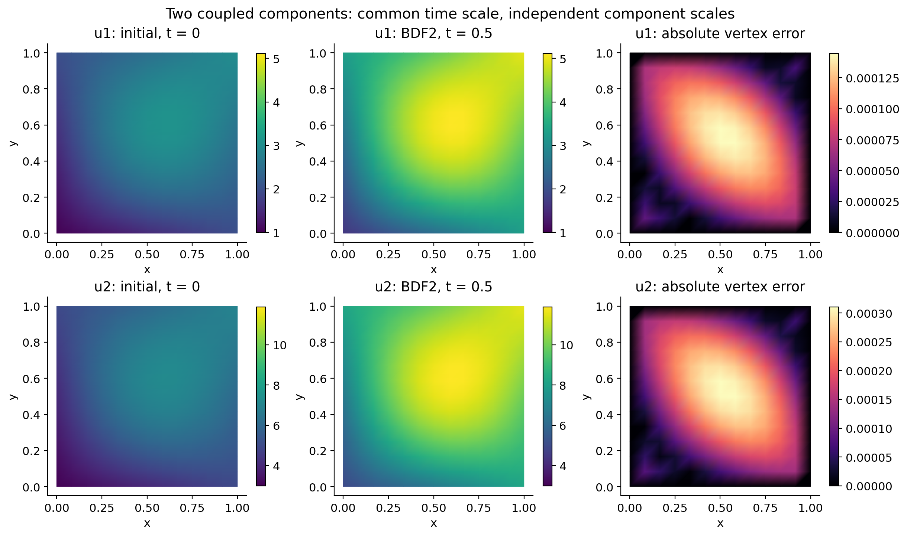

# 用 ParaView 查看向量 CDR 时间序列

ParaView 是查看和分析数值模拟结果的桌面软件。求解器负责计算，ParaView 负责把网格和场显示出来。Python 的 `vtk` 包负责本项目的文件写入和读回验证；安装它不会自动安装 ParaView 桌面程序。[官方介绍](https://www.paraview.org/desktop/)

## 1. 准备数据

仓库已经提供 `results_final/vtu/solution.pvd` 及对应的 21 个 VTU 文件，时间从 0 到 0.5。也可以重新计算：

```bash
python example_vector.py --dim 2 --n 12 --p 2 --steps 20 --output output/vector
```

VTU 是某一个时刻的网格和场；PVD 是时间序列目录，记录每个时刻对应哪个 VTU。复制结果时要保留 PVD 和同目录的全部 VTU，不能只复制 PVD。

## 2. 安装与第一次打开

从 [ParaView 官方下载页](https://www.paraview.org/download/) 选择适合电脑的版本。Windows 单机学习可选文件名不带 MPI 的安装程序；安装后启动 ParaView。[官方安装说明](https://discourse.paraview.org/t/im-trying-to-install-paraview-but-do-not-know-where-to-start/16033)

1. 在 ParaView 中使用 File → Open，选择 `solution.pvd`。
2. 左侧 Properties 中点击 Apply。
3. 如果没有看到平面，使用 Reset Camera；二维数据可以切到沿 z 轴观察的视角。
4. 在着色变量菜单选择 `u_0`，表示数学上的第一个分量 $u_1$。选择 `u_1` 表示第二个分量 $u_2$。程序字段编号从 0 开始。
5. 显示方式选 Surface。想看三角形网格时选 Surface With Edges。
6. 使用顶部播放按钮或时间步切换按钮查看从初始到终态的变化。ParaView 读入含时数据后会读取其时间信息。[官方动画说明](https://docs.paraview.org/en/latest/UsersGuide/animation.html)

## 3. 这些字段分别代表什么

| 字段 | 含义 | 适合观察的内容 |
| --- | --- | --- |
| `u_0`、`u_1`…… | 每一个未知分量 | 单独物理量的分布 |
| `u_magnitude` | 所有分量平方和的平方根 | 总体幅度 |
| `u` | 最多三个分量组成的 VTK 向量，不足补零 | 分量或模长着色 |

本算例的两个分量是一组耦合未知量，不是二维流速。因此不要把 u 的箭头默认理解为流体运动方向。若题目中的未知量确实代表位移或速度，向量显示才有相应物理意义。

## 4. 让不同时刻的颜色可比较

若每个时刻自动重新缩放颜色范围，小幅值场和大幅值场都可能显示成同样鲜艳的颜色。比较时间演化时，给同一个分量设置统一色标范围，例如先查看全部时刻范围，再固定上下限。ParaView 的 Color Map Editor 提供重设范围和自动更新选项；不同版本的按钮位置可能略有区别。[官方颜色映射说明](https://docs.paraview.org/en/v5.9.1/ReferenceManual/colorMapping.html)

仓库中的静态图已经让同一行的初值和终态使用同一色标，并把两个分量分别标注：



右列是程序与精确解比较得到的顶点绝对误差，不是 ParaView 默认自动生成的误差字段。完整 $L^2/H^1$ 误差看数值报告。

## 5. 保存汇报图片与动画

调整好相机、字段和色标后，可用 File → Save Screenshot 保存当前视图，用 File → Save Animation 输出时间动画或逐帧图片。动画格式取决于本机可用编解码支持。[官方动画导出说明](https://docs.paraview.org/en/latest/UsersGuide/animation.html)

建议汇报时注明：维数、分量、时间、网格 n、有限元阶次 p 和色标范围。需要说明网格结构时另存一张带网格边的图，避免所有图片都被网格线遮住。

## 6. 当前导出的范围

本项目导出 P1/P2 解在网格顶点的采样值。P2 的边中点自由度没有完整写为高阶 VTK 单元，因此细致的二次形状以求解器内的 FE 函数为准。该限制不影响已由 FE 函数积分计算的收敛数据。

已有自动验证使用 VTK 读回终态文件，并逐点核对两个分量、补零第三分量和原始网格数据未被修改。这里提供的是数据与操作指南，未把桌面端手动操作表述为已执行的验收。
