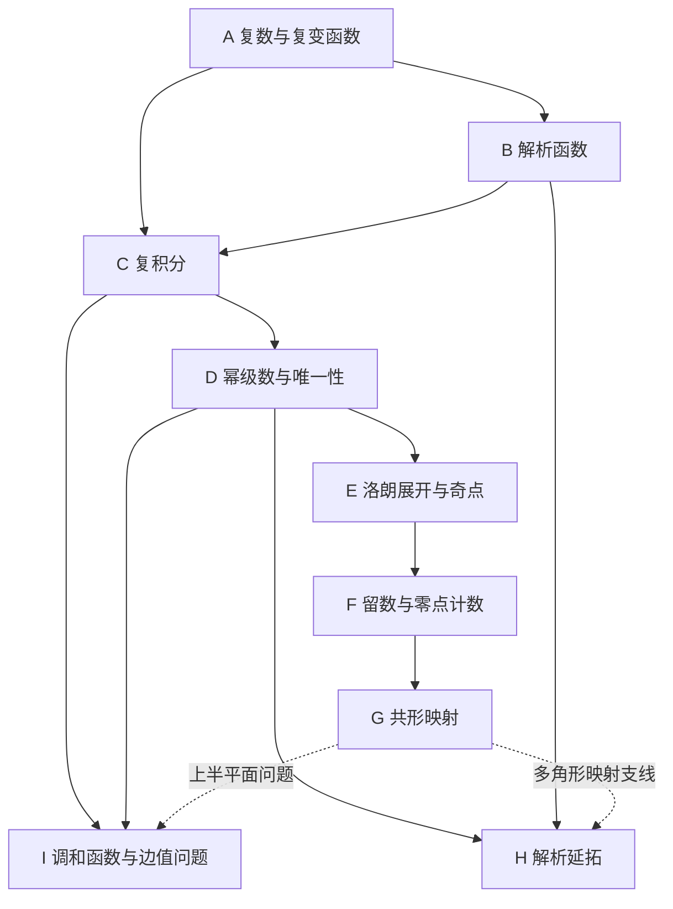

# 复变函数论 · 课程大地图

这门课围绕一个问题展开：**复可导这一条件，为何能同时约束函数的局部展开、整体取值、积分和几何形状？**

当前位置：地图已建立，尚未开始据点学习。所有据点“未开始”，掌握度未知；这不表示你不会。课程编号待确认，A01 等只作本地图内部稳定 ID。此文件为唯一课程主地图，后续原位更新。

依据：用户提供的《复变函数论》第五版扫描 PDF；已逐页核对 PDF 第 6–9 页的完整目录及第五版序，并抽查正文页码。以下位置均为**书内印刷页码**，不是阅读器页码；已抽查位置的阅读器页码为印刷页码加 9，其他位置按页脚核对。未逐页审读全部正文；两个序言增补专题明确保留定位待办，不虚构精确页码。依赖、时间和通关条件是为自学设计，不是教材原有分级。

## 一、区域总表

| 区域 | 教材章名 / 书页 | 核心任务 | 主线 / 支线据点 | 主线用时 | 状态 |
|---|---|---|---|---|---|
| A | 复数与复变函数，3–34 | 建立复平面语言 | 4 / 1 | 6 小时 | 未开始 |
| B | 解析函数，35–70 | 识别解析性，管理多值分支 | 5 / 0 | 9.5 小时 | 未开始 |
| C | 复变函数的积分，71–106 | 由积分推出解析函数的强性质 | 6 / 2 | 12 小时 | 未开始 |
| D | 解析函数的幂级数表示法，107–132 | 用局部展开控制整体行为 | 5 / 1 | 8.5 小时 | 未开始 |
| E | 解析函数的洛朗展式与孤立奇点，133–160 | 刻画解析失效的方式 | 6 / 1 | 9 小时 | 未开始 |
| F | 留数理论及其应用，161–196 | 计算积分与零点个数 | 6 / 1 | 12 小时 | 未开始 |
| G | 共形映射，197–228 | 把区域变成易处理的形状 | 4 / 2 | 7.5 小时 | 未开始 |
| H | 解析延拓，229–257 | 跨越原定义域并理解多值性 | 4 / 1 | 6.5 小时 | 未开始 |
| I | 调和函数，258–265 | 求解平面边值问题 | 3 / 0 | 5 小时 | 未开始 |

## 二、依赖全景与开局

图表示区域联系，不要求前一区域所有支线通关；进入的精确依据是后面的据点表。

| 外部前置 | 需要会什么 | 直接使用位置 |
|---|---|---|
| P1 代数与三角 | 方程、三角恒等式、平面坐标 | A01、B03、G02 |
| P2 极限与点集语言 | 数列极限、开闭集、紧致性基本直觉、连续 | A02、A03、C02、DX1 |
| P3 多元微分 | 偏导、全微分、链式法则、二阶偏导 | B01、B02、C06、G01、I01 |
| P4 积分 | 参数曲线、定积分、反常积分、换元及估计 | C01、F03、F04、I02、I03 |
| P5 级数 | 绝对收敛、一致收敛、逐项运算条件 | D01、D02、CX1 |
| P6 向量场（选学） | 梯度、散度、旋度、流量与环量 | CX2、EX1 |

不要求先修完整拓扑学或泛函分析。缺哪个前置，就在使用处补哪个。

**当前开局**：尚无学习证据，严格意义上没有已经核验解锁的据点；若 P1 已具备，可直接进入 A01，无需先做全课程摸底。A01 后可分别进入 A02、A03；C01 在 A02、A03 和 P4 满足时可与 B 区部分内容交错。若你已有基础，可以通过具体解释或解题表现核验入口，直接跳到相应据点。

## 三、推荐路线与节奏

1. 建立语言：A01 → A02、A03 → A04 → B01–B05。
2. 建立理论骨架：C01–C06 → D01–D05。重点连起“解析 → 积分定理 → 积分公式 → 幂级数”。
3. 建立计算与局部分类工具：E01–E06 → F01–F06。
4. 完成几何与全局视角：G01–G04 → H01–H04 → I01–I03。

这是兼顾首次学习连贯性的推荐次序。E04 在 E03 后学不违反依赖，但只需 E02、D05 就能提前进入。

可调整路线：H01–H04 在 D04 和所需分支知识之后就能进入，不必等待留数和整个 G 区；I01–I02 在 C06、D05 后就能进入，I03 再补 G02。提前 H 有助于理解分支的全局来源，提前 I 有助于连接偏微分方程。多角形映射 HX1 仍需 G03。

共 52 个据点：43 个必学、9 个选学。主线首次学习与少量练习估计 76 小时，支线约 14.5 小时；另留主线用时的 25%–40% 做章末综合练习和间隔复习。它们是规划估计，遇到证明难点可拆成多次会话。每周 6 小时，主线连同复习约需 16–18 周；不把该节奏当作你的时间承诺。

## 四、据点明细

每行建议安排一次约 1–2.5 小时的学习会话，也可分成两次。必学权重为 1，选学权重为 0（不计入主线完成率）。通关须独立完成表中任务并说清关键条件；听过讲解或看过答案不算独立通过。外部前置只列直接使用项，间接前置沿依赖链继承。

### A 区：复数与复变函数

建立复平面语言。

| ID | 主题 / 来源（章、节、页） | 前置据点 | 外部前置 | 可观察的通关条件 | 权重 | 用时 | 状态 | 证据/档案 |
|---|---|---|---|---|---|---|---|---|
| A01 | 复数运算与几何表示；一§1，3–14 | — | P1 | 互换代数式与极式，求全部 n 次方根并画图 | 必学 | 2 小时 | 未开始 | 暂无 |
| A02 | 点集、区域与曲线；一§2，17–21 | A01 | P2 | 区分开集、区域、单连通与多连通，给出反例 | 必学 | 1.5 小时 | 未开始 | 暂无 |
| A03 | 复变函数、极限与连续；一§3，22–28 | A01 | P2 | 用不同趋近路径否定极限，并用估计证明一个极限 | 必学 | 1.5 小时 | 未开始 | 暂无 |
| A04 | 复球面与无穷远点；一§4，29–30 | A02,A03 | — | 用 w=1/z 把无穷远邻域转为原点邻域 | 必学 | 1 小时 | 未开始 | 暂无 |
| AX1 | 复数构造的推广；一§1.7，15–16 | A01 | — | 说明四元数与复数的一个结构差异 | 选学 | 1 小时 | 未开始 | 暂无 |

### B 区：解析函数

识别解析性，管理多值分支。

| ID | 主题 / 来源（章、节、页） | 前置据点 | 外部前置 | 可观察的通关条件 | 权重 | 用时 | 状态 | 证据/档案 |
|---|---|---|---|---|---|---|---|---|
| B01 | 复导数与解析性；二§1.1–2，35–37 | A03 | P3 | 区分一点可导与区域解析，用定义分析共轭函数 | 必学 | 1.5 小时 | 未开始 | 暂无 |
| B02 | 柯西–黎曼方程；二§1.3–4，37–44 | B01 | P3 | 准确陈述判别条件，判定实虚部给定函数的解析域 | 必学 | 2 小时 | 未开始 | 暂无 |
| B03 | 指数、三角与双曲函数；二§2，45–48 | B02 | P1 | 求导并说明复指数的周期与非单射性 | 必学 | 1.5 小时 | 未开始 | 暂无 |
| B04 | 辐角、根式与对数分支；二§3.1–3，49–58 | A02,B03 | — | 为对数或根式选割线，说明绕支点一周的变化 | 必学 | 2.5 小时 | 未开始 | 暂无 |
| B05 | 一般幂与多支点函数；二§3.4–6，59–66 | B04 | — | 确定 z 的一般幂的分支，解释多支点函数的选域 | 必学 | 2 小时 | 未开始 | 暂无 |

### C 区：复变函数的积分

由积分推出解析函数的强性质。

| ID | 主题 / 来源（章、节、页） | 前置据点 | 外部前置 | 可观察的通关条件 | 权重 | 用时 | 状态 | 证据/档案 |
|---|---|---|---|---|---|---|---|---|
| C01 | 复积分定义与估计；三§1，71–75 | A02,A03 | P4 | 参数化曲线求积分，并用 ML 不等式估计 | 必学 | 2 小时 | 未开始 | 暂无 |
| C02 | 柯西积分定理与证明主线；三§2.1–2，76–80 | B02,C01 | P2 | 写清定理条件，解释古尔萨证明的细分思路 | 必学 | 2 小时 | 未开始 | 暂无 |
| C03 | 原函数、路径无关与复周线；三§2.3–5，81–86 | C02 | — | 判定路径无关，正确处理多连通域的边界方向 | 必学 | 2 小时 | 未开始 | 暂无 |
| C04 | 柯西积分公式与高阶导数；三§3.1–2，87–91 | C03 | — | 按奇点位置与阶数应用公式，解释解析为何无穷可微 | 必学 | 2 小时 | 未开始 | 暂无 |
| C05 | 柯西估计、刘维尔与莫雷拉；三§3.3–4，92–93 | C04 | — | 用估计证明一个整函数结论，并说清莫雷拉的条件 | 必学 | 2 小时 | 未开始 | 暂无 |
| C06 | 解析函数与调和函数；三§4，95–98 | B02,C03 | P3 | 检验调和性并求共轭调和函数，说明全局存在的障碍 | 必学 | 2 小时 | 未开始 | 暂无 |
| CX1 | 柯西型积分；三§3.5，94 | C04 | P5 | 说明参数积分何时定义解析函数并求导 | 选学 | 1 小时 | 未开始 | 暂无 |
| CX2 | 平面向量场与复势；三§5，99–101 | C06 | P6 | 把一个复势的实虚部与流动意义对应 | 选学 | 1.5 小时 | 未开始 | 暂无 |

### D 区：解析函数的幂级数表示法

用局部展开控制整体行为。

| ID | 主题 / 来源（章、节、页） | 前置据点 | 外部前置 | 可观察的通关条件 | 权重 | 用时 | 状态 | 证据/档案 |
|---|---|---|---|---|---|---|---|---|
| D01 | 复级数与一致收敛；四§1，107–112 | C05 | P5 | 区分逐点与一致收敛，说明解析函数列极限所需条件 | 必学 | 2 小时 | 未开始 | 暂无 |
| D02 | 幂级数与收敛半径；四§2，113–116 | D01 | P5 | 求收敛半径并单独讨论边界点 | 必学 | 1.5 小时 | 未开始 | 暂无 |
| D03 | 泰勒展开；四§3，117–123 | D02,C04 | — | 围绕指定中心展开并说明适用圆盘 | 必学 | 2 小时 | 未开始 | 暂无 |
| D04 | 零点阶数与唯一性；四§4.1–2，124–127 | D03 | — | 求零点阶数，正确使用有域内聚点的唯一性定理 | 必学 | 1.5 小时 | 未开始 | 暂无 |
| D05 | 最大模原理；四§4.3，128 | D04 | — | 给出适用条件，证明一个边界控制结论 | 必学 | 1.5 小时 | 未开始 | 暂无 |
| DX1 | 蒙泰尔定理专题；四§1范围；第五版序明确增补，具体页待定位 | D01,C05 | P2 | 说明局部一致有界与正规族的关系及其用途 | 选学 | 2 小时 | 未开始 | 暂无 |

### E 区：解析函数的洛朗展式与孤立奇点

刻画解析失效的方式。

| ID | 主题 / 来源（章、节、页） | 前置据点 | 外部前置 | 可观察的通关条件 | 权重 | 用时 | 状态 | 证据/档案 |
|---|---|---|---|---|---|---|---|---|
| E01 | 洛朗展开与收敛圆环；五§1，133–138 | D03,C03 | — | 对同一函数在两个圆环分别展开并标明区域 | 必学 | 2 小时 | 未开始 | 暂无 |
| E02 | 可去奇点与极点；五§2.1–2、4，139–143 | E01,D04 | — | 用主部或极限分类并确定极点阶数 | 必学 | 1.5 小时 | 未开始 | 暂无 |
| E03 | 本质奇点与皮卡定理；五§2.5–6，144–146 | E02 | — | 识别本质奇点，准确叙述皮卡结论，不把它当可去或极点 | 必学 | 1.5 小时 | 未开始 | 暂无 |
| E04 | 施瓦茨引理；五§2.3，141–142 | E02,D05 | — | 检查单位圆盘及归一化条件，处理等号情形 | 必学 | 1.5 小时 | 未开始 | 暂无 |
| E05 | 无穷远点的性质；五§3，147–150 | E03,A04 | — | 经变量替换判定无穷远点类型 | 必学 | 1.5 小时 | 未开始 | 暂无 |
| E06 | 整函数与亚纯函数；五§4，151–152 | E05,C05 | — | 区分整函数、亚纯函数及有理函数并举例 | 必学 | 1 小时 | 未开始 | 暂无 |
| EX1 | 奇点的流体与电场意义；五§5，153–156 | E03,CX2 | P6 | 从一个复势识别源汇或电场奇点 | 选学 | 1.5 小时 | 未开始 | 暂无 |

### F 区：留数理论及其应用

计算积分与零点个数。

| ID | 主题 / 来源（章、节、页） | 前置据点 | 外部前置 | 可观察的通关条件 | 权重 | 用时 | 状态 | 证据/档案 |
|---|---|---|---|---|---|---|---|---|
| F01 | 留数定义与留数定理；六§1.1–2，161–163 | E02,C03 | — | 从洛朗系数解释留数，写出含多个奇点的积分 | 必学 | 1.5 小时 | 未开始 | 暂无 |
| F02 | 留数计算与无穷远留数；六§1.3–4，164–168 | F01,E05 | — | 处理简单极点、高阶极点与无穷远留数并核对符号 | 必学 | 2 小时 | 未开始 | 暂无 |
| F03 | 三角有理式与实轴有理积分；六§2.1–2，169–174 | F02 | P4 | 选单位圆或半圆路径，验证大圆弧积分消失 | 必学 | 2 小时 | 未开始 | 暂无 |
| F04 | 振荡积分与路径上奇点；六§2.3–5，175–179 | F03 | P4 | 选择闭合半平面，区分普通反常积分与柯西主值 | 必学 | 2.5 小时 | 未开始 | 暂无 |
| F05 | 多值函数积分；六§2.6，180–184 | F04,B05 | — | 标明割线两侧函数值并计算钥匙孔型路径贡献 | 必学 | 2 小时 | 未开始 | 暂无 |
| F06 | 辐角原理与儒歇定理；六§3，185–191 | F02,D04 | — | 验证边界无零极点，用严格边界不等式计算域内零点数 | 必学 | 2 小时 | 未开始 | 暂无 |
| FX1 | 分歧覆盖定理专题；第六章；第五版序明确增补，具体页待定位 | F06 | — | 定位原文后说明定理假设及局部覆盖的含义 | 选学 | 1.5 小时 | 未开始 | 暂无 |

### G 区：共形映射

把区域变成易处理的形状。

| ID | 主题 / 来源（章、节、页） | 前置据点 | 外部前置 | 可观察的通关条件 | 权重 | 用时 | 状态 | 证据/档案 |
|---|---|---|---|---|---|---|---|---|
| G01 | 解析变换与共形性；七§1，197–201 | B02,D05,F06 | P3 | 解释非零导数的旋转伸缩意义，区分局部保角与全局单叶 | 必学 | 1.5 小时 | 未开始 | 暂无 |
| G02 | 分式线性变换；七§2，202–212 | G01,A04 | P1 | 按三个点构造变换，并用测试点判断区域映向哪一侧 | 必学 | 2.5 小时 | 未开始 | 暂无 |
| G03 | 初等函数构造共形映射；七§3.1–3，213–216 | G02,B05 | — | 用幂、指数或对数把角域或带状域映到标准域并验证单叶 | 必学 | 2 小时 | 未开始 | 暂无 |
| G04 | 黎曼映射与边界对应；七§4，220–224 | G03,E04 | — | 准确说出存在唯一性与边界对应的条件，区分存在与显式构造 | 必学 | 1.5 小时 | 未开始 | 暂无 |
| GX1 | 机翼剖面与茹科夫斯基函数；七§3.4–5，217–220 | G03 | — | 寻找临界点并判断一个限制域上的单叶性 | 选学 | 1.5 小时 | 未开始 | 暂无 |
| GX2 | 黎曼映射存在性证明；七§4.1，220起，精确证明页待定位 | G04,DX1 | — | 复述极值构造、正规族取极限及满射性的证明路线 | 选学 | 2.5 小时 | 未开始 | 暂无 |

### H 区：解析延拓

跨越原定义域并理解多值性。

| ID | 主题 / 来源（章、节、页） | 前置据点 | 外部前置 | 可观察的通关条件 | 权重 | 用时 | 状态 | 证据/档案 |
|---|---|---|---|---|---|---|---|---|
| H01 | 解析延拓与幂级数方法；八§1，229–234 | D04,B04 | — | 用重叠圆盘延拓，并说明唯一性从何而来 | 必学 | 2 小时 | 未开始 | 暂无 |
| H02 | 透弧延拓与对称原理；八§2，235–239 | H01,C05 | — | 检查边界条件并写出反射延拓，说明解析性依据 | 必学 | 1.5 小时 | 未开始 | 暂无 |
| H03 | 完全解析函数与单值性；八§3.1–2，240–242 | H01,B05 | — | 说明沿路径延拓与路径无关的区别，陈述单值性定理条件 | 必学 | 1.5 小时 | 未开始 | 暂无 |
| H04 | 黎曼面的概念；八§3.3，243–245 | H03 | — | 以平方根或对数解释多层曲面如何承载单值函数 | 必学 | 1.5 小时 | 未开始 | 暂无 |
| HX1 | 多角形区域的共形映射；八§4，246–253 | H02,G03 | — | 根据顶角确定克里斯托费尔–施瓦茨积分的指数 | 选学 | 2 小时 | 未开始 | 暂无 |

### I 区：调和函数

求解平面边值问题。

| ID | 主题 / 来源（章、节、页） | 前置据点 | 外部前置 | 可观察的通关条件 | 权重 | 用时 | 状态 | 证据/档案 |
|---|---|---|---|---|---|---|---|---|
| I01 | 调和函数平均值与极值原理；九§1，258–259 | C06,D05 | P3 | 使用平均值与极值原理证明边值问题解的唯一性 | 必学 | 1.5 小时 | 未开始 | 暂无 |
| I02 | 泊松公式与圆盘狄利克雷问题；九§2.1–3，259–262 | I01,C04 | P4 | 由连续边界数据写出圆盘泊松积分并核验简单数据 | 必学 | 2 小时 | 未开始 | 暂无 |
| I03 | 上半平面狄利克雷问题；九§2.4，263–264 | I02,G02 | P4 | 用上半平面泊松核或共形变换求解，并说明边界与增长条件 | 必学 | 1.5 小时 | 未开始 | 暂无 |

## 五、支线、补给与阶段验收

选学划分服务于首次系统学习，不等同于教材星号标记：AX1 扩展数系视野；CX1 加强参数积分；CX2、EX1 连接物理；DX1、GX2 加深存在性证明；FX1 连接局部映射结构；GX1、HX1 加强映射应用。所有支线均保留在全书地图，暂缓不代表删除。

补给按需进行：B02 卡住时补全微分与方向极限；C03 卡住时画域和边界方向；D01 卡住时补一致收敛与交换极限条件；F04 卡住时补反常积分、主值和弧线估计；G03 卡住时逐步画边界像并检验内部点。补给不另算课程据点，后续在对应学习档案记录。

| 阶段 | 验收产出 | 易错警戒 |
|---|---|---|
| A–B | 判定解析域，选择一个对数分支并解释割线 | 只满足一点的柯西–黎曼方程不足以直接断言邻域解析 |
| C–D | 讲清柯西理论到泰勒展开的证明链；独立完成积分和唯一性问题 | 定理的区域、连续性与聚点位置条件不可省略 |
| E–F | 对同一函数完成展开、奇点分类、留数与积分 | 展开依赖圆环；主值不自动等于普通反常积分 |
| G–H | 构造一个复合映射；解释延拓中的路径与分支 | 局部保角不自动保证全局单叶 |
| I | 对简单边界数据写出调和解并说明唯一性条件 | 无界域的唯一性需要注意增长或有界性条件 |

章末练习位置：第一章 31，第二章 67，第三章 102，第四章 129，第五章 157，第六章 192，第七章 225，第八章 254，第九章 265。进入相应阶段后核对题面，再选概念、计算、证明各类题，不预造原书题号。目录列有参考答案 266 起、名词索引 273 起，本次未确认扫描件是否含这两部分，不把它们当作已可用材料。

## 六、通关记录与续学入口

| 日期 | 据点 | 结果 | 证据 | 目标 |
|---|---|---|---|---|
| 2026-09-07 | — | 课程地图建立；无掌握度判定 | 尚无用户解释、计算或证明表现 | 全书系统学习 |

主线完成率：0 个已通过；区域全部未开始。状态可用“未开始、进行中、已通过、跳过”；跳过与通过分开。一个区域的全部必学据点通过后才标记区域完成，未做支线不影响主线完成。已有学习但证据不足时可记“进行中”，不得由阅读时长推定掌握。

后续可直接说“从 A01 开始”“进入 F02”“接下来学什么”或“把路线调整为每周四小时”。启动学习时读取本地图和对应教材页，以实际表现更新状态；课程地图只记录课程级进度，逐题讲解另存对应学习档案并在证据列链接。

地图依据与边界：本次完成目录级课程规划和依赖设计，未宣称逐页审读全书，也未对你的知识水平作测试。待明确考试范围、学期安排或已有学习证据时，仅调整相关路线与权重，保留稳定 ID。
