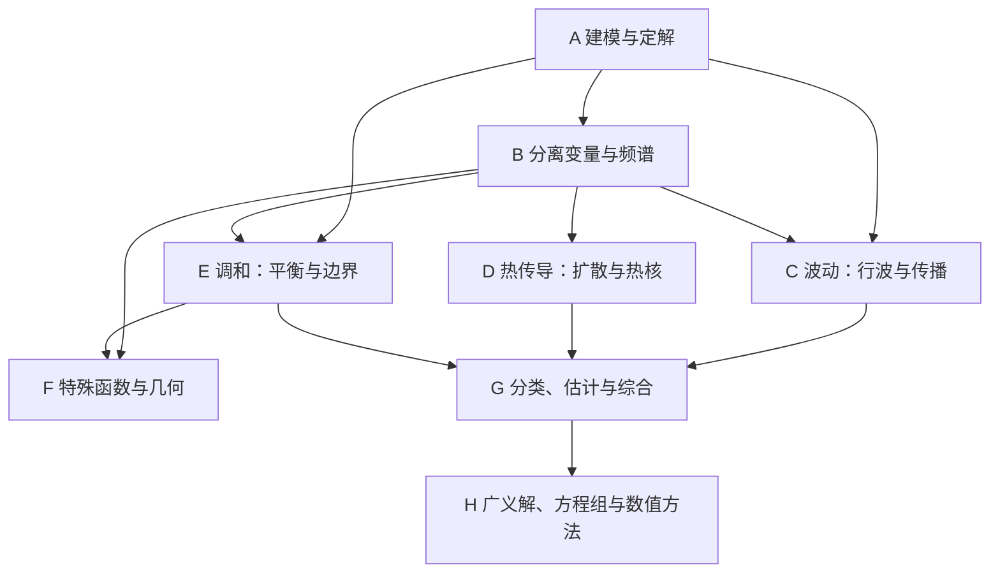

# 数学物理方程学习大地图

目前：地图已建立，尚未开始学习或评估。所有据点均为“未开始”，掌握程度未知；没有把阅读过、跳过或看懂答案视为已掌握。课程编号待确认，以下 A1 等仅为本地图内部稳定索引。

## 1. 两门课是不是同一门？

**内容高度重叠，但不能仅凭课程名称认定为同一门。** 对照你提供的教材，数学物理方程以偏微分方程为研究对象：怎样从物理建立方程、怎样给定初边值条件、怎样求解，以及解是否存在、唯一、稳定。数学物理方法强调处理物理问题的数学工具，其范围可能还包括复变函数、积分变换和特殊函数。具体学校的课程是否等同，还要看教学大纲。

梁昆淼这本书明确分成“复变函数论”和“数学物理方程”两篇；顾樵这本虽叫“方法”，却主要围绕 Fourier 工具、方程求解和特殊函数展开。因此，不能把“数学物理方法都包含完整复变课程”当作规则。

本地图以“数学物理方程”为核心，不要求把五份材料依次读完。默认目标是本科系统学习；没有假定你的考试范围或科研方向。

## 2. 教材分工与核对依据

以下结论依据本地 PDF 的目录、前言/内容介绍及部分开篇正文，不代表已逐页校勘全书。页码若写 p.，指书内印刷页；“PDF 页”指阅读器从 1 开始计数。

| 简称 | 在地图中的用途 | 已核对的结构及定位 |
|---|---|---|
| 谷 | 谷超豪等《数学物理方程》第四版：主教材 | 目录 PDF 页 8–11；第1章波动，第2章热传导，第3章调和，第4章分类与总结，第5章一阶方程组，第6章广义函数与广义解，第7章数值解，附录特殊函数 |
| 雷 | 雷震等《数学物理方程》：三类方程的理论对照 | 目录 PDF 页 12–14；第2章调和，第3章热，第4章波，第5章应用。§2.5 特征值问题、§3.5 能量方法、§4.5 唯一性与稳定性尤适合对应阅读 |
| 顾 | 顾樵《数学物理方法》：求解工具和物理解释 | 目录 PDF 页 7–12；第2–4章 Fourier 级数/变换与 Laplace 变换，第5章建模，第6–9章分离变量、本征函数和 Sturm–Liouville 理论，第10–12章行波、积分变换、Green 函数，第13–14章特殊函数，第15章量子应用 |
| 梁 | 梁昆淼原著、刘法等改编“101计划”本：工具补充 | 目录 PDF 页 9–12；第1–6章为第一篇，第7–15章为第二篇；第8章分离变量，第9章级数解法及本征值，第10–11章球/柱函数，第12章 Green 函数，第13章积分变换，第14章保角变换，第15章非线性简介 |
| 齐 | 齐海涛习题解答：独立练习后的核对材料 | 所给文件开头直接是“第一章 波动方程”习题讲义，PDF 页1列出6节，署名及日期为齐海涛、2008年12月9日；不能仅凭文件名当作第四版配套答案 |

使用方法：每个主题先读“谷”的指定节；卡在计算步骤时查“顾”，需要另一种理论组织方式时查“雷”，遇到圆柱/球坐标时查“梁”。齐的答案按题干、条件、符号逐题对应，不直接套用第三版题号到第四版。

## 3. 区域总览

| 区域 | 要回答的问题 | 主要成果 | 优先级 |
|---|---|---|---|
| A 建模与定解 | 物理问题怎样变成一个可求解的问题？ | 三类模型、初边值条件、适定性语言 | 必学 |
| B 频谱与分离变量 | 为什么能把函数展开成一组振动模式？ | Fourier 展开、边界特征值、非齐次处理 | 必学 |
| C 波动 | 扰动怎样传播？ | 达朗贝尔公式、影响区域、能量方法 | 必学；高维深化可后置 |
| D 热传导 | 扩散怎样使分布变平？ | 热核、极值原理、长期行为 | 必学 |
| E 调和与泊松 | 平衡状态怎样由边界和源决定？ | Green 公式、极值原理、Green 函数 | 必学 |
| F 特殊几何与函数 | 圆形、球形区域为什么出现特殊函数？ | Bessel、Legendre、球面模式 | 扩展；按课程要求升为必学 |
| G 理论综合 | 三类方程的本质差异在哪里？ | 特征、分类、先验估计、方法选择 | 必学 |
| H 后续入口 | 如何迈向现代 PDE 和计算？ | 广义解、一阶系统、差分/有限元概念 | 选学 |

## 4. 前置依赖与开局

不要求先补完所有前置课。已有能力可直接使用，缺什么补什么；下表是入口能力清单，不是你的能力诊断。

| 外部前置 | 最小要求 | 用在何处 |
|---|---|---|
| P1 多元微积分 | 偏导、链式法则、重积分、分部积分 | A1 起，几乎全程 |
| P2 常微分方程 | 一、二阶常系数线性 ODE，初值问题 | B2、B3、C1、D1 |
| P3 级数与积分极限 | 函数级数、基本收敛概念、交换极限的条件意识 | B1、B3、D1、D2 |
| P4 线性代数 | 线性空间、特征值、内积、正交投影 | B1、B2、H1 |
| P5 向量分析 | 梯度、散度、外法向、Gauss 公式 | A1 多维建模、E1、C3 |
| P6 复数 | Euler 公式、复指数运算 | D2、T1；完整复变仅支线需要 |
| P7 分析深化 | 一致收敛、函数空间和基本不等式 | H2、H3，可边学边补 |
| P8 编程 | 数组、绘图、线性方程组求解 | H4 |

开局可选：具备 P1 就能进入 A1；具备 P1/P3/P4 可进入 B1。由于尚未核验前置，这些是“条件满足即可进入”，不是已经确认你具备。推荐第一站 A1，然后 A2，同时按需补 B1。

这是区域概览，不表示每个区域都必须整块完成才能前进；准确入口见据点表。

推荐顺序：A1–A2 → B1–B3 → C1–C3 → D1–D3 → E1–E4 → B4 → G1–G2。C3 的高维传播细节可后置；F、T、H 支线按目标插入。

重排理由：谷书从波方程开始，雷书从调和方程开始，顾书先铺工具。本地图先用建模明确问题，再用有限区间的分离变量建立可计算的共同框架，随后比较传播、扩散和平衡。分类先在 A2 认识，等见过三类解后在 G1 深入，避免一开始只记判别式。

## 5. 据点明细

每个据点是一项可在一次较长会话中推进的主题；预计 1–3 小时，含阅读与少量独立练习。首次接触或证明困难时可拆成两次。时间只是规划估计，不是教材规定。全部状态为“未开始”，证据均“待记录”。表中出现多个入口时默认都需满足。

### A 建模与定解

| ID | 主题/材料位置 | 入口 | 可观察的通关条件 | 权重 | 估时 |
|---|---|---|---|---|---|
| A1 | 波、热、势三类模型；谷1§1、2§1、3§1；顾5.1–5.3 | P1；多维部分P5 | 从弦受力或热量守恒独立导出一个方程，并解释参数、源项及假设 | 必学 | 2–3h |
| A2 | 初值、边值、线性、适定性和分类初识；谷1§1、4§1；梁7.2–7.3 | A1 | 将两个物理描述写成完整定解问题，辨认三类边界，区分存在/唯一/稳定 | 必学 | 2h |

### B 频谱与分离变量

| ID | 主题/材料位置 | 入口 | 可观察的通关条件 | 权重 | 估时 |
|---|---|---|---|---|---|
| B1 | Fourier 级数、奇偶延拓；顾第2章；梁5.1 | P1/P3/P4 | 独立求一个函数的正弦或余弦系数，说明端点和收敛的含义 | 必学 | 2–3h |
| B2 | 边界特征值问题；谷1§3；顾6.1、6.4 | A2/P2/P4 | 对 Dirichlet 和 Neumann 两种边界求特征值，检查零模态 | 必学 | 2–3h |
| B3 | 分离变量完整流程；谷1§3、2§2；顾第6章 | B1/B2/P3 | 独立完成有限杆热问题或固定弦问题，逐一核对方程、初值、边值 | 必学 | 2–3h |
| B4 | 非齐次源与非齐次边界；顾8.2、8.5；梁8.2–8.3 | B3/D1 | 构造边界提升函数，推导新的源项和初值，求模态系数方程 | 必学 | 2–3h |
| B5 | Sturm–Liouville 与带权正交；顾第9章；梁9.4 | B2/P1/P4 | 用分部积分证明不同特征值对应的正交性，写出带权投影系数 | 扩展 | 2–3h |

### C 波动方程

| ID | 主题/材料位置 | 入口 | 可观察的通关条件 | 权重 | 估时 |
|---|---|---|---|---|---|
| C1 | 达朗贝尔公式与特征线；谷1§2；顾10.1–10.2 | A2/P1/P2 | 用给定初位移和初速度求解，并画出一点的依赖区间 | 必学 | 2–3h |
| C2 | 非齐次波方程、反射与有限区间；谷1§2–§3；顾10.3–10.5 | C1/B3 | 解释行波与驻波的联系，处理一个外力项或半直线反射问题 | 必学 | 2–3h |
| C3 | 高维传播、能量与唯一性；谷1§4–§6；雷4.2–4.5 | C1/B3/P5 | 推导齐次固定边界下波能量守恒并证明唯一性；解释二维和三维传播差异 | 能量必学，高维扩展 | 3h |

### D 热传导方程

| ID | 主题/材料位置 | 入口 | 可观察的通关条件 | 权重 | 估时 |
|---|---|---|---|---|---|
| D1 | 有限杆扩散与模态衰减；谷2§2、§5；顾6.2 | B3 | 求温度展开并判断长期极限，解释绝热边界零模态与平均温度 | 必学 | 2h |
| D2 | Fourier 变换与全空间热核；谷2§3；顾第3章、11.1 | A2/B1/P6 | 将空间导数变为频率乘子，求高斯热核并说明质量归一化 | 必学 | 3h |
| D3 | 极值原理、唯一性和稳定性；谷2§4；雷3.4–3.5 | D1/D2 | 写清抛物边界，用解之差证明唯一性，解释瞬时扩散和反向求解困难 | 必学 | 2–3h |

### E 调和与泊松方程

| ID | 主题/材料位置 | 入口 | 可观察的通关条件 | 权重 | 估时 |
|---|---|---|---|---|---|
| E1 | Green 公式、平均值与极值原理；谷3§1–§2；雷2.1–2.3 | A2/P5 | 从分部积分得到 Green 恒等式，并证明 Dirichlet 问题至多一解 | 必学 | 2–3h |
| E2 | 矩形/圆域边值问题；顾7.3；梁8.4 | E1/B3 | 由边界数据选择展开，解释圆心有界性如何排除奇异项 | 必学 | 2–3h |
| E3 | 基本解、Green 函数与镜像；谷3§3；顾12.4–12.6 | E1/E2 | 区分基本解与满足边界条件的 Green 函数，验证一个半空间镜像构造 | 必学 | 3h |
| E4 | Neumann 相容条件、唯一性；谷3§5 | E1 | 对泊松方程积分得到通量相容条件，解释解为什么只差常数 | 必学 | 1–2h |
| E5 | Harnack、奇点与解析性；谷3§4；雷2.4.4 | E1/P3 | 陈述一个定理的条件，并说明为何比极值原理提供更多信息 | 扩展 | 2–3h |

### F 特殊几何与函数

| ID | 主题/材料位置 | 入口 | 可观察的通关条件 | 权重 | 估时 |
|---|---|---|---|---|---|
| F1 | 幂级数和正则奇点；梁9.1–9.3；顾13.2–13.3 | P2/P3 | 对一个二阶 ODE 写出指标方程和系数递推，辨认适用位置 | 扩展 | 2–3h |
| F2 | Bessel 函数与圆膜；梁11.1–11.2；顾第13章 | F1/B5/E2 | 从极坐标分离得到径向方程，用边界和原点条件选择模式 | 扩展 | 3h |
| F3 | Legendre 函数、球函数与球域；梁第10章；顾第14章 | F1/B5/E1/P5 | 在轴对称球域问题中分离变量，确定 Legendre 展开系数 | 扩展 | 3h |

### G 理论综合

| ID | 主题/材料位置 | 入口 | 可观察的通关条件 | 权重 | 估时 |
|---|---|---|---|---|---|
| G1 | 二阶分类、特征与标准形；谷4§1–§2；顾5.4 | C1/D3/E1 | 对给定二元二阶线性方程分类，求双曲型特征坐标并完成一次化简 | 必学 | 2–3h |
| G2 | 先验估计与三类比较；谷4§3–§4 | C3/D3/E3/E4/G1 | 对同一扰动问题说明三类解的不同响应，并独立完成一次能量或最大模估计 | 必学 | 3h |

### T 方法补给支线

| ID | 主题/材料位置 | 入口 | 可观察的通关条件 | 权重 | 估时 |
|---|---|---|---|---|---|
| T1 | Laplace 变换解初值问题；顾第4章、11.2；梁6.1–6.3、13.2 | A2/P2/P6 | 正确处理时间导数变换中的初值项，反演一个简单问题 | 选学 | 2–3h |
| T2 | 复变函数与留数补给；梁第1–4章 | P1/P3/P6 | 围绕一次反演/积分需求，识别极点并计算留数；完整复变课另行展开 | 选学 | 3h起 |
| T3 | 保角变换解二维势问题；梁第14章 | E1/T2 | 解释二维调和性与保角映射的联系，检查变换后的边界条件 | 选学 | 2–3h |

### H 后续入口

| ID | 主题/材料位置 | 入口 | 可观察的通关条件 | 权重 | 估时 |
|---|---|---|---|---|---|
| H1 | 一阶线性系统与特征；谷5§1–§3 | G1/P2/P4 | 将简单系统对角化，并解释各特征分量的传播 | 选学 | 3h |
| H2 | 广义函数、delta 与基本解；谷6§2–§5 | D2/E3/P7 | 正确写出分布导数定义，并验证 delta 的一个基本运算 | 选学 | 3h |
| H3 | 弱解与变分形式；谷6§1、3§1 | E1/H2/P7 | 对泊松问题乘测试函数并分部积分，区分强制边界与自然边界 | 选学 | 2–3h |
| H4 | 数值方法入口；谷第7章 | D1/C1/E1/P8 | 实现一维热显式差分，以网格加密检验误差并展示稳定步长的影响 | 选学 | 3h起 |
| H5 | 应用方向导览；雷第5章；顾第15章；梁第15章 | G2 | 选一个应用说明未知量、方程、条件和主线工具的作用；不要求掌握所有新理论 | 选学 | 2h |

H、T 属于入口节点：其时长不代表能在数小时内完整学会现代 PDE、复变函数或有限元。

## 6. 三条主线如何汇合

统一写法是“算子 + 定解条件”。三个原型为

$$
\text{波：}\quad u_{tt}-c^2\Delta u=f,\qquad
\text{热：}\quad u_t-\kappa\Delta u=f,\qquad
\text{势：}\quad-\Delta u=f,
$$

其中 $c>0$ 是波速，$\kappa>0$ 是扩散系数；无源势方程是 $\Delta u=0$。

| 比较维度 | 波动 | 热传导 | 调和/泊松 |
|---|---|---|---|
| 对应现象 | 振动与传播 | 扩散与耗散 | 静态平衡 |
| 时间初值 | 通常给位移和速度 | 通常给初始温度 | 无时间初值 |
| 典型工具 | 行波、特征、分离变量 | 分离变量、Fourier 变换、热核 | 分离变量、Green 函数 |
| 重要性质 | 有限传播；适当无源边界下能量守恒 | 平滑化；适当条件下能量耗散 | 平均值性质；极值原理 |
| 理论抓手 | 能量估计 | 极值原理与能量估计 | 极值原理与 Green 恒等式 |

不能只按“方程名称”选方法。还要看空间区域、边界是否齐次、是否有源、是否求显式解：有限区间优先考虑特征展开，全空间考虑 Fourier 变换，一维波初值考虑达朗贝尔公式，简单几何的点源/边值问题考虑 Green 函数。

对二元方程 $A u_{xx}+2B u_{xy}+C u_{yy}+\cdots=0$，判别量为 $B^2-AC$。这是本地图采用的系数约定；若交叉项写成 $B u_{xy}$，判别式应相应改变，不能混用。

## 7. 通关方式与阶段成果

每个必学据点至少留下：一次独立解释、一道独立计算或证明，以及方程/初边值条件的核对。查答案前保留自己的尝试；看过完整解答后换题复检，不能以复述答案代替独立通过。

阶段一（A、B1–B3）：能从物理叙述建立有限杆或固定弦问题，写出完整分离变量解。

阶段二（C、D、E主线及B4）：能求解典型波、热、势问题，并对适定性给出基本说明。

阶段三（G）：面对陌生题目，能先根据区域、边界、源项选择方法，再用性质检验结果。区域通过以其必学节点完成为准，未做选学支线不影响主线完成。

建议的综合任务：

1. 用同一正弦初始形状比较固定弦振动与有限杆降温，解释时间系数为何不同。
2. 比较 Dirichlet 与 Neumann 热问题的长期极限，辨认零模态。
3. 对一个泊松边值问题同时说明求解思路和唯一性证明。
4. 将非齐次边界齐次化，明确新增源项、初值变化和边界相容性。

这些是待完成任务，不在地图中预填答案。

## 8. 时间与目标裁剪

主线大约 45–65 小时，另留 15–25 小时做综合题和复习；估计按已具备主要前置计算。可按每周 5–7 小时安排约 10–16 周，具体取决于证明训练强度。F/H 支线另计。

若以常规课程考试为目标：先完成 A–E 主线及 G，再依据教师大纲决定特殊函数、高维波、数值解是否必学。

若偏物理应用：保留 F 与 T1，随后选顾第15章；不必一开始深入广义函数与一阶系统的全部理论。

若偏数学或后续 PDE：加强 C3、D3、E4–E5、G，随后进入 H1–H3。

若偏数值 PDE/有限元：完成核心求解与性质后走 E1 → H2 → H3，并进入 H4；进一步的 Sobolev 空间、弱形式适定性、误差估计需另建后续课程路线，不假定这几本已完整覆盖。

可后置内容及原因：梁1–4章完整复变理论不是主线开局条件；保角变换、孤立子/混沌、量子专门应用并非所有数学物理方程课程的共同核心。

## 9. 当前进度与恢复入口

| 项目 | 当前记录 |
|---|---|
| 已通过 | 无；尚无学习证据 |
| 进行中 | 无 |
| 跳过 | 无；选学不等于已跳过 |
| 建议入口 | A1：从物理守恒/受力写出方程 |
| 可条件进入 | A1（P1满足）；B1（P1/P3/P4满足） |
| 下一动作 | 用户选择开始后，读取对应教材小节，从该据点推进并补充证据 |

通关记录表暂空，未来按“日期｜ID｜结果｜独立程度｜证据/解题档案｜对应目标”更新本文件。当前每个据点的状态统一为未开始，证据为空；依赖指向本表有效 ID，编号只作索引。

## 10. 本地材料索引

原文件保留在用户提供的位置，没有改写。对应源路径：

- 梁：D:/桌面/大三学习/数学物理方程/数学物理方法 梁昆淼 101计划 (梁昆淼原著 刘法 缪国庆 邵陆兵 改编) (z-library.sk, 1lib.sk, z-lib.sk).pdf
- 顾：D:/桌面/大三学习/数学物理方程/数学物理方法 (顾樵) (z-library.sk, 1lib.sk, z-lib.sk).pdf
- 齐：D:/桌面/大三学习/数学物理方程/数学物理方程 第三版 谷超豪 习题解答 齐海涛 (谷超豪) (z-library.sk, 1lib.sk, z-lib.sk).pdf
- 雷：D:/桌面/大三学习/数学物理方程/数学物理方程 (雷震, 王志强, 华波波) (z-library.sk, 1lib.sk, z-lib.sk).pdf
- 谷：C:/Users/10251/Downloads/数学物理方程(第四版) (谷超豪等) (z-library.sk, 1lib.sk, z-lib.sk).pdf

