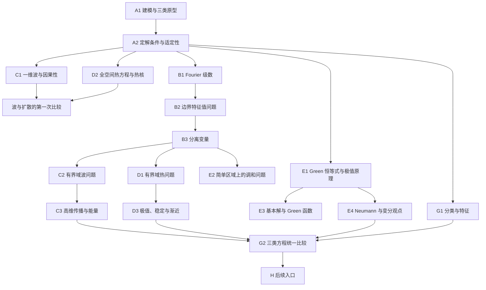

# 数学物理方程学习大地图

## 1. 课程罗盘

这门课的核心不是收集求解公式，而是围绕一个完整定解问题回答四类问题：

1. **模型**：未知量、区域、方程、初值和边界条件从哪里来？
2. **表示**：能否用行波、Fourier 展开、热核、Poisson 核或 Green 函数写出解？
3. **估计**：解是否存在、唯一、稳定？能量、极值原理或变分法能说明什么？
4. **结构**：双曲、抛物、椭圆三类方程为什么分别表现为传播、扩散和平衡？

每个核心据点都必须落到“方程 + 区域 + 数据 + 方法 + 性质”这条链上。只会套公式、不核对定解条件，不算通过。

## 2. 三本教材的分工

### 主教材：谷超豪等《数学物理方程》第四版

用于保持国内本科课程的完整骨架：

- Ch. 1 波动方程：建模、达朗贝尔、分离变量、高维传播、能量法。
- Ch. 2 热传导方程：分离变量、Cauchy 问题、极值原理、渐近行为。
- Ch. 3 调和方程：Green 公式、Green 函数、调和函数性质、第二边值问题。
- Ch. 4 二阶方程分类、特征与先验估计。
- Ch. 5–7 一阶系统、广义函数与数值方法，作为后续入口。

### 路线教材：Walter A. Strauss, *Partial Differential Equations: An Introduction*, 2nd ed.

用于调整学习顺序和建立直觉。其核心原则是：先一维后高维，先无边界问题后边界问题，先比较波与扩散，再进入 Fourier、调和函数和 Green 函数。重点对应：

- Ch. 1–3：PDE 来源、适定性、波与扩散、反射和源项。
- Ch. 4–7：边界条件、Fourier 级数、调和函数、Green 恒等式与 Green 函数。
- Ch. 8：数值方法入口。
- Ch. 9–12：高维波、特殊几何、一般特征值问题、分布与变换。

### 理论强化：雷震、王志强、华波波《数学物理方程》

用于补充经典显式解之外的理论方法：

- Ch. 2 椭圆方程：变分原理、极值原理、Green 函数、特征值问题与一般椭圆方程。
- Ch. 3 热方程：Fourier 变换、弱/强极值原理、梯度估计、热半群、能量法。
- Ch. 4 波方程：高维基本公式、有限传播、Huygens 原理、能量法。
- Ch. 5 应用：Maxwell、Monge–Ampère、Hamilton–Jacobi–Bellman。

### 材料使用规则

每个主题先用谷书确定课程范围；用 Strauss 建立动机和路线；需要证明、估计或现代观点时查雷书。不按顺序通读三本书，也不在同一知识点上重复抄三份正文。

旧有数学物理方法、特殊函数和习题答案资料降为按需补充，不再参与主线导航。

## 3. 区域总览

| 区域 | 核心问题 | 主教材位置 | 权重 | 状态 |
|---|---|---|---|---|
| A 建模、定解与适定性 | 一个物理过程怎样变成完整 PDE 问题？ | 谷 Ch. 1–3 各 §1；Strauss Ch. 1 | 必学 | 未开始 |
| C 波动方程 | 信息怎样有限速度传播，能量怎样守恒？ | 谷 Ch. 1；Strauss Ch. 2–3、9；雷 Ch. 4 | 必学 | 未开始 |
| D 热方程 | 扩散为什么平滑并耗散初值？ | 谷 Ch. 2；Strauss Ch. 2–3；雷 Ch. 3 | 必学 | 未开始 |
| B Fourier、边界谱与分离变量 | 边界怎样把连续问题变成离散模态？ | 谷 1§3、2§2；Strauss Ch. 4–5、11 | 必学 | 未开始 |
| E 椭圆、调和与 Poisson 方程 | 平衡状态怎样由边界和源决定？ | 谷 Ch. 3；Strauss Ch. 6–7；雷 Ch. 2 | 必学 | 未开始 |
| G 分类、估计与统一比较 | 三类方程的结构差异如何决定方法和性质？ | 谷 Ch. 4；Strauss §§1.5–1.6 | 必学 | 未开始 |
| F 特殊几何与特殊函数 | 圆域、球域中的模态为什么出现 Bessel/Legendre 函数？ | Strauss Ch. 10–11；谷附录 | 选学 | 未开始 |
| H 理论、计算与应用入口 | 如何进入广义解、数值 PDE 和现代模型？ | 谷 Ch. 5–7；Strauss Ch. 8、12–14；雷 Ch. 5 | 选学 | 未开始 |
| T 工具补给 | 何时需要 Laplace 变换、复变或保角映射？ | Strauss §12.5；外部材料 | 按需 | 未开始 |

## 4. 依赖图与推荐路线



推荐学习顺序：

```text
A1 → A2
→ C1 与 D2（先比较传播和扩散）
→ B1 → B2 → B3
→ C2 → D1
→ E1 → E2 → E3 → E4
→ B4 → C3 → D3
→ G1 → G2
```

这一路线吸收 Strauss 的组织原则：先在整线和一维上看清现象，再加入边界和高维几何。谷书的章节顺序仍用于查阅，雷书在 E4、D3、C3 等理论节点加入。

当前可进入：若具备多元微积分，可直接进入 A1；若同时具备基本级数、内积与常微分方程，可并行预习 B1。尚无学习证据，不能把“可进入”记为“已掌握”。

## 5. 外部前置

| 前置 | 最小要求 | 首次关键使用 | 当前状态 |
|---|---|---|---|
| P1 多元微积分 | 偏导、链式法则、重积分、分部积分 | A1、E1 | 未测 |
| P2 常微分方程 | 二阶常系数 ODE、初值问题 | C1、B2 | 未测 |
| P3 级数与极限 | 函数级数、逐项积分/求导的条件意识 | B1、D1 | 未测 |
| P4 线性代数 | 内积、正交投影、特征值 | B1、B2、E4 | 未测 |
| P5 向量分析 | 梯度、散度、外法向、Gauss 公式 | A1 多维模型、E1 | 未测 |
| P6 Fourier 变换基础 | 变换、逆变换、卷积 | D2、H2 | 可在课程内补 |
| P7 泛函分析初步 | 函数空间、弱收敛、基本不等式 | E4 深化、H2–H3 | 仅后续需要 |
| P8 编程与数值分析 | 数组、线性系统、误差与稳定性 | H4 | 仅数值支线需要 |

前置按需补，不要求在开始前一次性学完。

## 6. 核心据点

### A 建模、定解与适定性

| ID | 主题与材料 | 必要前置 | 可观察通关条件 | 状态 |
|---|---|---|---|---|
| A1 | PDE、线性与叠加；波/热/势方程建模。谷 1§1、2§1、3§1；Strauss §§1.1–1.3 | P1；多维部分 P5 | 独立从弦受力或热量守恒导出一个方程，写清未知量、参数、假设和源项 | 未开始 |
| A2 | 初值、Dirichlet/Neumann/Robin 边界、适定性与分类初识。谷 1§1；Strauss §§1.4–1.6 | A1 | 将物理描述写成完整定解问题，并区分存在、唯一、稳定 | 未开始 |

### C 波动方程

| ID | 主题与材料 | 必要前置 | 可观察通关条件 | 状态 |
|---|---|---|---|---|
| C1 | 一维达朗贝尔公式、特征线、依赖区间与因果性。谷 1§2；Strauss §§2.1–2.2 | A2、P2 | 由初位移和初速度写出解，并画出一点的依赖区间 | 未开始 |
| C2 | 反射、外力、有限区间与模态。谷 1§3；Strauss §§3.2、3.4、Ch. 4 | C1、B3 | 处理一个反射或受迫波问题，并说明行波与驻波的联系 | 未开始 |
| C3 | 高维公式、有限传播、Huygens 原理、能量与唯一性。谷 1§4–§6；Strauss Ch. 9；雷 §§4.2–4.5 | C1、C2、P5 | 推导波能量守恒/估计并据此证明唯一性；解释维数对传播的影响 | 未开始 |

### D 热方程

| ID | 主题与材料 | 必要前置 | 可观察通关条件 | 状态 |
|---|---|---|---|---|
| D1 | 有界区间分离变量、零模态与长期行为。谷 2§2、§5；Strauss Ch. 4–5 | B3 | 写出温度模态展开，判断 Dirichlet 与 Neumann 问题的长期极限 | 未开始 |
| D2 | 整线 Cauchy 问题、Fourier 变换与热核。谷 2§3；Strauss §§2.3–2.5；雷 §3.3 | A2、P3；P6 可随学 | 推导热核卷积形式，检查质量守恒并解释瞬时平滑 | 未开始 |
| D3 | 极值原理、唯一性、稳定性、梯度估计与半群观点。谷 2§4–§5；雷 §§3.4–3.5 | D1、D2 | 用极值原理或能量法证明唯一性，并解释反向热问题为何不稳定 | 未开始 |

### B Fourier、边界谱与分离变量

| ID | 主题与材料 | 必要前置 | 可观察通关条件 | 状态 |
|---|---|---|---|---|
| B1 | Fourier 系数、奇偶延拓、正交与收敛。Strauss Ch. 5 | P3、P4 | 独立求一个正弦/余弦展开，并解释端点值和 Gibbs 现象 | 未开始 |
| B2 | Dirichlet/Neumann/Robin 特征值问题、零模态与 Rayleigh 商。谷 1§3；Strauss Ch. 11；雷 §2.5 | P2、P4 | 求一维边界特征值，检查零模态，并用正交性投影初值 | 未开始 |
| B3 | 分离变量的完整闭环。谷 1§3、2§2；Strauss Ch. 4–5 | B1、B2 | 独立完成一个固定弦或有限杆问题，逐项核对方程、初值和边界 | 未开始 |
| B4 | 非齐次源、非齐次边界与 Duhamel 思想。Strauss Ch. 3、§5.6；谷相关小节 | B3、C1、D1 | 完成边界提升或模态常微分方程，写清变换后的初值和源项 | 未开始 |
| B5 | 一般 Sturm–Liouville、带权正交与完备性。Strauss Ch. 11 | B2、P4 | 用分部积分证明正交性，并写出带权投影系数 | 选学，未开始 |

### E 椭圆、调和与 Poisson 方程

| ID | 主题与材料 | 必要前置 | 可观察通关条件 | 状态 |
|---|---|---|---|---|
| E1 | Green 恒等式、平均值性质与极值原理。谷 3§1–§2、§4；Strauss §§6.1、7.1–7.2；雷 §§2.2–2.3 | A2、P5 | 推导一个 Green 恒等式，并由极值原理证明 Dirichlet 解的唯一性 | 未开始 |
| E2 | 矩形、圆盘、Poisson 公式与调和展开。Strauss §§6.2–6.4；谷相关例题 | B3、E1 | 根据几何与边界数据选择展开，验证所得解满足边界条件 | 未开始 |
| E3 | 基本解、Green 函数与镜像法。谷 3§3；Strauss §§7.3–7.4；雷 §2.4 | E1、E2 | 区分基本解与 Green 函数，并验证一个半空间或球域构造 | 未开始 |
| E4 | Neumann 相容条件、变分原理与第一特征值。谷 3§5；雷 §§2.1、2.5 | E1、P4 | 推出 Neumann 相容条件，解释解只差常数；写出一个能量极小问题 | 未开始 |
| E5 | Harnack、不等式、解析性与一般椭圆方程。谷 3§4；雷 §§2.4、2.6 | E1、P3 | 准确陈述一个结果的条件，并说明它比极值原理多提供了什么 | 选学，未开始 |

### G 分类、估计与统一比较

| ID | 主题与材料 | 必要前置 | 可观察通关条件 | 状态 |
|---|---|---|---|---|
| G1 | 二阶线性方程分类、特征坐标与标准形。谷 4§1–§2；Strauss §1.6 | A2、C1 | 对二元二阶方程分类，求双曲型特征坐标并化为标准形 | 未开始 |
| G2 | 先验估计与三类方程比较。谷 4§3–§4 | C3、D3、E4、G1 | 面对陌生定解问题，能依据区域、数据和结构选择方法，并给出一种稳定性估计 | 未开始 |

判别式约定：若主部写作 $Au_{xx}+2Bu_{xy}+Cu_{yy}$，使用 $B^2-AC$；若交叉项系数写作 $Bu_{xy}$，判别式必须相应调整，不能混用。

## 7. 选学与后续入口

### F 特殊几何与特殊函数

| ID | 主题与材料 | 必要前置 | 通关证据 | 状态 |
|---|---|---|---|---|
| F1 | 正则奇点与幂级数法 | P2、P3 | 写出指标方程和系数递推 | 选学，未开始 |
| F2 | Bessel 函数、圆膜与柱域。Strauss §§10.2、10.5 | F1、B5 | 从极坐标分离得到径向方程并选择正则解 | 选学，未开始 |
| F3 | Legendre 函数、球域与球面模态。Strauss §§10.3、10.6 | F1、B5、P5 | 在轴对称球域中完成分离并确定展开系数 | 选学，未开始 |

### H 理论、计算与应用入口

| ID | 主题与材料 | 必要前置 | 通关证据 | 状态 |
|---|---|---|---|---|
| H1 | 一阶线性系统、特征与 Cauchy–Kowalevski。谷 Ch. 5 | G1、P4 | 对简单系统作特征分解并解释传播分量 | 选学，未开始 |
| H2 | 分布、Fourier 变换与基本解。谷 Ch. 6；Strauss Ch. 12 | D2、E3、P7 | 写出分布导数定义并验证一个基本解关系 | 选学，未开始 |
| H3 | 弱解与变分形式。谷 6§1；雷 §2.1 | E1、E4、P7 | 从 Poisson 方程通过分部积分得到弱形式并区分两类边界 | 选学，未开始 |
| H4 | 有限差分与有限元入口。谷 Ch. 7；Strauss Ch. 8 | C/D/E 主线、P8 | 实现一个一维差分格式，验证误差阶并展示稳定性限制 | 选学，未开始 |
| H5 | Maxwell、Monge–Ampère、HJB 与非线性 PDE 导览。雷 Ch. 5；Strauss Ch. 13–14 | G2 | 选一个模型说明未知量、方程类型、数据和主要分析困难 | 选学，未开始 |

### T 工具补给

| ID | 主题 | 使用时机 | 状态 |
|---|---|---|---|
| T1 | Laplace 变换；Strauss §12.5 | 时间半轴问题或常系数源项需要变换法时 | 按需，未开始 |
| T2 | 复变函数与留数 | Fourier/Laplace 反演需要复积分时；不在本课系统重学复变 | 按需，未开始 |
| T3 | 保角映射 | 二维调和问题且区域可被简单映射时 | 按需，未开始 |

这些节点不阻塞本科主线；需要完整复变、泛函分析或数值 PDE 时应另建课程路线。

## 8. 三类方程的统一视图

$$
\text{波：}\quad u_{tt}-c^2\Delta u=f,
$$

$$
\text{热：}\quad u_t-\kappa\Delta u=f,
$$

$$
\text{Poisson：}\quad-\Delta u=f.
$$

| 维度 | 波动方程 | 热方程 | 椭圆方程 |
|---|---|---|---|
| 物理图像 | 传播与振动 | 扩散与耗散 | 静态平衡 |
| 数据 | 位移、速度及边界 | 初始温度及边界 | 边界数据与源 |
| 典型表示 | 达朗贝尔、模态、球平均 | 热核、模态、半群 | Poisson 核、Green 函数 |
| 核心估计 | 能量与有限传播 | 极值原理、能量、平滑 | 极值原理、变分、Green 恒等式 |
| 典型风险 | 反射、共振、正则性传播 | 反向问题不稳定 | 边界相容性与几何依赖 |

方法选择首先看区域与数据：整线 Cauchy 问题优先考虑基本公式或 Fourier 变换；有界简单区域考虑边界谱与分离变量；源项可考虑 Duhamel/Green 方法；只需唯一性和稳定性时，能量、极值或变分方法往往比显式求解更直接。

## 9. 阶段通关与进度

### 阶段一：模型与基本现象

范围：A1–A2、C1、D2。

证据：能建立一个完整定解问题，并比较波的有限传播与热的瞬时扩散。

### 阶段二：边界与谱方法

范围：B1–B3、C2、D1、E1–E2。

证据：能独立完成一个分离变量问题，并用极值原理或 Green 恒等式证明一个唯一性结论。

### 阶段三：源项、表示与理论性质

范围：B4、C3、D3、E3–E4。

证据：能处理一个非齐次问题，并使用能量、极值或变分法给出稳定性/唯一性论证。

### 阶段四：统一判断

范围：G1–G2。

证据：面对陌生 PDE，能先识别类型、区域和数据，再选择表示或估计工具；不能只按方程名称套方法。

每个据点的“通过”至少需要一次独立解释和一道独立计算或证明。看过答案、复述教材或主动跳过都不构成通过证据。

## 10. 当前状态与恢复入口

| 项目 | 当前记录 |
|---|---|
| 已通过 | 无 |
| 进行中 | 无 |
| 学习证据 | 尚未开始教学或评估，mastery 为 unknown |
| 推荐入口 | A1：从弦振动或热传导守恒律建立方程 |
| 第一阶段路线 | A1 → A2 → C1 → D2 |
| 下一动作 | 开始 A1，并只检查会阻塞建模的多元微积分前置 |

未来通关记录使用：日期｜据点 ID｜结果｜独立程度｜具体证据｜下一步。地图只记录稳定的课程级状态，不复制逐轮问答。

## 11. 本地教材索引

- Strauss：`D:/桌面/大三学习/数学物理方程/Partial Partial Differential Equations An Introduction, Second Edition (Walter A. Strauss) (z-library.sk, 1lib.sk, z-lib.sk).pdf`
- 谷超豪等：`D:/桌面/大三学习/数学物理方程/数学物理方程(第四版) (谷超豪等) (z-library.sk, 1lib.sk, z-lib.sk).pdf`
- 雷震等：`D:/桌面/大三学习/数学物理方程/数学物理方程 (雷震, 王志强, 华波波) (z-library.sk, 1lib.sk, z-lib.sk).pdf`

教材原文件未修改。
