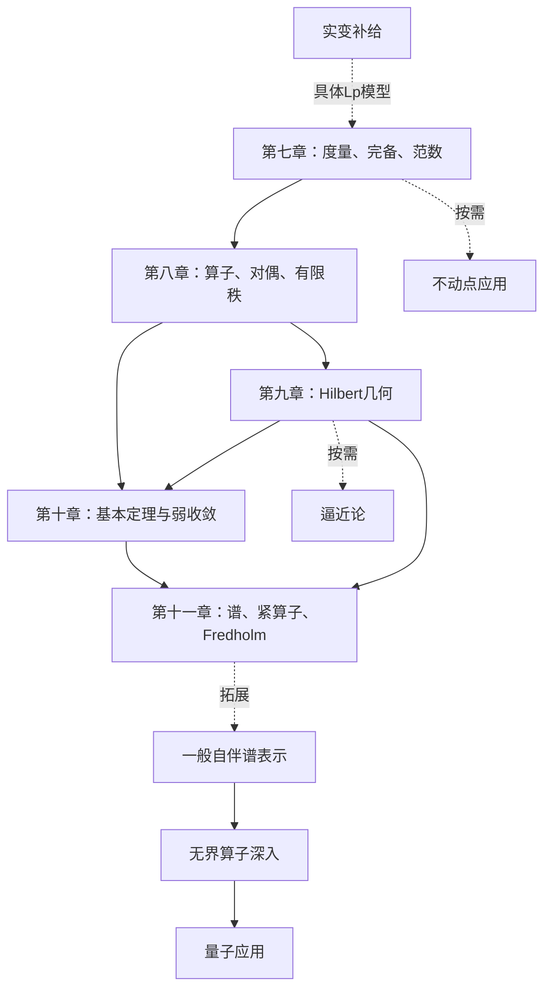

# 泛函分析 · 课程大地图（教材主线重设计）

**主问题：当未知量从有限维向量变成函数，怎样保证极限仍在空间中、方程有解且稳定，并把算子分解成可理解的结构？**

当前位置：M01、M02 已通过，下一据点为 M06「连续映射与等距映射」。课程编号待确认，M01 等仅为此地图内部稳定 ID。本文件是泛函分析课程的唯一主地图，后续原位更新；复变函数地图独立保留。

## 一、材料分工与设计依据

| 代号 | 资料 | 使用方式 |
|---|---|---|
| Z 主教材 | 程其襄、张奠宙、胡善文、薛以锋《实变函数与泛函分析基础》第4版 | 以第二篇第七至十一章（123–222页）组织主线，先读定义、定理、证明和例子，再做章末题 |
| K 拓展教材 | Kreyszig, Introductory Functional Analysis with Applications | 补充解释、例子与证明；逼近论、一般谱表示、无界算子和量子应用保留为拓展 |
| H 习题参考 | 胡善文《实变函数与泛函分析基础（第四版）学习指导与习题解答》 | 独立尝试Z习题后核对题面与解答；补充题作为额外练习，不承担主教材角色 |

本次已核对Z版权页、第四版前言、完整目录，并抽查印刷123、158、215页。前言明确说明有限秩、全连续和Fredholm算子及指标是第四版补充完善的内容。因此本地图单列有限秩据点O05，并将C05纳入主线。沿用旧ID，补入M06连续映射、O06序列空间对偶，不丢失原有节点。

Z第七章开头承接第二章的度量、邻域和开闭集概念，故M01、M02标明回读第二章，而不要求先通读全部实变内容。读具体Lebesgue空间时再进入R区。当前为章节级规划与重点页核验，尚未逐页审读全文；来源列给阅读范围，正式教学时核对具体定理和例题。

所有页码均为各书自己的印刷页码，不能互换。Z抽查的PDF页码为印刷页码+9；H已抽查为+3；K优先按节号和页脚定位。H与Z的题号和条件需逐题核对，不能仅按同章同号认定完全对应。

## 二、五大主线区域

| 教材区域 | 必学据点与顺序 | 关键成果 | 原书习题 |
|---|---|---|---|
| 第七章 度量空间和赋范线性空间，123–148 | M01→M02→M06→M03→M04→M05；N01→N02→N03 | 能证明完备性、使用压缩原理并比较范数 | Z146–148 |
| 第八章 有界线性算子和连续线性泛函，149–162 | O01→O02→O03；O04、O06；O05；N05按需补商空间 | 能求范数、表示泛函、构造有限秩算子 | Z161–162 |
| 第九章 内积空间和希尔伯特空间，163–182 | H01→H02→H03；H04→H05→H06 | 能使用投影、正交展开与Riesz表示 | Z180–182 |
| 第十章 巴拿赫空间中的基本定理，183–202 | T01→T02→D05→D01→T03→T04→D02→D03→T05→T06 | 能选用延拓、一致有界、逆算子与闭图像定理 | Z201–202 |
| 第十一章 线性算子的谱，203–222 | S01→S02→S03；N04→C01→C02→C03→C04→C05 | 能分析谱、紧性、积分方程及Fredholm指标 | Z220–222 |

这些顺序按Z的章节组织，分号表示可交错学习，精确依赖见据点表。N04的紧性与无限维障碍可在第七章后提前作为例子学习，也可按教材留到第十一章。N05是理解商空间、余核的补给工具，不强行把它视为Z单独一节。

## 三、依赖全景与开局

箭头表示课程联系，不要求学完上游所有选学。B区一般自伴谱表示只需对应S、H据点，不必先完成C区；U01–U03可在H05、T06后提前学，U05才需B04。

当前没有已核验的掌握记录。若集合语言与极限基础已具备，可直接进入M01；M02后先学新增M06，再进入M03。R01是可独立进入的补给入口，不是所有人的必经门槛。已有基础可用实际解释或解题表现确认后跳到满足前置的据点。

| 外部前置 | 最低要求与补给位置 | 使用据点 |
|---|---|---|
| P1 集合与证明语言 | 集合运算、映射、可数性、等价关系、量词；Z第一章5–19、第二章22–29；K附录1，609起 | M01、M02、M04、T01、T03、R01 |
| P2 数学分析基础 | 极限、柯西准则、上确界、级数和一致收敛；K 附录1相关条目；按需复习分析 | M01、M06、M03、M05、N02、N04、O02、H03、S03、B03、R01等 |
| P3 线性代数 | 子空间、基、核像、矩阵、特征值、内积；K 2.1、7.1可回顾 | N01、N03、N05、O01、H01、H06、S01、S05 |
| P4 积分与逼近基础 | 定积分、参数积分估计；D05另需有界变差与 Riemann–Stieltjes 积分，K 4.4可补；真正 Lebesgue 模型走R区 | D05、D06、A01、A04–A06、B04、U02、U06、R02 |
| P5 局部复分析补给 | S04需解析函数、柯西理论、刘维尔；U05按K相关构造补复平面与圆周变换 | S04、U05；不是全课程开局前置 |
| P6 常微分方程 | 初值问题、积分方程形式、线性常微分方程 | A02、Q02、Q03 |
| P7 物理背景 | 复振幅、概率解释、能量与动量基本概念 | Q01–Q03，仅量子支线 |

## 四、主线与拓展的权重

“核心”表示本次教材主线及必要工具，权重1；“进阶”“选学”权重0，不影响主线通关；“补给”依所用模型按需启用。它们是当前学习设计，不是已确认的学校考试范围。

共67个据点：核心41个、进阶13个、选学10个、补给3个。核心约81.5小时；另留25%–40%用于章末题和复习。每周6小时约需17–19周。估计包含首次理解和少量练习，不代表个人速度承诺。

拓展路线仍保留：D04自反性、S04复分析谱论、S05 Banach代数、A区应用、B区一般谱表示、U区无界算子与Q区物理。C05现为Z第十一章主线，不再作为纯拓展。R区只承担可测性、积分极限交换与L^p模型的补给。

## 五、全部据点明细

每个据点通常1.5–3小时，可拆成两次。来源列按“Z教材 → K补充”安排；H仅供题目与答案回查。来源“拓展，无直接主线节”不表示Z绝无相关词句，而表示不将它列为Z指定章节的主任务。前置只列直接依赖，间接前置沿链继承。

### M：度量空间

| ID / 主题 | Z主教材位置 | K补充位置 | H习题参考 | 前置据点 / 外部前置 | 通关条件 | 权重层级 / 用时 | 状态 / 证据 |
|---|---|---|---|---|---|---|---|
| M01 度量与函数空间的视角 | 七§1，123–124；定义回查二§1，22–23 | 1.1–1.2，2–16 | 七，94 | — / P1,P2 | 验证一个函数空间的度量，解释函数为何可作为空间中的点 | 核心 / 1.5h | 已通过 / 独立解释函数作为空间元素；验证一致度量的关键公理；以 $\rho(f,g)=|f(0)-g(0)|$ 识别同一性失败；区分度量与内积 |
| M02 开闭集、稠密性与可分性 | 七§2，125–127；二§2–3，24–29 | 1.3，17–24 | 七，94–95 | M01 / P1 | 用序列或邻域刻画闭包，构造一个可数稠密集 | 核心 / 2h | 已通过 / 求出 $\{1/n:n\ge1\}$ 的闭包并辨析聚点、孤立点；用邻域刻画稠密性；证明 $\mathbb Q^2$ 可数且在 $\mathbb R^2$ 中稠密，从而判断可分性 |
| M06 连续映射与等距映射 | 七§3，128–129 | 1.3–1.6，17–48相关内容 | 七，96–97 | M02 / P2 | 用序列刻画连续性，区分连续、等距与压缩映射 | 核心 / 1.5h | 未开始 / 暂无 |
| M03 收敛、柯西列与完备性 | 七§4，129–132 | 1.4–1.5，25–40 | 七，96–97 | M06 / P2 | 完成 C[a,b] 一致范数或一个序列空间的完备性证明 | 核心 / 2.5h | 未开始 / 暂无 |
| M04 完备化 | 七§5，132–135 | 1.6，41–48 | 七，97–98 | M03 / P1 | 用柯西列等价类说明完备化构造及等距稠密嵌入 | 核心 / 2h | 未开始 / 暂无 |
| M05 压缩映射原理 | 七§6，135–138 | 5.1，299–306 | 七，96、98 | M03,M06 / P2 | 检查自映射、完备与压缩常数，证明迭代收敛并给误差界 | 核心 / 2h | 未开始 / 暂无 |

### N：赋范空间及补充工具

| ID / 主题 | Z主教材位置 | K补充位置 | H习题参考 | 前置据点 / 外部前置 | 通关条件 | 权重层级 / 用时 | 状态 / 证据 |
|---|---|---|---|---|---|---|---|
| N01 线性空间、范数与 Banach 空间 | 七§7–8，138–145 | 2.1–2.3，50–71 | 七，96–97 | M03 / P3 | 区分代数结构与拓扑结构，说明同一线性空间可配不同范数 | 核心 / 2h | 未开始 / 暂无 |
| N02 Hölder、Minkowski 与序列空间 | 七§8，140–145 | 1.2、2.2；9–16、58–66 | 七，97–98 | N01 / P2 | 用不等式验证 l^p 范数并区分 l^p、c_0 与 l^∞ | 核心 / 2h | 未开始 / 暂无 |
| N03 有限维空间与范数等价 | 七§8，140–145 | 2.4，72–76 | 七，98起，相关例题99–101 | N01 / P3 | 解释有限维子空间闭及范数等价，指出无限维不能照搬 | 核心 / 1.5h | 未开始 / 暂无 |
| N04 紧致性与无限维障碍 | 十一§3，207–209；首次可用K 2.5提前补 | 2.5，77–81 | 七，95；十一，158–159 | N03,M02 / P2 | 用 Riesz 引理或标准正交序列说明无限维单位球不紧 | 核心 / 2h | 未开始 / 暂无 |
| N05 商空间与商范数 | 直接定义补读H八116；在Z十一§5，215–219讨论核与余核前使用 | 2.3相关；商空间主读H | 八，116及本章练习 | N01,M02 / P3 | 证明闭子空间给出真正商范数，说明闭性不可删 | 核心 / 1.5h | 未开始 / 暂无 |

### O：算子与泛函

| ID / 主题 | Z主教材位置 | K补充位置 | H习题参考 | 前置据点 / 外部前置 | 通关条件 | 权重层级 / 用时 | 状态 / 证据 |
|---|---|---|---|---|---|---|---|
| O01 线性算子、核与像 | 八§1，149–153 | 2.6、2.9；82–90、111–116 | 八，115–116 | N01 / P3 | 对微分或移位算子写清定义域、值域、核及像 | 核心 / 1.5h | 未开始 / 暂无 |
| O02 有界性、连续性与算子范数 | 八§1，149–153 | 2.7，91–102 | 八，115–116 | O01 / P2 | 证明线性算子有界等价于连续，并用上下界求算子范数 | 核心 / 2h | 未开始 / 暂无 |
| O03 连续线性泛函与对偶空间 | 八§1，149–153 | 2.8、2.10；103–110、117–126 | 八，115–116 | O02 / — | 求一个坐标或积分泛函的范数，区分代数对偶与连续对偶 | 核心 / 2h | 未开始 / 暂无 |
| O04 算子空间的完备性与延拓 | 八§2，154–158 | 2.7、2.10；91–102、117–126 | 八，116；七，95稠密性提示 | O03,M03 / — | 说明 B(X,Y) 完备需要 Y 完备，并从稠密子空间延拓有界算子 | 核心 / 2h | 未开始 / 暂无 |
| O05 有限秩算子的结构 | 八§3，158–160 | 2.9及8.1，111–116、405起 | 八，116及118起相关练习 | O03,N03 / P3 | 把有限秩有界算子写为有限个向量与连续泛函的组合，计算秩并说明有界条件 | 核心 / 2h | 未开始 / 暂无 |
| O06 典型序列空间的对偶表示 | 八§2，154–158 | 2.10，117–126 | 八，118–123相关练习 | O03,N02 / P2 | 从标准基取值构造泛函表示，证明1<p<∞时(l^p)'对应l^q，并单独讨论l^1 | 核心 / 2h | 未开始 / 暂无 |

### H：Hilbert空间

| ID / 主题 | Z主教材位置 | K补充位置 | H习题参考 | 前置据点 / 外部前置 | 通关条件 | 权重层级 / 用时 | 状态 / 证据 |
|---|---|---|---|---|---|---|---|
| H01 内积、Hilbert 空间与极化 | 九§1，163–166 | 3.1–3.2，128–141 | 九，125–127 | N02 / P3 | 用平行四边形律判别范数是否来自内积，并解释完备性 | 核心 / 2h | 未开始 / 暂无 |
| H02 投影定理与正交分解 | 九§2，166–169 | 3.3，142–150 | 九，127 | H01 / — | 对闭子空间构造最佳逼近并证明存在唯一性 | 核心 / 2h | 未开始 / 暂无 |
| H03 正交系、Bessel 与 Parseval | 九§3，169–175 | 3.4–3.6，151–174 | 九，125–128 | H02 / P2 | 计算正交展开，区分正交、完备正交系及 Parseval 等式 | 核心 / 2.5h | 未开始 / 暂无 |
| H04 Hilbert 空间 Riesz 表示 | 九§4，175–177 | 3.8，188–194 | 九，128 | H02,O03 / — | 把一个有界泛函表示成内积，并核对代表元唯一性和范数 | 核心 / 2h | 未开始 / 暂无 |
| H05 Hilbert 共轭算子 | 九§4，175–177 | 3.9，195–200 | 九，126、128 | H04,O04 / — | 从内积恒等式计算移位算子的共轭，证明一条共轭运算法则 | 核心 / 2h | 未开始 / 暂无 |
| H06 自伴、酉与正规算子 | 九§5，177–179 | 3.10，201–208 | 九，126、128 | H05 / P3 | 比较三类算子的定义，构造例子并避免把实矩阵直觉直接外推 | 核心 / 1.5h | 未开始 / 暂无 |

### T：基本定理

| ID / 主题 | Z主教材位置 | K补充位置 | H习题参考 | 前置据点 / 外部前置 | 通关条件 | 权重层级 / 用时 | 状态 / 证据 |
|---|---|---|---|---|---|---|---|
| T01 Zorn 引理与 Hahn–Banach 延拓 | 十§1，184–187；附录二225–227 | 4.1–4.3，210–224 | 十，142–144 | O03 / P1 | 说清实情形支配条件、复情形保范延拓，并复述一步延拓到极大的证明路线 | 核心 / 2.5h | 未开始 / 暂无 |
| T02 泛函分离与范数刻画 | 十§1，184–187 | 4.3，218–224 | 十，144 | T01,N05 / — | 用保范延拓分离点与闭子空间，写出范数的对偶刻画 | 核心 / 2h | 未开始 / 暂无 |
| T03 Baire 纲定理 | 十§4，191–194 | 4.7，246起 | 十，142、144 | M03 / P1 | 陈述完备空间的纲定理，并说明套球构造的作用 | 核心 / 1.5h | 未开始 / 暂无 |
| T04 一致有界原理 | 十§4，191–194 | 4.7，246–255 | 十，144 | T03,O04 / — | 区分逐点有界与范数一致有界，写清定义域完备的用途 | 核心 / 2h | 未开始 / 暂无 |
| T05 开映射与有界逆定理 | 十§6，197–199 | 4.12，285–290 | 十，144 | T03,O04 / — | 用开映射推出双射有界线性算子的逆有界，并列齐 Banach 条件 | 核心 / 2h | 未开始 / 暂无 |
| T06 闭图像定理 | 十§7，199–200 | 4.13，291–298 | 十，143–144 | T05 / — | 用序列验证图像闭，解释处处定义与空间完备为何重要 | 核心 / 2h | 未开始 / 暂无 |

### D：对偶与收敛

| ID / 主题 | Z主教材位置 | K补充位置 | H习题参考 | 前置据点 / 外部前置 | 通关条件 | 权重层级 / 用时 | 状态 / 证据 |
|---|---|---|---|---|---|---|---|
| D01 Banach 对偶算子 | 十§3，190–191 | 4.5，231–238 | 十，142、144 | O03,T02 / — | 写出 T' 的定义及方向 X'与Y'，并与 Hilbert 共轭比较 | 核心 / 1.5h | 未开始 / 暂无 |
| D02 强收敛、弱收敛与弱星收敛 | 十§5，195–197 | 4.8、4.11；256–262、276–284 | 十，142–144 | T04,O03,H03 / — | 用 l^2 标准基给出弱而非强收敛，准确写出弱星测试对象 | 核心 / 2h | 未开始 / 暂无 |
| D03 算子列的不同收敛 | 十§5，195–197 | 4.9，263–268 | 十，142–144 | D02,O04 / — | 区分范数、强算子、弱算子收敛，并说明逐点极限的有界性条件 | 核心 / 2h | 未开始 / 暂无 |
| D04 自反空间与典范嵌入 | 拓展，无直接主线节 | 4.6，239–245 | — | D01,H04 / — | 构造 X 到 X'' 的典范嵌入，区分等距与满射并说明自反定义 | 进阶 / 2h | 未开始 / 暂无 |
| D05 C[a,b] 泛函的积分表示 | 十§2，188–189；六§3、§5，103–107、112–114补给 | 4.4，225–230 | 十，144 | T01 / P4 | 区分本定理与 Hilbert Riesz 表示，说明有界变差积分表示中的范数关系 | 核心 / 2h | 未开始 / 暂无 |
| D06 可和性与数值积分中的弱星观点 | 拓展，无直接主线节 | 4.10–4.11，269–284 | — | D03,D05 / P2,P4 | 把求和或求积公式写成泛函列，解释一致有界原理的作用 | 选学 / 2h | 未开始 / 暂无 |

### S：谱

| ID / 主题 | Z主教材位置 | K补充位置 | H习题参考 | 前置据点 / 外部前置 | 通关条件 | 权重层级 / 用时 | 状态 / 证据 |
|---|---|---|---|---|---|---|---|
| S01 可逆性、预解式与 Neumann 级数 | 十一§1，203–205 | 7.1–7.3，364–378 | 十一，158–159 | T05,O04 / P3 | 在范数小于1时构造 I-T 的逆并给出逆的范数估计 | 核心 / 2h | 未开始 / 暂无 |
| S02 谱与点谱、连续谱、剩余谱 | 十一§1，203–205 | 7.2–7.4，370–385 | 十一，158–159 | S01,D01 / — | 按单射、像稠密性、满射及逆有界性分类一个无限维例子 | 核心 / 2h | 未开始 / 暂无 |
| S03 谱的闭性、有界性与谱半径 | 十一§2，206–207 | 7.3–7.4，374–385 | 十一，159 | S02 / P2 | 证明谱的有界与闭，区分谱半径与算子范数 | 核心 / 2h | 未开始 / 暂无 |
| S04 用复分析证明谱非空与谱半径公式 | 十一§2，206–207为结论背景；完整复分析论证读K | 7.5，386–393 | 十一，159给出谱非空结论 | S03 / P5 | 对复 Banach 空间复述预解式解析性及刘维尔论证，并陈述谱半径公式 | 进阶 / 2.5h | 未开始 / 暂无 |
| S05 Banach 代数 | 拓展，无直接主线节 | 7.6–7.7，394–404 | — | S03 / P3 | 把算子代数抽象成含幺 Banach 代数，说明可逆元与谱概念 | 进阶 / 2h | 未开始 / 暂无 |

### C：紧算子与Fredholm理论

| ID / 主题 | Z主教材位置 | K补充位置 | H习题参考 | 前置据点 / 外部前置 | 通关条件 | 权重层级 / 用时 | 状态 / 证据 |
|---|---|---|---|---|---|---|---|
| C01 紧算子与有限秩近似 | 十一§3，207–209 | 8.1–8.2，405–418 | 十一，158–160 | N04,O04,O05 / — | 用有界列的像子列判定紧性，区分有限秩、紧与一般有界算子 | 核心 / 2h | 未开始 / 暂无 |
| C02 紧算子的非零谱 | 十一§4，210–215 | 8.3–8.4，419–435 | 十一，160 | C01,S03 / — | 说清非零谱点、有限维特征空间和唯一可能聚点0，并单独处理0 | 核心 / 2.5h | 未开始 / 暂无 |
| C03 Fredholm 型方程与择一定理 | 十一§4，210–215 | 8.5–8.7，436–458 | 十一，159–160 | C02,D01,H05 / — | 对 I-K 写出齐次核与非齐次方程可解性之间的关系 | 核心 / 2.5h | 未开始 / 暂无 |
| C04 紧自伴算子的正交展开 | 十一§4，210–215 | 8.3–8.4、9.1–9.2为背景；直接主读Z十一§4 | 十一，160（直接主读） | C02,H06,H03 / — | 对紧自伴例子按特征空间展开，补入核空间并说明级数收敛意义 | 核心 / 2.5h | 未开始 / 暂无 |
| C05 Fredholm 算子与指标 | 十一§5，215–219 | 8.5–8.7为Fredholm背景，指标直接主读Z十一§5 | 十一，159–160及163起相关练习 | C03,N05,O05 / — | 写齐闭像及有限维核余核条件，计算一个算子的指标并解释紧扰动不变性 | 核心 / 2.5h | 未开始 / 暂无 |

### A：应用

| ID / 主题 | Z主教材位置 | K补充位置 | H习题参考 | 前置据点 / 外部前置 | 通关条件 | 权重层级 / 用时 | 状态 / 证据 |
|---|---|---|---|---|---|---|---|
| A01 压缩映射解线性与积分方程 | 七§6，135–138为应用入口，扩展例子读K | 5.2、5.4；307–313、319–326 | 七，99–101相关例题 | M05,O02 / P4 | 把方程化成自映射，验证压缩常数并估计迭代误差 | 选学 / 2h | 未开始 / 暂无 |
| A02 压缩映射与常微分方程 | 七§6，135–138为应用入口，扩展例子读K | 5.3，314–318 | — | M05 / P6 | 构造 Picard 算子并通过区间长度保证压缩 | 选学 / 2h | 未开始 / 暂无 |
| A03 最佳逼近与严格凸性 | 九§2，166–169仅投影基础；逼近专题读K | 6.1–6.2，327–335 | 九，127提供 Hilbert 情形 | H02,N03 / — | 分开讨论最佳逼近的存在性与唯一性，并说明严格凸性的作用 | 选学 / 2h | 未开始 / 暂无 |
| A04 一致逼近与 Chebyshev 多项式 | 拓展，无直接主线节 | 6.3–6.4，336–351 | — | A03 / P4 | 区分一致误差与平方误差，解释交错条件并完成简单逼近 | 选学 / 2.5h | 未开始 / 暂无 |
| A05 Hilbert 最佳逼近与样条 | 九§2，166–169仅投影基础；逼近专题读K | 6.5–6.6，352–362 | 九，127–128提供投影背景 | A03,H03 / P4 | 由正交条件得到逼近系数，解释样条的分段与拼接约束 | 选学 / 2.5h | 未开始 / 暂无 |
| A06 经典正交多项式 | 拓展，无直接主线节 | 3.7，175–187 | — | H03 / P4 | 在指定权函数下验证正交性，区分三类多项式的积分区间与权 | 选学 / 2h | 未开始 / 暂无 |

### B：一般有界自伴谱表示

| ID / 主题 | Z主教材位置 | K补充位置 | H习题参考 | 前置据点 / 外部前置 | 通关条件 | 权重层级 / 用时 | 状态 / 证据 |
|---|---|---|---|---|---|---|---|
| B01 有界自伴算子的谱与正算子 | 九§5，177–179及十一§4，210–215为背景；一般理论读K | 9.1–9.3，460–475 | 九，128；十一，160仅紧自伴特例 | S03,H06 / — | 说明自伴算子谱为实数，以二次型判定正性 | 进阶 / 2h | 未开始 / 暂无 |
| B02 正平方根与投影算子 | 九§2，166–169仅投影基础；正平方根读K | 9.4–9.6，476–491 | 九，127提供正交投影背景 | B01,H02 / — | 说明正平方根的存在唯一性，区分投影与正交投影 | 进阶 / 2.5h | 未开始 / 暂无 |
| B03 谱族的构造与性质 | 拓展，无直接主线节 | 9.7–9.8，492–504 | — | B02 / P2 | 解释递增投影族、右连续性以及区间对应的谱投影 | 进阶 / 2.5h | 未开始 / 暂无 |
| B04 谱表示与连续函数演算 | 拓展，无直接主线节 | 9.9–9.11，505–522 | — | B03 / P4 | 解释谱积分的意义，用简单函数计算 f(T)，区分离散求和与一般谱表示 | 进阶 / 3h | 未开始 / 暂无 |

### U：无界算子

| ID / 主题 | Z主教材位置 | K补充位置 | H习题参考 | 前置据点 / 外部前置 | 通关条件 | 权重层级 / 用时 | 状态 / 证据 |
|---|---|---|---|---|---|---|---|
| U01 无界算子、定义域与稠密定义的共轭 | 十§7，199–200仅闭图像背景；无界理论读K | 10.1，524–529 | 八，115；十，143仅概念背景 | H05,T06 / — | 对微分算子同时写出作用法则与定义域，说明稠密性的作用 | 进阶 / 2h | 未开始 / 暂无 |
| U02 对称与自伴：定义域的差异 | 拓展，无直接主线节 | 10.2，530–534 | — | U01 / P4 | 在内积恒等式之外比较算子及共轭的定义域，解释对称未必自伴 | 进阶 / 2h | 未开始 / 暂无 |
| U03 闭算子、可闭性与闭包 | 十§7，199–200仅闭图像背景；无界理论读K | 10.3，535–540 | 十，143–144提供闭图像背景 | U02,T06 / — | 区分图像闭、可闭与有界，避免误用处处定义的闭图像定理 | 进阶 / 2h | 未开始 / 暂无 |
| U04 无界自伴算子的谱 | 拓展，无直接主线节 | 10.4，541–545 | — | U03,S03 / — | 说明无界自伴谱可无界，解释预解算子的有界性 | 进阶 / 2h | 未开始 / 暂无 |
| U05 酉算子与自伴算子的谱表示 | 拓展，无直接主线节 | 10.5–10.6，546–561 | — | U04,B04,H06 / P5 | 解释 Cayley 变换的作用，并指出无界谱积分的定义域约束 | 进阶 / 3h | 未开始 / 暂无 |
| U06 乘法与微分算子模型 | 拓展，无直接主线节 | 10.7，562–570 | — | U05 / P4 | 在书中模型上求共轭或谱并追踪边界条件对定义域的影响 | 进阶 / 2.5h | 未开始 / 暂无 |

### Q：量子应用

| ID / 主题 | Z主教材位置 | K补充位置 | H习题参考 | 前置据点 / 外部前置 | 通关条件 | 权重层级 / 用时 | 状态 / 证据 |
|---|---|---|---|---|---|---|---|
| Q01 态、可观测量与位置动量 | 拓展，无直接主线节 | 11.1–11.2，572–582 | — | U02,H06 / P7 | 解释态与自伴算子的角色，用共同定义域陈述不确定性关系 | 选学 / 2h | 未开始 / 暂无 |
| Q02 定态方程与 Hamilton 算子 | 拓展，无直接主线节 | 11.3–11.4，583–597 | — | Q01,U06 / P6,P7 | 把定态问题写成本征值问题并说明边界条件决定的算子域 | 选学 / 2.5h | 未开始 / 暂无 |
| Q03 含时 Schrödinger 方程 | 拓展，无直接主线节 | 11.5，598–608 | — | Q02,U05 / P6,P7 | 说明自伴 Hamilton 算子与酉演化的关系及所用假设 | 选学 / 2h | 未开始 / 暂无 |

### R：实变补给

| ID / 主题 | Z主教材位置 | K补充位置 | H习题参考 | 前置据点 / 外部前置 | 通关条件 | 权重层级 / 用时 | 状态 / 证据 |
|---|---|---|---|---|---|---|---|
| R01 测度、可测性与几乎处处 | 三§1–3，39–49；四§1，53–58 | —；K不系统讲测度论 | 三，28起；四，42起 | — / P1,P2 | 解释零测集与几乎处处相等，为函数等价类给出例子 | 补给 / 2h | 未开始 / 暂无 |
| R02 Lebesgue 积分与极限交换 | 五§2–4，69–83 | —；K不系统讲测度论 | 五，57起，定理58起 | R01 / P4 | 区分单调收敛、Fatou 与控制收敛的使用条件 | 补给 / 2.5h | 未开始 / 暂无 |
| R03 L^p 空间与完备性补给 | 七§8，140–145，配合五§2–4，69–83 | 2.2，58–66用于空间对照，不代替测度论证明 | 七，97–98；五，57起 | R02,N02 / — | 用几乎处处等价类定义 L^p，解释为何原始函数集合上只是半范数，并证明完备性主线 | 补给 / 2.5h | 未开始 / 暂无 |

## 六、练习与阶段验收

先以Z章末习题为准：读题→独立尝试→记录卡点→对照H同题题面后查看解答→合上答案复做。K的Problems用于补例子与迁移；不把“读懂答案”记作独立通过。

| 主教材任务 | 答案与补充参考 | 验收要求 |
|---|---|---|
| Z第七章146–148 | H第七章：习题解答102起，补充题114，补充解答198起 | 一个完备性证明、一次压缩迭代、一次范数比较 |
| Z第八章161–162 | H第八章：118起，补充123，补充解答201起 | 求算子范数、表示序列泛函、写有限秩表示 |
| Z第九章180–182 | H第九章：130起，补充141，补充解答203起 | 投影、正交展开、泛函表示与共轭算子 |
| Z第十章201–202 | H第十章：147起，补充156，补充解答207起 | 对问题选对定理并写全假设，给弱非强收敛例子 |
| Z第十一章220–222 | H第十一章：163起，补充171，补充解答210起 | 分析谱类型、紧算子方程与Fredholm指标 |

实际题号和题面在开学该据点时逐项确认。本次不提前填写答案，也不生成掌握结论。K奇数题答案从623起，用于相同的“独立尝试后核对”流程。

## 七、贯穿全程的例子与易混术语

为每个抽象定理至少找到一个具体模型，也保留一个说明假设不能删的例子。

| 模型 | 要观察的变化 | 对应据点 |
|---|---|---|
| C[a,b]配一致范数，及同一函数集合配积分范数 | 完备性依赖范数，不只依赖“函数连续” | M03、N01、O02 |
| l^p、c_0、l^∞ | 可分性、完备性、对偶结构随空间而变 | N02、O03、D04 |
| l^2标准基 | 有界不推出紧；弱收敛不推出范数收敛 | N04、H03、D02 |
| 移位算子 | 共轭、像、谱分类与无限维现象 | H05、S02 |
| 对角算子 | 非零特征值趋零、紧性及核空间 | C01、C02、C04 |
| 积分算子 | 范数估计、压缩条件、紧性和方程可解性 | O02、A01、C01、C03 |
| 微分算子与不同边界条件 | 作用法则相同也可能是不同算子 | O01、U01–U06 |

| 术语 | 阅读时的区分 |
|---|---|
| Banach space / 巴拿赫空间 | 完备赋范空间；不要把“闭子集”直接等同“线性子空间” |
| Dual space / 共轭空间、对偶空间 | H中“共轭空间”常指连续对偶；它和复数共轭不是同一概念 |
| Hilbert-adjoint 与 Banach adjoint | H05讨论内积下的共轭；D01讨论对偶之间的算子，先核对定义域和值域及记号 |
| Riesz representation | H04是Hilbert内积表示；D05是C[a,b]泛函的积分表示，不能混成一个定理 |
| Completely continuous / 全连续算子 | H第11章按紧算子定义使用；以“有界集映为相对紧集”核对，不仅看中文词义 |
| Strong convergence | 向量强收敛指范数收敛；算子强收敛指对每个向量的像范数收敛，不是算子范数收敛 |
| Compact self-adjoint 与 bounded self-adjoint | 前者C04有离散特征展开；一般情形B04不能预设存在离散特征向量基 |
| Symmetric 与 self-adjoint | 无界情形必须比较定义域，只有形式上的内积对称不够 |

源码扫描或OCR中的公式可能有误。特别是零谱点、紧算子有限秩近似、Fredholm闭像等敏感条件，正式学习时回查定理假设与证明，不把提要的省略当作一般结论。地图C02对零点单独处理，C05显式包含闭像；C01不宣称任意Banach空间上的紧算子都可由有限秩算子范数逼近。

## 八、与已有复变地图的衔接

泛函核心入口不依赖学完复变。S04需要较集中的复分析：可回到[复变函数课程地图](复变函数论_课程大地图.md)中的B01–B03、C02–C05及D03补解析性、柯西理论、刘维尔和局部展开。U05需要的圆周与分式变换可按K的实际证明补，必要时参考复变G02。

以上只是资源链接，不把复变地图中“未开始”的节点视作已经通关，也不以一门课的文件已生成来推断另一门课前置已掌握。

## 九、进度与恢复规则

| 日期 | 据点 | 结果 | 证据 | 当前目标 |
|---|---|---|---|---|
| 2026-09-07 | — | 首次课程地图建立 | 无用户学习表现，未做水平判断 | 泛函分析基础与进阶全景规划 |
| 2026-09-07 | M06、O05、O06、C05及来源全表 | 根据正确教材重设计；新增三据点，C05纳入核心；保留原ID及状态 | 核对Z目录、前言及重点正文页 | Z第二篇为主线，K拓展，H习题核对 |
| 2026-09-10 | M01 | 已通过 | 独立说明函数作为空间元素；完成一致度量公理验证的关键推理；反例辨析伪度量；确认夹角需额外内积结构 | 进入 M02「开闭集、稠密性与可分性」 |
| 2026-09-10 | M02 | 已通过 | 求闭包并区分闭包点、聚点与孤立点；修正邻域量词后迁移证明 $\mathbb Q^2$ 是 $\mathbb R^2$ 的可数稠密子集 | 进入 M06「连续映射与等距映射」 |

主线已通过2个（M01、M02）；M 区已开始，其余区域未开始。状态仅用未开始、进行中、已通过、跳过。必须有独立解释、计算、构造或证明表现，才能写已通过；只看答案不能通关。

每个区域全部核心据点通过才记核心完成；无核心据点的区域按所选择的支线目标记录完成，不能自动算作已完成。学习过程另存对应主题档案并回填证据链接，课程地图不复制逐轮讲解。

下次可直接说“从M01开始”“我想学H02”“接下来学什么”或“按本学期教学大纲裁剪”。读取本地图、相应原文和已有表现后推进；有实际基础时进入前置满足的据点，不机械从头重学。目标变化只调整权重和路线，保留ID与原有证据。

修订记录：此次用Z的第七至十一章组织五大主线区域，所有原据点ID及未开始状态保留；新增连续映射、有限秩、序列对偶表示。旧版73.5小时估计由本文件的新统计替代。后续只更新本文件，不另建重复地图。

