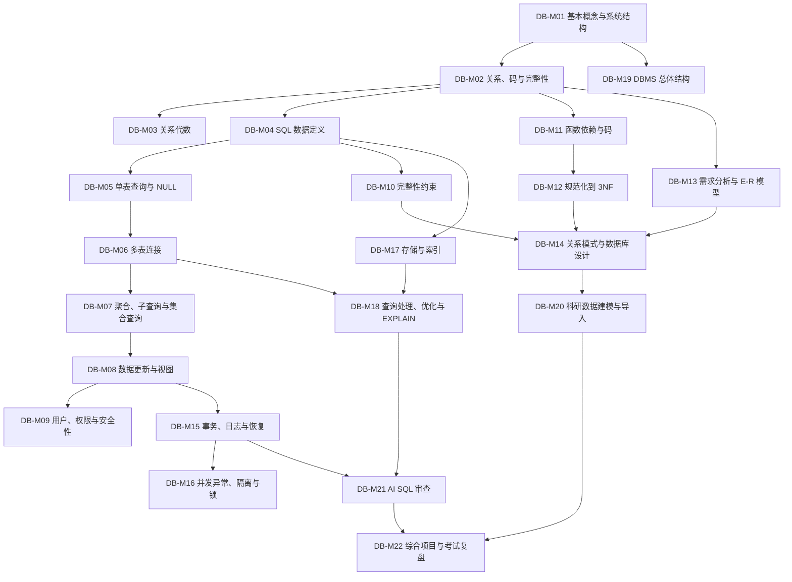

# 数据库系统学习大地图

## 当前位置与进度

| 项目 | 状态 | 证据 |
|---|---|---|
| MySQL 8.4 与 DBeaver 实验环境 | 已完成 | 已连接 `course_lab`，执行过 `CREATE TABLE`、`INSERT`、`SELECT` |
| 数据库概念与原理 | 未测 | 尚无独立解释证据 |
| SQL 独立编写能力 | 未测 | 已跟随示例运行，不等同于独立掌握 |
| 数据库设计、事务与索引 | 未开始 | - |
| 科研数据管理与 AI SQL 审查 | 未开始 | - |

当前位置：`DB-M01 数据库、DBMS 与系统结构`。

开局已解锁：`DB-M01`。环境已经可用，因此不再安排安装课程。

## 目标范围

### 完成本地图后应能做到

1. 用自己的话解释数据库、数据库管理系统、关系模型、模式、表、元组、属性、码和完整性。
2. 独立编写常见的建表、增删改查、连接、聚合、子查询和视图 SQL。
3. 根据需求画出简单 E-R 图，并转换为满足 3NF 的关系模式。
4. 解释事务的 ACID、并发异常、隔离、锁、日志、恢复和索引的实际作用。
5. 为小型科研项目设计数据表、导入 CSV、记录元数据并完成可复现查询。
6. 审查 AI 生成的 SQL，发现错误作用域、无条件更新或删除、错误连接、重复计数、NULL 误用和缺少事务等问题。

### 不以精通为目标

- 不实现数据库内核、B+ 树、查询优化器或并发控制算法。
- 不学习生产级集群运维、分布式数据库、内存数据库和区块链数据库。
- 不把 SQL Server 2005、Oracle 11g、旧版 MySQL Workbench 的具体界面操作作为主线。
- 关系演算、4NF/5NF、嵌入式 SQL、ODBC/JDBC、存储过程和触发器只在考纲要求时深入。

## 材料与采用原则

### 主教材 A

《数据库系统概论（第 5 版）》，王珊、萨师煊，高等教育出版社。

- 文件位置：`C:/Users/10251/Downloads/数据库系统概论（第5版） (王珊 萨师煊) (z-library.sk, 1lib.sk, z-lib.sk).pdf`
- 用途：概念定义、关系模型、SQL、规范化、设计、查询处理、恢复、并发控制和 DBMS 结构的主依据。
- 采用范围：第 1-12 章为课程主体；第 13-16 章不进入当前主线。

### 课程教材 B

《数据库原理及技术》，钱雪忠、王燕玲、林挺，清华大学出版社，2011。

- 文件位置：`D:/桌面/大三学习/数据库原理及技术 -- 钱雪忠,王燕玲,林挺编著 -- 2011 -- 北京清华大学出版社.pdf`
- 用途：核对学校课程编排、考试术语、并发与恢复的组合方式，以及实验清单。
- 采用范围：第 1-6 章和第 10 章实验目录作为参考。
- 不采用为主线：第 7-9 章围绕 SQL Server 2005、Oracle 11g、MySQL Workbench 5.2，版本和界面已过时；其中可迁移的概念改用当前 MySQL 8.4 实验实现。

### 实验环境

- MySQL Community Server 8.4
- DBeaver Community 26.2
- 数据库：`course_lab`
- 日常账户：`student`

## 两本教材的内容裁决

| 主题 | 主教材 A | 课程教材 B | 地图决定 |
|---|---|---|---|
| 基本概念与系统结构 | 第 1 章 | 第 1 章 | 以 A 为准，B 用于核对课程术语 |
| 关系模型与关系代数 | 第 2 章 | 第 2 章 | 以 A 为准；关系演算列为支线 |
| SQL | 第 3 章 | 第 3 章 | 以 A 为准，在 MySQL 8.4 中实验 |
| 安全性与完整性 | 第 4、5 章 | 第 5 章前半 | 以 A 的分章结构为准 |
| 规范化理论 | 第 6 章 | 第 4 章 | 以 A 为准；主线止于 3NF，BCNF 为考试增强 |
| 数据库设计 | 第 7 章 | 第 6 章 | 以 A 为准，吸收 B 的需求分析顺序 |
| 数据库编程 | 第 8 章 | 第 3.7、7、8 章 | 支线；只保留理解应用如何连接数据库 |
| 查询处理与优化 | 第 9 章 | 零散于技术篇 | 学概念、索引与 `EXPLAIN`，不推导实现算法 |
| 恢复与事务 | 第 10 章 | 第 5.4 节 | 主线，A 为准 |
| 并发控制 | 第 11 章 | 第 5.3 节 | 主线，A 为准 |
| DBMS 结构 | 第 12 章 | 第 1 章零散内容 | 选学概览 |
| 新技术 | 第 13-16 章 | 无对应主线 | 当前跳过，不计为掌握 |
| 产品操作 | 无固定产品主线 | 第 7-9 章 | 跳过旧产品界面，统一迁移到 MySQL 8.4 |

## 区域总览

| 区域 | 主题 | 据点 | 目标权重 | 预计投入 | 状态 |
|---|---|---|---|---:|---|
| R1 | 数据库与关系基础 | DB-M01 - DB-M03 | 必学 | 6-8 小时 | 未开始 |
| R2 | SQL 核心能力 | DB-M04 - DB-M08 | 必学 | 10-13 小时 | 未开始 |
| R3 | 安全性与完整性 | DB-M09 - DB-M10 | 必学但从简 | 3-4 小时 | 未开始 |
| R4 | 规范化与数据库设计 | DB-M11 - DB-M14 | 必学 | 8-10 小时 | 未开始 |
| R5 | 事务、并发、存储与优化 | DB-M15 - DB-M19 | 主线加选学 | 8-11 小时 | 未开始 |
| R6 | 科研应用与 AI 审查 | DB-M20 - DB-M22 | 必学 | 6-8 小时 | 未开始 |

主线预计投入约 35-45 小时。支线不计入主线完成条件。

## 外部前置

| 前置 | 要求 | 使用位置 | 当前状态 |
|---|---|---|---|
| 基础计算机操作 | 会打开 DBeaver、保存 SQL 脚本 | DB-M04 起 | 已具备 |
| 集合与逻辑的直觉 | 理解集合、交集、并集、条件真假 | DB-M03、DB-M11 | 未测；需要时就地补充 |
| 基础代数 | 能看懂简单表达式与变量 | DB-M03、DB-M11 | 未测；要求很低 |
| 编程 | 主线不要求 | DB-S03 数据库编程支线 | 非主线前置 |
| 统计学 | 只需理解均值、计数和分组 | DB-M07、DB-M20 | 未测；需要时就地补充 |

## 依赖图

## 推荐路线

`DB-M01 → M02 → M04 → M05 → M06 → M07 → M08 → M10 → M03 → M11 → M12 → M13 → M14 → M15 → M16 → M17 → M18 → M09 → M19 → M20 → M21 → M22`

与教材目录不同的理由：

1. 先尽早学习 SQL，建立可操作的直觉，再返回关系代数与规范化，降低纯符号学习的门槛。
2. 完整性约束放在 SQL 之后，让主码、外码和检查约束都能立即实验。
3. 安全性只保留用户、角色、授权与回收，放到已有完整 SQL 能力之后。
4. 查询优化安排在索引和连接之后，直接使用 `EXPLAIN` 观察，而不学习优化器实现。
5. 科研与 AI 审查放在末段整合，但从 SQL 阶段起就持续采用“先查询、再修改、后验证”的习惯。

## 据点明细

### R1 数据库与关系基础

| ID | 主题与材料位置 | 必要前置 | 通关条件 | 权重 | 预计 | 状态 | 评估 |
|---|---|---|---|---|---:|---|---|
| DB-M01 | 数据库、DBMS、数据模型、三级模式与二级映像。A 第 1 章；B 第 1 章 | 无 | 不看资料解释 MySQL、DBeaver、数据库、模式和表之间的关系；说明数据独立性的直觉 | 主线 | 2 小时 | 未开始 | 未测 |
| DB-M02 | 关系、元组、属性、域、关系模式、候选码/主码/外码、三类完整性。A 2.1-2.3；B 2.1-2.3 | DB-M01 | 给定三张表找出候选码、主码和外码，并判断至少 3 个完整性错误 | 主线 | 2 小时 | 未开始 | 未测 |
| DB-M03 | 选择、投影、连接、并、差、笛卡尔积及其 SQL 对应。A 2.4；B 2.4 | DB-M02 | 把 4 个自然语言查询分别写成关系代数和 SQL，并解释连接与笛卡尔积的区别 | 主线 | 2-4 小时 | 未开始 | 未测 |

### R2 SQL 核心能力

| ID | 主题与材料位置 | 必要前置 | 通关条件 | 权重 | 预计 | 状态 | 评估 |
|---|---|---|---|---|---:|---|---|
| DB-M04 | SQL 基本概念、数据类型、`CREATE/ALTER/DROP`、表与索引定义。A 3.1-3.3；B 3.1-3.2 | DB-M02 | 独立创建学生、课程、选课三张表，选择合适类型并设置主外码 | 主线 | 2 小时 | 未开始 | 未测 |
| DB-M05 | 单表 `SELECT`、`WHERE`、表达式、排序、模式匹配、NULL。A 3.4.1、3.5；B 3.3.1-3.3.6 | DB-M04 | 独立完成 8 个单表查询，正确区分 `NULL`、空串和 0 | 主线 | 2-3 小时 | 未开始 | 未测 |
| DB-M06 | 内连接、外连接、自连接、连接条件与重复行。A 3.4.2；B 3.3.7 | DB-M05 | 用三表连接回答成绩问题，并预测连接前后行数变化及重复来源 | 主线 | 2-3 小时 | 未开始 | 未测 |
| DB-M07 | 聚合函数、`GROUP BY/HAVING`、嵌套查询、集合查询。A 3.4.3-3.4.5；B 3.3.4、3.3.8-3.3.10 | DB-M06 | 完成分组统计、相关子查询和集合查询；解释 `WHERE` 与 `HAVING` 的差别 | 主线 | 3 小时 | 未开始 | 未测 |
| DB-M08 | `INSERT/UPDATE/DELETE`、视图、修改前验证。A 3.5-3.7；B 3.4-3.5 | DB-M07 | 在事务中完成一次批量修改，修改前后用 `SELECT` 和 `COUNT(*)` 验证；建立一个视图 | 主线 | 2-3 小时 | 未开始 | 未测 |

### R3 安全性与完整性

| ID | 主题与材料位置 | 必要前置 | 通关条件 | 权重 | 预计 | 状态 | 评估 |
|---|---|---|---|---|---:|---|---|
| DB-M09 | 身份鉴别、用户/角色、授权与回收、视图保护、审计概念。A 第 4 章；B 5.1、3.6 | DB-M08 | 说明 `root` 与 `student` 的权限差别，能读懂并编写基本 `GRANT/REVOKE` | 主线从简 | 1-2 小时 | 未开始 | 未测 |
| DB-M10 | 实体、参照和用户定义完整性；`PRIMARY KEY/FOREIGN KEY/UNIQUE/NOT NULL/CHECK`。A 第 5 章；B 5.2 | DB-M04 | 为三表模型写出完整约束，并通过故意插入错误数据观察拒绝结果 | 主线 | 2 小时 | 未开始 | 未测 |

### R4 规范化与数据库设计

| ID | 主题与材料位置 | 必要前置 | 通关条件 | 权重 | 预计 | 状态 | 评估 |
|---|---|---|---|---|---:|---|---|
| DB-M11 | 数据冗余、更新异常、函数依赖、平凡/非平凡依赖、属性闭包与码。A 6.1-6.2.3；B 4.1-4.2.3 | DB-M02 | 从业务规则写出函数依赖，求一个属性集闭包并找出候选码 | 主线 | 2-3 小时 | 未开始 | 未测 |
| DB-M12 | 1NF、2NF、3NF；BCNF 概念；无损连接与保持依赖的直觉。A 6.2-6.4；B 4.2 | DB-M11 | 把一张含重复与异常的表分解到 3NF，并说明分解消除了什么异常 | 主线 | 2-3 小时 | 未开始 | 未测 |
| DB-M13 | 需求分析、数据字典、实体、属性、联系、基数和 E-R 图。A 7.1-7.3；B 6.1-6.3 | DB-M02 | 根据一个科研或教学场景画出 E-R 图，正确表达 1:1、1:N、M:N | 主线 | 2 小时 | 未开始 | 未测 |
| DB-M14 | E-R 图到关系模式、逻辑优化、物理设计概念、实施与维护。A 7.4-7.6；B 6.4-6.7 | DB-M10、DB-M12、DB-M13 | 把 E-R 图转成带约束的 MySQL 表，说明每张表、每个码和每条关系的依据 | 主线 | 2-3 小时 | 未开始 | 未测 |

### R5 事务、并发、存储与优化

| ID | 主题与材料位置 | 必要前置 | 通关条件 | 权重 | 预计 | 状态 | 评估 |
|---|---|---|---|---|---:|---|---|
| DB-M15 | 事务、ACID、故障、日志、检查点、恢复策略。A 第 10 章；B 5.4 | DB-M08 | 用 `START TRANSACTION/COMMIT/ROLLBACK` 演示成功与撤销；解释日志为何能恢复 | 主线 | 2-3 小时 | 未开始 | 未测 |
| DB-M16 | 丢失修改、脏读、不可重复读、幻读、可串行化、封锁与死锁。A 第 11 章；B 5.3 | DB-M15 | 判断 4 个并发场景中的异常，并说明隔离级别或锁如何改变结果 | 主线 | 2-3 小时 | 未开始 | 未测 |
| DB-M17 | 文件、页、记录、索引、B+ 树与哈希索引的用途和代价。A 第 9 章相关内容及索引概念；B 实验 7-8 仅作问题参考 | DB-M04 | 能判断三个查询是否值得建索引，并说明索引为何会增加写入和空间成本 | 主线从简 | 1-2 小时 | 未开始 | 未测 |
| DB-M18 | 查询处理步骤、连接策略、逻辑/物理优化、`EXPLAIN`。A 第 9 章；B 无系统对应 | DB-M06、DB-M17 | 对两个查询运行 `EXPLAIN`，识别全表扫描、索引访问和连接顺序 | 主线从简 | 2 小时 | 未开始 | 未测 |
| DB-M19 | DBMS 的功能、进程/线程、存储管理、缓冲区与语言处理层概览。A 第 12 章 | DB-M01 | 画出从 DBeaver 提交 SQL 到 MySQL 返回结果的高层流程图 | 选学 | 1-2 小时 | 未开始 | 未测 |

### R6 科研应用与 AI 审查

| ID | 主题与材料位置 | 必要前置 | 通关条件 | 权重 | 预计 | 状态 | 评估 |
|---|---|---|---|---|---:|---|---|
| DB-M20 | 科研数据建模：实验、样本、测量、单位、时间、批次、来源、缺失值；CSV 导入导出 | DB-M14 | 为一个真实或模拟科研问题设计至少 3 张表，导入数据并完成分组统计 | 主线 | 2-3 小时 | 未开始 | 未测 |
| DB-M21 | AI SQL 审查：作用域、危险语句、`WHERE`、连接基数、NULL、重复、事务、验证与可回滚性 | DB-M15、DB-M18 | 审查 5 条 AI 生成 SQL，至少发现并修正 4 类真实问题 | 主线 | 2 小时 | 未开始 | 未测 |
| DB-M22 | 综合项目与考试复盘：设计、建表、查询、事务、索引、口头解释与书面题 | DB-M20、DB-M21 | 独立完成小型数据库；闭卷回答核心概念；完成一套覆盖 SQL、规范化、设计和事务的模拟题 | 主线 | 2-3 小时 | 未开始 | 未测 |

## 支线

| ID | 主题 | 进入条件 | 收益 | 何时选择 | 状态 |
|---|---|---|---|---|---|
| DB-S01 | 元组关系演算、域关系演算、ALPHA 与 QBE。A 2.5；B 2.5 | DB-M03 | 覆盖理论型考试题 | 考纲明确要求关系演算时 | 未开始 |
| DB-S02 | BCNF 深入、4NF、多值依赖、模式分解算法。A 6.2.6-6.4；B 4.2.7-4.3 | DB-M12 | 覆盖高难规范化题 | 期末试卷含 BCNF/4NF 或无损分解算法时 | 未开始 |
| DB-S03 | 过程化 SQL、存储过程、函数、游标、触发器、应用连接概念。A 第 8 章；B 3.7、实验 9-10 | DB-M08 | 看懂数据库应用如何调用 DBMS | 考试或科研项目明确使用时 | 未开始 |
| DB-S04 | DBMS 新技术概览。A 第 13-16 章 | DB-M19 | 建立大数据、NoSQL、内存数据库和数据仓库词汇表 | 课程报告或研究方向需要时 | 未开始 |

## 实验路线

课程教材第 10 章的 15 个实验不照搬旧产品界面，重组为以下 MySQL 8.4 实验：

| 实验 ID | 实验 | 对应课程教材 | 对应据点 | 产出 |
|---|---|---|---|---|
| DB-L01 | 环境、数据库、模式与基本对象观察 | 实验 1 | DB-M01、M04 | 环境说明与对象清单 |
| DB-L02 | 建表、视图与增删改查 | 实验 2-5 | DB-M04 - M08 | 可重复执行的 SQL 脚本 |
| DB-L03 | 主外码、检查约束与错误数据测试 | 实验 7、12 | DB-M10 | 约束测试记录 |
| DB-L04 | 用户、授权与回收 | 实验 11 | DB-M09 | `student` 权限说明 |
| DB-L05 | 事务、并发异常和回滚 | 实验 13 | DB-M15、M16 | 双连接实验记录 |
| DB-L06 | 索引与 `EXPLAIN` | 实验 7-8 | DB-M17、M18 | 查询计划对比 |
| DB-L07 | 备份与恢复基础 | 实验 14 | DB-M15 | 小型数据库导出与恢复记录 |
| DB-L08 | 科研数据小项目 | 实验 15 | DB-M20 - M22 | 数据库、SQL、E-R 图与审查说明 |

课程教材实验 6（嵌入式 SQL）、实验 9（存储过程）和实验 10（触发器）默认不进入主线；考纲要求时分别进入 DB-S03。

## 主线完成标准

以下证据全部成立才算主线完成：

1. 不依赖示例独立写出建表、增删改查、连接、聚合和子查询。
2. 独立把一个业务或科研场景画成 E-R 图并实现为满足 3NF 的表。
3. 能解释主码、外码、完整性、函数依赖、事务 ACID、并发异常和索引。
4. 完成 DB-L02、L03、L05、L06、L08。
5. 能审查 AI 生成的 SQL，并用预览、计数、事务和回滚降低错误后果。
6. 完成一套与实际课程考纲一致的模拟题；若考纲尚未提供，该项保持待补，不提前宣称通过。

## AI SQL 审查基线

每次让 AI 修改数据库时，至少核对：

1. 当前连接、数据库、模式和表是否正确。
2. `UPDATE`、`DELETE` 是否有正确的 `WHERE`。
3. 是否出现 `DROP`、`TRUNCATE` 或覆盖式导入。
4. `JOIN` 的键和基数是否正确，行数是否被意外放大。
5. `NULL`、空字符串、0 和缺失值是否被混淆。
6. 聚合前后粒度是否一致，`COUNT(*)` 与 `COUNT(column)` 是否选对。
7. 多步修改是否位于事务中，失败能否 `ROLLBACK`。
8. 修改前是否用等价 `SELECT` 预览，修改后是否核对行数和抽样结果。
9. 数据类型、单位、日期、字符集和小数精度是否符合科研语义。
10. 查询慢时是否先看 `EXPLAIN`，而不是盲目创建大量索引。

## 限制与待补

- 当前没有学校正式教学大纲、历年试卷和考试题型，因此考试权重按两本教材的共同核心与用户目标裁剪；取得考纲后应只调整受影响据点，不重建地图。
- 两份 PDF 都是扫描版，地图中的章节与页码依据目录页核对；需要逐节教学时再打开对应正文页。
- 课程教材的 SQL Server 2005、Oracle 11g 和 MySQL Workbench 5.2 操作不直接复现，所有实验统一迁移到当前 MySQL 8.4 与 DBeaver。

## 目标变化记录

| 日期 | 变化 | 影响 |
|---|---|---|
| 2026-09-23 | 建立地图；目标为本科考试、科研基础和 AI 流程可读性，不追求计算机专业级精通 | 以主教材 A 为主，课程教材 B 只作课程与实验参考；压缩内核、新技术和旧产品操作 |
