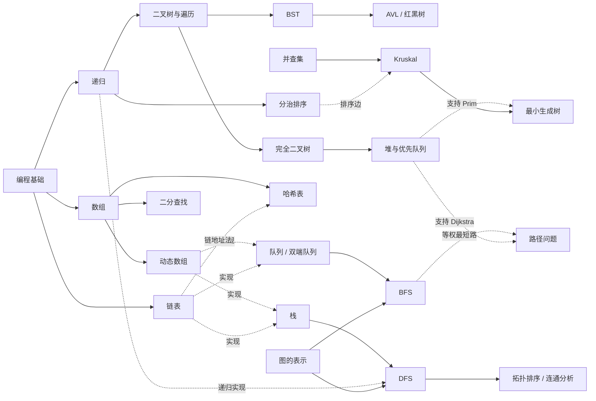
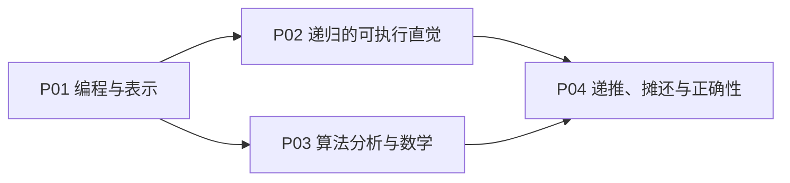
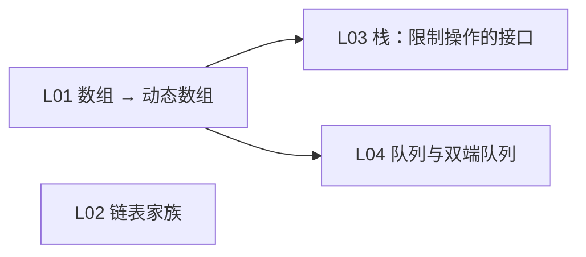
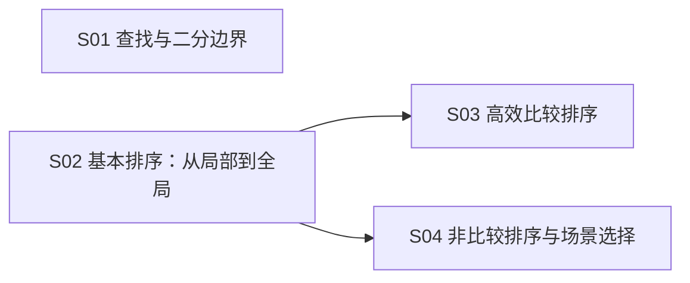
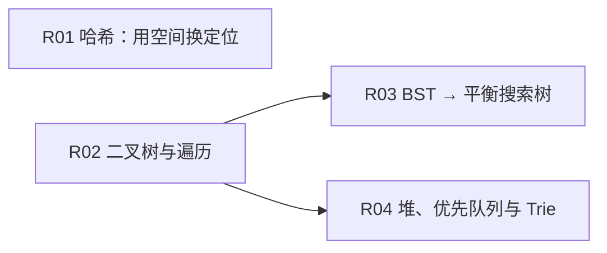
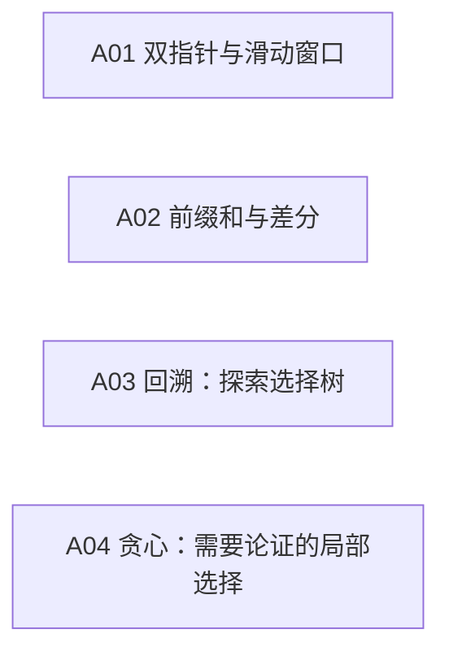
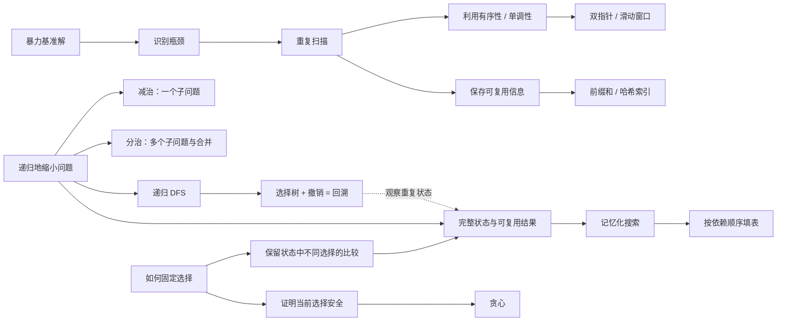
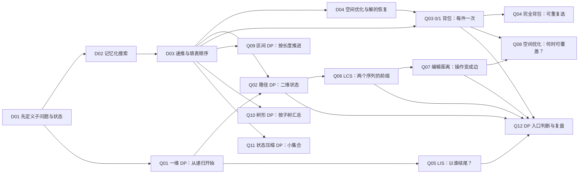

# 数据结构与算法学习大地图

## 我现在在哪里

| 项目 | 当前记录 |
| --- | --- |
| 学习背景 | 以前完整学过一次数据结构，也接触过 C、C++、Python；保留少量概念，但理解联系和独立实现能力不足 |
| 当前据点 | **P01 编程与表示**，尚未开始本轮学习 |
| 当前可进入 | 先做编程基础地图 B00；达到 C02 或 PY02 后进入 P01，确认基础后 P02 与 P03 可并行 |
| 已有掌握证据 | 尚未记录；已有印象不自动记为通过 |
| 下一步 | 完成 B00 基线程序；随后用容器统计小程序恢复 P01，再画一次递归调用栈 |
| 长期目标 | 能从问题约束选择结构和算法，独立实现、验证、分析，并把它们用于真实小项目 |

本文件只负责数据结构、算法思想、问题建模和综合应用。C、C++、Python 的语言基础、调试、测试和独立项目能力由 [编程基础与独立开发大地图](../计算机基础/6-1_计算机基础_大地图.md) 维护，两图共享实际代码证据但不重复设置课程节点。每次按必要前置选择下一节点；阶段编号表示推荐路线，不是强制关卡。详细学习问答与解题过程放在相应学习档案中，通关后将证据链接填回本地图。

## 导航

- [学习深度与进度标记](#学习深度与进度标记)
- [前置基础与使用位置](#前置基础与使用位置)
- [八个阶段与进度总表](#八个阶段与进度总表)
- [核心知识依赖网络](#核心知识依赖网络)
- [算法思想主线](#算法思想主线)
- [动态规划专区](#动态规划专区)
- [操作代价与选择](#操作代价与选择)
- [算法题模式识别](#算法题模式识别)
- [能力升级与练习](#能力升级与练习)
- [教材索引](#教材索引)
- [复习与下一步](#复习与下一步)

图表采用 Mermaid，适合在 Obsidian 等支持 Mermaid 的 Markdown 阅读器中查看。各图只画相关的结构关系，完整前置见节点条目。

## 学习深度与进度标记

| 标记 | 学习要求 |
| --- | --- |
| 🟢 熟练 | 能解释、分析复杂度、识别使用条件并解决典型问题 |
| 🟡 理解 | 能跟踪一个例子，解释思想、适用条件和主要代价 |
| 🔵 第二阶段 | 后续支线；首轮主线不以完成它为前提 |
| 🔴 难点 | 容易出错，需用例子解释边界或正确性；可与其他深度标记并存 |
| 手写 | 先用 Python 从零写核心逻辑，再按节点要求迁移到 C 或 C++；不以现成容器替代正在学习的结构 |
| C/C++ 强化 | 选代表结构用 C 观察内存与链接，用 C++ 练习泛型容器、RAII 和工程接口 |

**学习深度和个人进度分开记录。** 节点的教学状态使用“未开始 / 进行中 / 通过 / 待复习 / 跳过”；评估使用“未测 / 红 / 黄 / 绿”。只有独立表现支持通关时，才勾选节点的通过框，并填写证据。跳过不等于通过。

## 前置基础与使用位置

| 已有基础或补充入口 | 首次使用 | 后续作用 |
| --- | --- | --- |
| 编程基础地图 C02 或 PY02：变量、函数、循环和常用容器 | P01 | 所有实现与测试 |
| 编程基础地图 C03/C05：指针、地址与生命周期 | L02 | 链表、树、哈希和图的 C 强化；不阻断 Python 主线 |
| 编程基础地图 CPP02：STL 容器 | S03 起 | C++ 算法题与项目实现；可与 Stage 1 同步补齐 |
| 递归终止、调用栈与返回值 | P02 | 树遍历、分治、回溯与记忆化 |
| log、求和、指数增长 | P03 | 二分、递归成本与状态空间规模 |
| 不变式、归纳与基本递推 | P04 | 排序正确性、贪心论证与 DP 转移 |

这些是课程中的补缺入口，不要求先重学一整门数学或程序设计课程。达到 C02 或 PY02 即可进入 P01；C03/C05 和 CPP02 只在对应语言强化节点成为必要前置。

## 八个阶段与进度总表

| 阶段 | 主线节点 | 练习预算 | 参考节奏 | 教学状态 | 评估 |
| --- | --- | --- | --- | --- | --- |
| Stage 0 重新启动 | [P01](#p01)、[P02](#p02)、[P03](#p03)、[P04](#p04) | 6–10 道 | 2–3 周 | 未开始 | 未测 |
| Stage 1 线性结构 | [L01](#l01)、[L02](#l02)、[L03](#l03)、[L04](#l04) | 12–18 道 | 3–5 周 | 未开始 | 未测 |
| Stage 2 有序性与搜索 | [S01](#s01)、[S02](#s02)、[S03](#s03)、[S04](#s04) | 14–20 道 | 3–5 周 | 未开始 | 未测 |
| Stage 3 哈希与树 | [R01](#r01)、[R02](#r02)、[R03](#r03)、[R04](#r04) | 14–20 道 | 4–6 周 | 未开始 | 未测 |
| Stage 4 图与关系 | [G01](#g01)、[G02](#g02)、[G03](#g03)、[G04](#g04) | 14–20 道 | 4–6 周 | 未开始 | 未测 |
| Stage 5 设计工具箱 | [A01](#a01)、[A02](#a02)、[A03](#a03)、[A04](#a04) | 18–26 道 | 4–6 周 | 未开始 | 未测 |
| Stage 6 动态规划 | [D01](#d01)、[D02](#d02)、[D03](#d03)、[D04](#d04) | 24–36 道 | 5–9 周 | 未开始 | 未测 |
| Stage 7 组合与进阶 | [X01](#x01)、[X02](#x02)、[X03](#x03)、[X04](#x04) | 12–20 道 | 4–8 周 | 未开始 | 未测 |

题量包含节点练习和阶段变式，作为练习预算，不作为通关分数。与语言地图合计每周 8–10 小时时，前期建议约 4 小时给语言/项目、4–6 小时给本图；达到 CPP02 后再逐步提高算法实践比重。整体按练习证据调整，不用“刷完题量”代替通关。

## 核心知识依赖网络

下图的实线表示前置或结构推导，虚线表示一种实现或应用。数组和链表都可实现栈、队列；堆依赖完全二叉树和堆序性质，不依赖 BST。动态规划也不要求先学完全部图算法。

先恢复线性结构，能尽早练习可观察的操作成本；把有序性提前，方便比较二分、BST 和哈希；图算法在栈、队列和堆之后学习。算法思想和 DP 则按各自前置反复回访，教材章节只作阅读入口。

## Stage 0 重新启动

| 阶段安排 | 内容 |
| --- | --- |
| 入口 | 无；复用已有 Python / C 基础 |
| 核心 | 变量、容器、递归、数量级、正确性 |
| 必须实现 | 递归求和；计数版线性查找 |
| 推荐练习 | 6–10 道；参考 2–3 周 |
| 达标 | 闭卷解释调用栈，分析三段循环 |
| 后续入口 | P01–P04 → Stage 1 |
| 阅读 | M 第1、2、4章；H 第1–3章 |

### P01 编程与表示

🟢 熟练 · 主线

**学习内容**

- 变量、函数、循环、类与对象
- Python list / tuple / dict / set
- C 指针、引用、节点与对象生命周期

- **必要前置**：已有编程基础；可从本节点开始
- **增强性前置**：无额外必需内容
- **阅读入口**：M 第1章；H 第3章；C 指针按已有基础补缺
- **时间估计**：1–3 小时；按练习反馈调整。综合节点可拆成多次会话。
- **通关标准**：写一个容器统计程序；画出两个引用指向同一对象的图。
- **教学状态**：未开始
- **评估**：未测
- **证据 / 学习档案**：待记录
- [ ] 已独立达到本节点通关标准

### P02 递归的可执行直觉

🟢 熟练 · 🔴 难点 · 手写 · 主线

**学习内容**

- 终止条件 → 缩小问题 → 返回结果
- 画调用栈；参数、局部变量、返回值
- 递归与迭代是实现选择，计入栈空间

- **必要前置**：[P01](#p01)
- **增强性前置**：无额外必需内容
- **阅读入口**：M 第4.2–4.3节；H 第2.2节
- **时间估计**：1–3 小时；按练习反馈调整。综合节点可拆成多次会话。
- **通关标准**：不用运行即可跟踪三层递归，并改写为显式栈或循环。
- **教学状态**：未开始
- **评估**：未测
- **证据 / 学习档案**：待记录
- [ ] 已独立达到本节点通关标准

### P03 算法分析与数学

🟢 熟练 · 🔴 难点 · 主线

**学习内容**

- log、求和、指数增长；时间 / 空间
- Big-O 上界、Ω 下界、Θ 紧确界
- 最好 / 平均 / 最坏 ≠ O / Ω / Θ

- **必要前置**：[P01](#p01)
- **增强性前置**：无额外必需内容
- **阅读入口**：M 第2章；H 第2章；数学与渐近界按节点补充
- **时间估计**：1–3 小时；按练习反馈调整。综合节点可拆成多次会话。
- **通关标准**：给嵌套循环和二分过程计数；说明平均情况的输入假设。
- **教学状态**：未开始
- **评估**：未测
- **证据 / 学习档案**：待记录
- [ ] 已独立达到本节点通关标准

### P04 递推、摊还与正确性

🟢 熟练 · 🔴 难点 · 主线

**学习内容**

- T(n)=T(n/2)+O(1) → O(log n)
- 2T(n/2)+O(n) → O(n log n)
- 倍增扩容的总成本；不变式与归纳

- **必要前置**：[P02](#p02)、[P03](#p03)
- **增强性前置**：无额外必需内容
- **阅读入口**：M 第2章、第4章及第8.2节；递推与正确性按节点补充
- **时间估计**：1–3 小时；按练习反馈调整。综合节点可拆成多次会话。
- **通关标准**：解释倍增追加为何摊还 O(1)；用不变式说明循环为何正确。
- **教学状态**：未开始
- **评估**：未测
- **证据 / 学习档案**：待记录
- [ ] 已独立达到本节点通关标准

## Stage 1 线性结构

| 阶段安排 | 内容 |
| --- | --- |
| 入口 | P01 编程；P03 复杂度 |
| 核心 | 数组、链表、栈、队列与内存布局 |
| 必须实现 | 动态数组、单/双链表、栈、循环队列 |
| 推荐练习 | 12–18 道；参考 3–5 周 |
| 达标 | 处理空表与首尾变更，解释操作代价 |
| 后续入口 | L01–L04 → Stage 2 / Stage 3 |
| 阅读 | M 第3章；H 第4、5章 |

### L01 数组 → 动态数组

🟢 熟练 · 手写 · 主线

**学习内容**

- 连续槽位；索引与元素移动
- 长度 / 容量分离；倍增、复制、追加
- Python list 是可增长的对象引用数组

- **必要前置**：[P01](#p01)、[P03](#p03)
- **增强性前置**：无额外必需内容
- **阅读入口**：H 第4.1、4.3节；M 第8.2节复习 Python 列表
- **时间估计**：1–3 小时；按练习反馈调整。综合节点可拆成多次会话。
- **通关标准**：用预分配槽位模拟容量，触发扩容；区分单次与摊还代价。
- **教学状态**：未开始
- **评估**：未测
- **证据 / 学习档案**：待记录
- [ ] 已独立达到本节点通关标准

### L02 链表家族

🟢 熟练 · 🔴 难点 · 手写 · C强化 · 主线

**学习内容**

- 单链表 / 双链表：节点与链接
- 头尾、前驱、哨兵；插入与删除
- 循环链表（理解）：闭环与终止条件

- **必要前置**：[P01](#p01)、[P03](#p03)
- **增强性前置**：无额外必需内容
- **阅读入口**：M 第3章；H 第4、5章
- **时间估计**：1–3 小时；按练习反馈调整。综合节点可拆成多次会话。
- **通关标准**：独立实现单/双链表；验证空表、唯一节点和头尾操作。循环链表理解即可。
- **教学状态**：未开始
- **评估**：未测
- **证据 / 学习档案**：待记录
- [ ] 已独立达到本节点通关标准

### L03 栈：限制操作的接口

🟢 熟练 · 手写 · 主线

**学习内容**

- 后进先出；push / pop / peek
- 可用数组，也可用链表实现
- 括号匹配、表达式、撤销、调用栈

- **必要前置**：[L01](#l01)
- **增强性前置**：L02：比较链式栈与数组栈
- **阅读入口**：M 第3章；H 第4、5章
- **时间估计**：1–3 小时；按练习反馈调整。综合节点可拆成多次会话。
- **通关标准**：用自己的栈检查括号；解释每个符号何时入栈和出栈。链表是替代实现。
- **教学状态**：未开始
- **评估**：未测
- **证据 / 学习档案**：待记录
- [ ] 已独立达到本节点通关标准

### L04 队列与双端队列

🟢 熟练 · 🔴 难点 · 手写 · 主线

**学习内容**

- 先进先出；循环数组 / 链式队列
- 双端队列两端可进出；容量与回绕
- 任务调度、BFS；日常用 deque

- **必要前置**：[L01](#l01)
- **增强性前置**：L02：比较链式队列与循环队列
- **阅读入口**：M 第3章；H 第4、5章
- **时间估计**：1–3 小时；按练习反馈调整。综合节点可拆成多次会话。
- **通关标准**：写循环队列，区分满与空；双端队列会用库并解释接口。
- **教学状态**：未开始
- **评估**：未测
- **证据 / 学习档案**：待记录
- [ ] 已独立达到本节点通关标准

## Stage 2 有序性与搜索

| 阶段安排 | 内容 |
| --- | --- |
| 入口 | L01 数组；P02 递归；P03 分析 |
| 核心 | 二分、排序、分治与选择策略 |
| 必须实现 | 二分；冒泡/选择/插入/归并/快排 |
| 推荐练习 | 14–20 道；参考 3–5 周 |
| 达标 | 独立写边界查找，比较稳定性和空间 |
| 后续入口 | S01–S03 → Stage 3；S04 可稍后 |
| 阅读 | M 第5章；H 第10–12章 |

### S01 查找与二分边界

🟢 熟练 · 🔴 难点 · 手写 · 主线

**学习内容**

- 线性查找：O(n)；二分：O(log n)
- 前提：可索引的有序序列 / 单调判定
- 区间不变式；首个 ≥ x、首个 > x

- **必要前置**：[L01](#l01)、[P03](#p03)
- **增强性前置**：无额外必需内容
- **阅读入口**：M 第5章；H 第10–12章
- **时间估计**：1–3 小时；按练习反馈调整。综合节点可拆成多次会话。
- **通关标准**：统一使用 [lo, hi)；通过空数组、重复值、两端越界目标。
- **教学状态**：未开始
- **评估**：未测
- **证据 / 学习档案**：待记录
- [ ] 已独立达到本节点通关标准

### S02 基本排序：从局部到全局

🟢 熟练 · 手写 · 主线

**学习内容**

- 冒泡：相邻交换；选择：固定最小值
- 插入：维护有序前缀；稳定性观察
- 以小数组跟踪元素位置，建立不变式

- **必要前置**：[L01](#l01)、[P03](#p03)
- **增强性前置**：无额外必需内容
- **阅读入口**：M 第5章；H 第10–12章
- **时间估计**：1–3 小时；按练习反馈调整。综合节点可拆成多次会话。
- **通关标准**：三种均独立实现一次；用带原始序号的重复键验证稳定性。
- **教学状态**：未开始
- **评估**：未测
- **证据 / 学习档案**：待记录
- [ ] 已独立达到本节点通关标准

### S03 高效比较排序

🟢 熟练 · 🔴 难点 · 手写 · 主线

**学习内容**

- 归并：分解、递归、合并
- 快速排序：划分、子问题；随机枢轴
- 堆排序见 R04；比较排序下界直觉

- **必要前置**：[S02](#s02)、[P02](#p02)
- **增强性前置**：无额外必需内容
- **阅读入口**：M 第5章；H 第10–12章
- **时间估计**：1–3 小时；按练习反馈调整。综合节点可拆成多次会话。
- **通关标准**：写归并和原地划分快排；解释快排最坏 O(n^2) 及递归栈。
- **教学状态**：未开始
- **评估**：未测
- **证据 / 学习档案**：待记录
- [ ] 已独立达到本节点通关标准

### S04 非比较排序与场景选择

🟡 理解 · 主线

**学习内容**

- 计数：小整数值域；基数：逐位稳定排
- 桶：利用分布；希尔排序理解即可
- 比较排序 / 非比较排序的输入假设

- **必要前置**：[S02](#s02)
- **增强性前置**：无额外必需内容
- **阅读入口**：M 第5章；H 第10–12章
- **时间估计**：1–3 小时；按练习反馈调整。综合节点可拆成多次会话。
- **通关标准**：按值域、分布、稳定性和内存选择；非比较排序会跟踪过程即可。
- **教学状态**：未开始
- **评估**：未测
- **证据 / 学习档案**：待记录
- [ ] 已独立达到本节点通关标准

## Stage 3 哈希与树

| 阶段安排 | 内容 |
| --- | --- |
| 入口 | L01–L04；P02 递归 |
| 核心 | 哈希、遍历、BST、平衡、堆、Trie |
| 必须实现 | 简化哈希表、二叉树、BST、二叉堆 |
| 推荐练习 | 14–20 道；参考 4–6 周 |
| 达标 | 能在哈希、BST、堆之间作选择 |
| 后续入口 | R01–R04 → Stage 4 |
| 阅读 | M 第5.2.3节、第6章；H 第6–8章 |

### R01 哈希：用空间换定位

🟢 熟练 · 🔴 难点 · 手写 · C强化 · 主线

**学习内容**

- 哈希函数、冲突、装载因子、扩容
- 手写链地址法；理解开放寻址
- dict / set 基于哈希；键须可哈希

- **必要前置**：[L01](#l01)、[L02](#l02)、[P04](#p04)
- **增强性前置**：无额外必需内容
- **阅读入口**：M 第5.2.3节；H 第6章
- **时间估计**：1–3 小时；按练习反馈调整。综合节点可拆成多次会话。
- **通关标准**：简化表支持增删查改与 rehash；解释期望 O(1)、最坏 O(n)。
- **教学状态**：未开始
- **评估**：未测
- **证据 / 学习档案**：待记录
- [ ] 已独立达到本节点通关标准

### R02 二叉树与遍历

🟢 熟练 · 手写 · C强化 · 主线

**学习内容**

- 根、父子、叶、深度、高度、子树
- 递归表示；前序 / 中序 / 后序 DFS
- 队列支持层序 BFS；树是图的特例

- **必要前置**：[P02](#p02)、[L04](#l04)
- **增强性前置**：无额外必需内容
- **阅读入口**：M 第6.3–6.5节；H 第7.1–7.3节
- **时间估计**：1–3 小时；按练习反馈调整。综合节点可拆成多次会话。
- **通关标准**：建节点树，写三种 DFS 和层序；说明访问节点与递归调用的区别。
- **教学状态**：未开始
- **评估**：未测
- **证据 / 学习档案**：待记录
- [ ] 已独立达到本节点通关标准

### R03 BST → 平衡搜索树

🟢 熟练 · 🔴 难点 · 手写 · 主线

**学习内容**

- BST：左小右大；查找 / 插入 / 删除
- 操作 O(h)；退化可到 O(n)
- AVL 旋转理解；红黑树仅建概念

- **必要前置**：[R02](#r02)
- **增强性前置**：无额外必需内容
- **阅读入口**：M 第6.7–6.8节；H 第7.4–7.5节；红黑树概念补充
- **时间估计**：1–3 小时；按练习反馈调整。综合节点可拆成多次会话。
- **通关标准**：独立写 BST 三种删除情况；画出 AVL 单/双旋转，平衡树完整实现放第二阶段。
- **教学状态**：未开始
- **评估**：未测
- **证据 / 学习档案**：待记录
- [ ] 已独立达到本节点通关标准

### R04 堆、优先队列与 Trie

🟢 熟练 · 手写 · 主线

**学习内容**

- 完全二叉树 + 堆序 → 数组表示堆
- 上浮 / 下沉；建堆 O(n)；堆排序
- Trie（理解）：字符分支与前缀检索

- **必要前置**：[L01](#l01)、[R02](#r02)
- **增强性前置**：S03：与其他排序比较堆排序
- **阅读入口**：M 第6.6节；H 第8章与第11.7节；Trie 补充
- **时间估计**：1–3 小时；按练习反馈调整。综合节点可拆成多次会话。
- **通关标准**：手写堆与堆排序；优先队列会用 heapq。Trie 思想理解，完整实现第二阶段。
- **教学状态**：未开始
- **评估**：未测
- **证据 / 学习档案**：待记录
- [ ] 已独立达到本节点通关标准

## Stage 4 图与关系

| 阶段安排 | 内容 |
| --- | --- |
| 入口 | 栈/队列、哈希、堆；S02 排序 |
| 核心 | 表示、遍历、连通、最短路、生成树 |
| 必须实现 | 邻接表、BFS/DFS、并查集、拓扑排序 |
| 推荐练习 | 14–20 道；参考 4–6 周 |
| 达标 | 区分遍历/路径/连通问题并给出代价 |
| 后续入口 | G01–G04 → Stage 5 |
| 阅读 | M 第7章；H 第9章；图进阶需补充 |

### G01 图的表示

🟢 熟练 · 手写 · C强化 · 主线

**学习内容**

- 顶点、边；有向 / 无向 / 加权
- 邻接表 O(V+E)；矩阵 O(V^2)
- 表示决定遍历邻居与查边的代价

- **必要前置**：[L01](#l01)、[R01](#r01)
- **增强性前置**：无额外必需内容
- **阅读入口**：M 第7章；H 第9章；图进阶需补充
- **时间估计**：1–3 小时；按练习反馈调整。综合节点可拆成多次会话。
- **通关标准**：写带孤立点的邻接表；比较稀疏图、稠密图的存储选择。
- **教学状态**：未开始
- **评估**：未测
- **证据 / 学习档案**：待记录
- [ ] 已独立达到本节点通关标准

### G02 BFS / DFS：系统探索

🟢 熟练 · 🔴 难点 · 手写 · 主线

**学习内容**

- BFS 用队列；DFS 用递归或显式栈
- visited、前驱与距离；遍历整个森林
- 邻接表下 O(V+E)，矩阵下 O(V^2)

- **必要前置**：[G01](#g01)、[L03](#l03)、[L04](#l04)、[P02](#p02)
- **增强性前置**：无额外必需内容
- **阅读入口**：M 第7章；H 第9章；图进阶需补充
- **时间估计**：1–3 小时；按练习反馈调整。综合节点可拆成多次会话。
- **通关标准**：写两个遍历，覆盖不连通图；解释标记时机与路径恢复。
- **教学状态**：未开始
- **评估**：未测
- **证据 / 学习档案**：待记录
- [ ] 已独立达到本节点通关标准

### G03 连通、环与依赖顺序

🟢 熟练 · 🔴 难点 · 手写 · 主线

**学习内容**

- 无向连通分量；有向环看当前路径
- 拓扑排序只适用于 DAG；Kahn / DFS
- 并查集：find / union、压缩、按秩合并

- **必要前置**：[G02](#g02)
- **增强性前置**：无额外必需内容
- **阅读入口**：M 第7章；H 第9章；图进阶需补充
- **时间估计**：1–3 小时；按练习反馈调整。综合节点可拆成多次会话。
- **通关标准**：写并查集和拓扑排序；区分有向/无向判环。强连通分量第二阶段。
- **教学状态**：未开始
- **评估**：未测
- **证据 / 学习档案**：待记录
- [ ] 已独立达到本节点通关标准

### G04 路径与最小生成树

🟢 熟练 · 🔴 难点 · 主线

**学习内容**

- 等权最短步数 → BFS；非负权 → Dijkstra
- 负边 → 理解 Bellman-Ford；全源 → Floyd
- Prim 用堆扩张；Kruskal 排序 + 并查集

- **必要前置**：[G02](#g02)、[G03](#g03)、[R04](#r04)、[S02](#s02)
- **增强性前置**：无额外必需内容
- **阅读入口**：M 第7章；H 第9章；图进阶需补充
- **时间估计**：1–3 小时；按练习反馈调整。综合节点可拆成多次会话。
- **通关标准**：实现 Dijkstra / Prim / Kruskal；解释最短路径与最小生成树的目标差别。
- **教学状态**：未开始
- **评估**：未测
- **证据 / 学习档案**：待记录
- [ ] 已独立达到本节点通关标准

## Stage 5 设计工具箱

| 阶段安排 | 内容 |
| --- | --- |
| 入口 | 数组/哈希；递归与图遍历 |
| 核心 | 双指针、窗口、前缀和、回溯、贪心 |
| 必须实现 | 窗口、前缀/差分、回溯、区间贪心 |
| 推荐练习 | 18–26 道；参考 4–6 周 |
| 达标 | 先给暴力解，再解释优化依据 |
| 后续入口 | A01–A04 + P02 → Stage 6 |
| 阅读 | M 第4章；H 第12、13、15章 |

### A01 双指针与滑动窗口

🟢 熟练 · 🔴 难点 · 手写 · 主线

**学习内容**

- 对撞、快慢指针；先找可丢弃的区间
- 窗口维护连续区间与可更新统计量
- 窗口能线性移动，需证明边界单调性

- **必要前置**：[S01](#s01)、[R01](#r01)
- **增强性前置**：无额外必需内容
- **阅读入口**：双指针、滑动窗口补充专题；H 第10章可辅助理解有序搜索
- **时间估计**：1–3 小时；按练习反馈调整。综合节点可拆成多次会话。
- **通关标准**：分别写两数和、链表判环、无重复子串；解释为何每个指针只走 O(n)。
- **教学状态**：未开始
- **评估**：未测
- **证据 / 学习档案**：待记录
- [ ] 已独立达到本节点通关标准

### A02 前缀和与差分

🟢 熟练 · 手写 · 主线

**学习内容**

- 前缀和：预处理换区间查询 O(1)
- 前缀和 + 哈希：子数组计数
- 差分：区间更新 O(1)，最后前缀还原

- **必要前置**：[L01](#l01)、[R01](#r01)
- **增强性前置**：无额外必需内容
- **阅读入口**：前缀和、差分及前缀和加哈希补充专题
- **时间估计**：1–3 小时；按练习反馈调整。综合节点可拆成多次会话。
- **通关标准**：写半开区间查询与区间增量；说明负数为何不影响前缀和。
- **教学状态**：未开始
- **评估**：未测
- **证据 / 学习档案**：待记录
- [ ] 已独立达到本节点通关标准

### A03 回溯：探索选择树

🟢 熟练 · 🔴 难点 · 手写 · 主线

**学习内容**

- 选择 → 递归 → 撤销；路径与候选集
- 排列、组合、子集；剪枝与去重
- 只求存在 / 计数 / 最优时重新看状态

- **必要前置**：[P02](#p02)、[L03](#l03)
- **增强性前置**：无额外必需内容
- **阅读入口**：M 第4.6节；H 第13章
- **时间估计**：1–3 小时；按练习反馈调整。综合节点可拆成多次会话。
- **通关标准**：独立写子集与排列；区分路径内使用标记和同层去重。
- **教学状态**：未开始
- **评估**：未测
- **证据 / 学习档案**：待记录
- [ ] 已独立达到本节点通关标准

### A04 贪心：需要论证的局部选择

🟢 熟练 · 🔴 难点 · 主线

**学习内容**

- 局部最优是候选，不是正确性证明
- 交换论证 / 保持领先 / 割性质
- 区间调度、分数背包、最小生成树

- **必要前置**：[P04](#p04)、[S02](#s02)
- **增强性前置**：无额外必需内容
- **阅读入口**：H 第15章；M 第7章中的 Prim 算法作应用回访
- **时间估计**：1–3 小时；按练习反馈调整。综合节点可拆成多次会话。
- **通关标准**：解释区间调度为什么按结束时间；用面额 1、3、4 和金额 6 构造贪心反例。
- **教学状态**：未开始
- **评估**：未测
- **证据 / 学习档案**：待记录
- [ ] 已独立达到本节点通关标准

## Stage 6 动态规划

| 阶段安排 | 内容 |
| --- | --- |
| 入口 | 递归；数组；状态与子问题 |
| 核心 | 状态、转移、记忆化、填表、空间优化 |
| 必须实现 | 同一问题写递归/记忆化/递推三版 |
| 推荐练习 | 24–36 道；参考 5–9 周 |
| 达标 | 独立定义状态，解释转移和循环顺序 |
| 后续入口 | D01–D04 + DP 专区主线 → Stage 7 |
| 阅读 | M 第4.7节；H 第14章；DP 拓展补充 |

### D01 先定义子问题与状态

🟢 熟练 · 🔴 难点 · 主线

**学习内容**

- 想到 DP：能复用的子问题结果
- 最优问题看最优子结构；也可计数/判定
- 状态必须保存影响未来选择的信息

- **必要前置**：[P02](#p02)、[L01](#l01)
- **增强性前置**：A03：通过回溯观察状态；不是 DP 的强制前置
- **阅读入口**：M 第4.7节；H 第14章；DP 拓展补充
- **时间估计**：1–3 小时；按练习反馈调整。综合节点可拆成多次会话。
- **通关标准**：用一句话定义 dp 的含义；解释为什么两段历史可以合并为同一状态。
- **教学状态**：未开始
- **评估**：未测
- **证据 / 学习档案**：待记录
- [ ] 已独立达到本节点通关标准

### D02 记忆化搜索

🟢 熟练 · 🔴 难点 · 手写 · 主线

**学习内容**

- 递归求值 + 按完整状态缓存
- 重复调用合并为状态依赖图
- 代价 ≈ 可达状态数 × 每状态转移成本

- **必要前置**：[D01](#d01)
- **增强性前置**：无额外必需内容
- **阅读入口**：M 第4.7节；H 第14章；DP 拓展补充
- **时间估计**：1–3 小时；按练习反馈调整。综合节点可拆成多次会话。
- **通关标准**：在暴力递归上加缓存；比较调用次数，并说明缓存键为什么足够。
- **教学状态**：未开始
- **评估**：未测
- **证据 / 学习档案**：待记录
- [ ] 已独立达到本节点通关标准

### D03 递推与填表顺序

🟢 熟练 · 🔴 难点 · 手写 · 主线

**学习内容**

- 初始化可达状态，区分 0 与不可达
- 按依赖先后填表；记录答案来源
- 记忆化与填表是 DP 的两种求值方式

- **必要前置**：[D02](#d02)
- **增强性前置**：无额外必需内容
- **阅读入口**：M 第4.7节；H 第14章；DP 拓展补充
- **时间估计**：1–3 小时；按练习反馈调整。综合节点可拆成多次会话。
- **通关标准**：把同一转移改成自底向上；解释每次读取的数据已经算好。
- **教学状态**：未开始
- **评估**：未测
- **证据 / 学习档案**：待记录
- [ ] 已独立达到本节点通关标准

### D04 空间优化与解的恢复

🟢 熟练 · 🔴 难点 · 手写 · 主线

**学习内容**

- 滚动数组仅保留未来要读取的层
- 覆盖顺序影响 0/1 与完全背包语义
- 保存选择 / 前驱可以恢复具体方案

- **必要前置**：[D03](#d03)
- **增强性前置**：无额外必需内容
- **阅读入口**：M 第4.7节；H 第14章；DP 拓展补充
- **时间估计**：1–3 小时；按练习反馈调整。综合节点可拆成多次会话。
- **通关标准**：先写清楚二维表，再压缩；展示空间减少后如何恢复或另算方案。
- **教学状态**：未开始
- **评估**：未测
- **证据 / 学习档案**：待记录
- [ ] 已独立达到本节点通关标准

## Stage 7 组合与进阶

| 阶段安排 | 内容 |
| --- | --- |
| 入口 | 对应结构与模式已独立应用 |
| 核心 | 混合题、项目、证明与后续课程 |
| 必须实现 | 2 个小项目；复用经过验证的基础实现 |
| 推荐练习 | 12–20 道；参考 4–8 周 |
| 达标 | 独立处理陌生 Medium，并解释选型 |
| 后续入口 | 按目标选 Weiss / CLRS 专题 |
| 阅读 | M 第8章选读；Weiss / CLRS 按主题 |

### X01 结构 + 模式组合

🟢 熟练 · 主线

**学习内容**

- LRU：哈希表 + 双链表
- Top K：哈希计数 + 堆
- 课程依赖：图 + 拓扑；路径：图 + 堆

- **必要前置**：[R01](#r01)、[L02](#l02)、[G04](#g04)、[A01](#a01)
- **增强性前置**：无额外必需内容
- **阅读入口**：M 第8章选读；Weiss / CLRS 按主题
- **时间估计**：1–3 小时；按练习反馈调整。综合节点可拆成多次会话。
- **通关标准**：面对新题写出候选方案、瓶颈与选型理由；能组合至少两种工具。
- **教学状态**：未开始
- **评估**：未测
- **证据 / 学习档案**：待记录
- [ ] 已独立达到本节点通关标准

### X02 项目与实际编程

🟢 熟练 · 手写 · 主线

**学习内容**

- 做 2 项：缓存 / 依赖调度 / 路线规划
- 定义接口、边界、样例与规模
- 与编程基础地图 P01–P03 共用项目代码；本节点验收数据结构和算法部分
- 用库交付，能解释库后的结构、适用条件与代价

- **必要前置**：[X01](#x01)、[D03](#d03)
- **增强性前置**：编程基础地图 CPP06 或 PY06
- **阅读入口**：M 第8章选读；Weiss / CLRS 按主题
- **时间估计**：20–35 小时；分成需求、核心算法、测试和复盘多次完成。
- **通关标准**：独立完成 2 个小项目；给出可运行入口、测试、使用样例、结构不变式或正确性依据、复杂度分析，并能现场修改一个小需求。
- **教学状态**：未开始
- **评估**：未测
- **证据 / 学习档案**：待记录
- [ ] 已独立达到本节点通关标准

### X03 第二阶段：扩展结构

🔵 第二阶段 · 选学支线

**学习内容**

- Trie 实现、AVL 实现、强连通分量
- 单调栈 / 单调队列、树状数组 / 线段树
- KMP、状态压缩、区间 / 树形 DP

- **必要前置**：[X01](#x01)、[D03](#d03)
- **增强性前置**：无额外必需内容
- **阅读入口**：M 第8章选读；Weiss / CLRS 按主题
- **时间估计**：1–3 小时；按练习反馈调整。综合节点可拆成多次会话。
- **通关标准**：按具体题型选一条支线；说明它相对已学工具解决了什么瓶颈。
- **教学状态**：未开始
- **评估**：未测
- **证据 / 学习档案**：待记录
- [ ] 已独立达到本节点通关标准

### X04 后续课程与阅读入口

🔵 第二阶段 · 选学支线

**学习内容**

- Weiss：实现取舍、并查集、摊还分析
- CLRS：递推、正确性、贪心、DP 选章
- 再到随机化、复杂性与 NP 完全概念

- **必要前置**：[X02](#x02)、[P04](#p04)
- **增强性前置**：无额外必需内容
- **阅读入口**：M 第8章选读；Weiss / CLRS 按主题
- **时间估计**：1–3 小时；按练习反馈调整。综合节点可拆成多次会话。
- **通关标准**：能读一个证明并配小例子验证；将结构联系数据库索引、编译器和网络。
- **教学状态**：未开始
- **评估**：未测
- **证据 / 学习档案**：待记录
- [ ] 已独立达到本节点通关标准

## 算法思想主线

这里的节点用于横向整理与复习，不与上方同列阶段绑定。读到需要的前置后再进入相应思想节点。

减治和分治是并列的设计方式；记忆化和填表是 DP 的两种求值方式。贪心需要证明局部选择安全，不能仅凭“每步取最大”确定正确。BFS 的等权最短路性质来自逐层扩张，不来自 DFS 或回溯。

### I00 暴力枚举

🟢 熟练 · 主线

**学习内容**

- 先写可验证的基准解
- 观察重复扫描和重复求值

- **必要前置**：[P01](#p01)
- **增强性前置**：无额外必需内容
- **阅读入口**：M 第1、2、4章；H 第1–3章
- **时间估计**：1–3 小时；按练习反馈调整。综合节点可拆成多次会话。
- **通关标准**：先定义解空间和枚举顺序，再识别瓶颈。
- **教学状态**：未开始
- **评估**：未测
- **证据 / 学习档案**：待记录
- [ ] 已独立达到本节点通关标准

### I10 减治与增量

🟢 熟练 · 主线

**学习内容**

- 每次只解一个更小问题
- 二分减半；插入排序逐步扩大

- **必要前置**：[P02](#p02)、[S01](#s01)
- **增强性前置**：无额外必需内容
- **阅读入口**：M 第5.2.2节与第5.3.3节；H 第10章与第11.4节
- **时间估计**：1–3 小时；按练习反馈调整。综合节点可拆成多次会话。
- **通关标准**：说明二分只保留一个子问题，与多分支分治的区别。
- **教学状态**：未开始
- **评估**：未测
- **证据 / 学习档案**：待记录
- [ ] 已独立达到本节点通关标准

### I20 分治

🟢 熟练 · 主线

**学习内容**

- 拆成多个子问题，求解后合并
- 归并 / 快排；递推式连接成本

- **必要前置**：[P02](#p02)、[S03](#s03)
- **增强性前置**：无额外必需内容
- **阅读入口**：M 第5章；H 第10–12章
- **时间估计**：1–3 小时；按练习反馈调整。综合节点可拆成多次会话。
- **通关标准**：写出子问题规模、数量和非递归工作。
- **教学状态**：未开始
- **评估**：未测
- **证据 / 学习档案**：待记录
- [ ] 已独立达到本节点通关标准

### I30 遍历与状态图

🟢 熟练 · 主线

**学习内容**

- 树 / 图 DFS 与 BFS
- 结构可以显式存储，也可隐式生成

- **必要前置**：[R02](#r02)、[G02](#g02)
- **增强性前置**：无额外必需内容
- **阅读入口**：M 第6、7章；H 第7、9章
- **时间估计**：1–3 小时；按练习反馈调整。综合节点可拆成多次会话。
- **通关标准**：把迷宫位置或操作结果视为顶点，说明边的含义。
- **教学状态**：未开始
- **评估**：未测
- **证据 / 学习档案**：待记录
- [ ] 已独立达到本节点通关标准

### I40 回溯与剪枝

🟢 熟练 · 🔴 难点 · 主线

**学习内容**

- 在选择树中 DFS，维护并撤销选择
- 剪掉不可能 / 不会更优的分支

- **必要前置**：[A03](#a03)
- **增强性前置**：无额外必需内容
- **阅读入口**：M 第4.6节；H 第13章
- **时间估计**：1–3 小时；按练习反馈调整。综合节点可拆成多次会话。
- **通关标准**：区分遍历结构的节点与遍历决策路径。
- **教学状态**：未开始
- **评估**：未测
- **证据 / 学习档案**：待记录
- [ ] 已独立达到本节点通关标准

### I50 贪心候选

🟢 熟练 · 🔴 难点 · 主线

**学习内容**

- 每步固定一个选择，通常不回退
- 排序或堆让候选选择更高效

- **必要前置**：[A04](#a04)
- **增强性前置**：无额外必需内容
- **阅读入口**：M 第4章；H 第12、13、15章
- **时间估计**：1–3 小时；按练习反馈调整。综合节点可拆成多次会话。
- **通关标准**：先尝试反例，再给交换论证等正确性理由。
- **教学状态**：未开始
- **评估**：未测
- **证据 / 学习档案**：待记录
- [ ] 已独立达到本节点通关标准

### I60 记忆化

🟢 熟练 · 🔴 难点 · 主线

**学习内容**

- 相同状态的未来相同 → 复用结果
- 将重复递归压成依赖图

- **必要前置**：[D01](#d01)
- **增强性前置**：无额外必需内容
- **阅读入口**：M 第4.7节；H 第14章；DP 拓展补充
- **时间估计**：1–3 小时；按练习反馈调整。综合节点可拆成多次会话。
- **通关标准**：指出两条不同路径何时可以共享同一缓存项。
- **教学状态**：未开始
- **评估**：未测
- **证据 / 学习档案**：待记录
- [ ] 已独立达到本节点通关标准

### I70 组合与随机化

🟡 理解 · 主线

**学习内容**

- 结构选型 + 算法模式 + 规模分析
- 随机枢轴：期望好，最坏仍可能差

- **必要前置**：[X01](#x01)、[S03](#s03)
- **增强性前置**：无额外必需内容
- **阅读入口**：M 第8章选读；Weiss / CLRS 按主题
- **时间估计**：1–3 小时；按练习反馈调整。综合节点可拆成多次会话。
- **通关标准**：区分随机算法的期望代价与对输入分布取平均。
- **教学状态**：未开始
- **评估**：未测
- **证据 / 学习档案**：待记录
- [ ] 已独立达到本节点通关标准

### J00 正确性贯穿全程

🟢 熟练 · 主线

**学习内容**

- 不变式：每一步保持什么？
- 归纳：小问题正确如何推出大问题？

- **必要前置**：[P04](#p04)
- **增强性前置**：无额外必需内容
- **阅读入口**：M 第1、2、4章；H 第1–3章
- **时间估计**：1–3 小时；按练习反馈调整。综合节点可拆成多次会话。
- **通关标准**：用具体不变式解释代码，无需先写长篇形式证明。
- **教学状态**：未开始
- **评估**：未测
- **证据 / 学习档案**：待记录
- [ ] 已独立达到本节点通关标准

### J10 空间—时间权衡

🟢 熟练 · 主线

**学习内容**

- 额外空间保存索引、历史或中间值
- 哈希 / 前缀和 / 记忆化均体现复用

- **必要前置**：[P03](#p03)
- **增强性前置**：无额外必需内容
- **阅读入口**：M 第3章；H 第4、5章
- **时间估计**：1–3 小时；按练习反馈调整。综合节点可拆成多次会话。
- **通关标准**：说明多花多少空间、少做多少工作。
- **教学状态**：未开始
- **评估**：未测
- **证据 / 学习档案**：待记录
- [ ] 已独立达到本节点通关标准

### J20 有序性与单调性

🟢 熟练 · 主线

**学习内容**

- 排序支持二分、对撞指针和贪心
- 前缀和并不要求原数组有序

- **必要前置**：[S01](#s01)、[A01](#a01)
- **增强性前置**：无额外必需内容
- **阅读入口**：M 第5章；H 第10–12章
- **时间估计**：1–3 小时；按练习反馈调整。综合节点可拆成多次会话。
- **通关标准**：识别真正的单调判定，并给不满足时的反例。
- **教学状态**：未开始
- **评估**：未测
- **证据 / 学习档案**：待记录
- [ ] 已独立达到本节点通关标准

### J30 BFS 的最优性边界

🟢 熟练 · 🔴 难点 · 主线

**学习内容**

- 按距离层推进 → 等权最短路
- 权重不同要换合适的路径算法

- **必要前置**：[G02](#g02)
- **增强性前置**：无额外必需内容
- **阅读入口**：M 第7.4节；H 第9.3节
- **时间估计**：1–3 小时；按练习反馈调整。综合节点可拆成多次会话。
- **通关标准**：说明为什么第一次到达可确定等权距离。
- **教学状态**：未开始
- **评估**：未测
- **证据 / 学习档案**：待记录
- [ ] 已独立达到本节点通关标准

### J40 重复子问题的发现

🟢 熟练 · 🔴 难点 · 主线

**学习内容**

- 回溯树上标完整状态，寻找重复
- 计数/最优/可达可复用；枚举仍需输出

- **必要前置**：[A03](#a03)、[D01](#d01)
- **增强性前置**：无额外必需内容
- **阅读入口**：M 第4.7节；H 第13、14章
- **时间估计**：1–3 小时；按练习反馈调整。综合节点可拆成多次会话。
- **通关标准**：解释列出全部方案时缓存不能消除输出规模。
- **教学状态**：未开始
- **评估**：未测
- **证据 / 学习档案**：待记录
- [ ] 已独立达到本节点通关标准

### J50 贪心与 DP 的分岔

🟢 熟练 · 🔴 难点 · 主线

**学习内容**

- 能证明一次选择安全 → 贪心
- 需要比较状态中的多种选择 → DP

- **必要前置**：[A04](#a04)、[D01](#d01)
- **增强性前置**：无额外必需内容
- **阅读入口**：H 第14、15章，比较两类背包
- **时间估计**：1–3 小时；按练习反馈调整。综合节点可拆成多次会话。
- **通关标准**：比较分数背包与 0/1 背包，指出拆分条件的影响。
- **教学状态**：未开始
- **评估**：未测
- **证据 / 学习档案**：待记录
- [ ] 已独立达到本节点通关标准

### J60 按依赖求值

🟢 熟练 · 🔴 难点 · 主线

**学习内容**

- 记忆化：从需求出发递归求值
- 填表：按依赖顺序逐个求值

- **必要前置**：[D02](#d02)、[D03](#d03)
- **增强性前置**：无额外必需内容
- **阅读入口**：M 第4.7节；H 第14章；DP 拓展补充
- **时间估计**：1–3 小时；按练习反馈调整。综合节点可拆成多次会话。
- **通关标准**：指出两种写法求的是同一状态转移。
- **教学状态**：未开始
- **评估**：未测
- **证据 / 学习档案**：待记录
- [ ] 已独立达到本节点通关标准

### J70 状态压缩的两种含义

🔵 第二阶段 · 选学支线

**学习内容**

- 滚动数组：减少保存的历史层
- 位掩码：把小集合编码成状态

- **必要前置**：[D04](#d04)
- **增强性前置**：无额外必需内容
- **阅读入口**：M 第8章选读；Weiss / CLRS 按主题
- **时间估计**：1–3 小时；按练习反馈调整。综合节点可拆成多次会话。
- **通关标准**：区分存储优化和状态表示；位掩码不会自动减少 2^n 个子集。
- **教学状态**：未开始
- **评估**：未测
- **证据 / 学习档案**：待记录
- [ ] 已独立达到本节点通关标准

## 动态规划专区

### 从递归到动态规划

1. 用暴力递归明确“接下来有哪些选择”。
2. 用一句话定义状态，保留决定未来的信息。
3. 找到重复状态，将结果按完整状态缓存。
4. 分析状态之间的依赖，把求值改为自底向上填表。
5. 确定初值、不可达值和答案位置，最后才做空间优化。

优化问题要检查最优子结构；计数、可达性问题同样可以使用 DP。复杂度通常从“状态数 × 每个状态的转移成本”估计。枚举全部方案时，缓存也无法省掉输出本身的代价。

Q01–Q08 和 Q12 是重点主线。Q09 区间 DP、Q10 树形 DP、Q11 状态压缩 DP 首轮建立概念，第二阶段再深入实现。

### Q01 一维 DP：从递归开始

🟢 熟练 · 手写 · 主线

**学习内容**

- 台阶：f(i)=f(i-1)+f(i-2)
- f(0)=1，f(1)=1；画出重复调用

- **必要前置**：[D01](#d01)
- **增强性前置**：无额外必需内容
- **阅读入口**：H 第14章；LIS/LCS/区间/树形/状态压缩 DP 为补充专题
- **时间估计**：1–3 小时；按练习反馈调整。综合节点可拆成多次会话。
- **通关标准**：写递归、记忆化和循环三版，解释空路径计数为 1。
- **教学状态**：未开始
- **评估**：未测
- **证据 / 学习档案**：待记录
- [ ] 已独立达到本节点通关标准

### Q02 路径 DP：二维状态

🟢 熟练 · 手写 · 主线

**学习内容**

- dp[i][j] 从上 / 左合法位置转移
- 障碍不可达；起点初始化；先行后列

- **必要前置**：[Q01](#q01)、[D03](#d03)
- **增强性前置**：无额外必需内容
- **阅读入口**：H 第14章；LIS/LCS/区间/树形/状态压缩 DP 为补充专题
- **时间估计**：1–3 小时；按练习反馈调整。综合节点可拆成多次会话。
- **通关标准**：写路径计数或最小路径和，并处理被阻断的起点。
- **教学状态**：未开始
- **评估**：未测
- **证据 / 学习档案**：待记录
- [ ] 已独立达到本节点通关标准

### Q03 0/1 背包：每件一次

🟢 熟练 · 🔴 难点 · 手写 · 主线

**学习内容**

- dp[i][c]：前 i 件、容量 c 的最优值
- 一维优化容量倒序，保留上一层来源

- **必要前置**：[D03](#d03)、[D04](#d04)
- **增强性前置**：无额外必需内容
- **阅读入口**：H 第14.4节，0/1 背包
- **时间估计**：1–3 小时；按练习反馈调整。综合节点可拆成多次会话。
- **通关标准**：解释倒序为何阻止重复选同一件；给出取与不取两种转移。
- **教学状态**：未开始
- **评估**：未测
- **证据 / 学习档案**：待记录
- [ ] 已独立达到本节点通关标准

### Q04 完全背包：可重复选

🟢 熟练 · 🔴 难点 · 手写 · 主线

**学习内容**

- 取当前物品可继续来自当前层
- 一维优化容量正序；先明确问题语义

- **必要前置**：[Q03](#q03)
- **增强性前置**：无额外必需内容
- **阅读入口**：H 第14.5节，完全背包
- **时间估计**：1–3 小时；按练习反馈调整。综合节点可拆成多次会话。
- **通关标准**：与 0/1 背包并排写；区分求最优、计数及排列/组合循环顺序。
- **教学状态**：未开始
- **评估**：未测
- **证据 / 学习档案**：待记录
- [ ] 已独立达到本节点通关标准

### Q05 LIS：以谁结尾？

🟢 熟练 · 手写 · 主线

**学习内容**

- dp[i]：以 a[i] 结尾的最长递增长度
- 枚举 j<i 且 a[j]

### Q06 LCS：两个序列的前缀

🟢 熟练 · 🔴 难点 · 手写 · 主线

**学习内容**

- dp[i][j]：两个前缀的最长公共子序列
- 相等接对角 +1；否则取上 / 左最大

- **必要前置**：[Q02](#q02)
- **增强性前置**：无额外必需内容
- **阅读入口**：LCS 补充专题；与 H 第14.6节编辑距离比较
- **时间估计**：1–3 小时；按练习反馈调整。综合节点可拆成多次会话。
- **通关标准**：正确设置空前缀一行一列，并解释子序列与子串不同。
- **教学状态**：未开始
- **评估**：未测
- **证据 / 学习档案**：待记录
- [ ] 已独立达到本节点通关标准

### Q07 编辑距离：操作变成边

🟢 熟练 · 🔴 难点 · 手写 · 主线

**学习内容**

- 前缀状态；插入、删除、替换各一步
- 空串到长度 j 为 j；按依赖填表

- **必要前置**：[Q06](#q06)
- **增强性前置**：无额外必需内容
- **阅读入口**：H 第14.6节，编辑距离
- **时间估计**：1–3 小时；按练习反馈调整。综合节点可拆成多次会话。
- **通关标准**：列出三个转移的含义；跟踪一个小例子的编辑方案。
- **教学状态**：未开始
- **评估**：未测
- **证据 / 学习档案**：待记录
- [ ] 已独立达到本节点通关标准

### Q08 空间优化：何时可覆盖？

🟢 熟练 · 🔴 难点 · 手写 · 主线

**学习内容**

- 保留上行、左侧、必要的旧对角值
- 能说明旧值何时最后一次被使用

- **必要前置**：[Q03](#q03)、[Q07](#q07)
- **增强性前置**：无额外必需内容
- **阅读入口**：H 第14章；LIS/LCS/区间/树形/状态压缩 DP 为补充专题
- **时间估计**：1–3 小时；按练习反馈调整。综合节点可拆成多次会话。
- **通关标准**：把二维表压缩为一行，手动追踪旧对角值避免覆盖。
- **教学状态**：未开始
- **评估**：未测
- **证据 / 学习档案**：待记录
- [ ] 已独立达到本节点通关标准

### Q09 区间 DP：按长度推进

🔵 第二阶段 · 选学支线

**学习内容**

- 状态 [l,r]；枚举分割点 k
- 短区间先算，再组合成长区间

- **必要前置**：[D03](#d03)
- **增强性前置**：无额外必需内容
- **阅读入口**：区间 DP 补充专题，第二阶段
- **时间估计**：1–3 小时；按练习反馈调整。综合节点可拆成多次会话。
- **通关标准**：能画出状态与子区间依赖；用矩阵链或区间合并作入门。
- **教学状态**：未开始
- **评估**：未测
- **证据 / 学习档案**：待记录
- [ ] 已独立达到本节点通关标准

### Q10 树形 DP：按子树汇总

🔵 第二阶段 · 选学支线

**学习内容**

- 节点状态由孩子状态合并
- 后序遍历；区分选 / 不选或其他约束

- **必要前置**：[R02](#r02)、[D03](#d03)
- **增强性前置**：无额外必需内容
- **阅读入口**：树形 DP 补充专题，第二阶段
- **时间估计**：1–3 小时；按练习反馈调整。综合节点可拆成多次会话。
- **通关标准**：用树上不相邻选点说明父子状态约束。
- **教学状态**：未开始
- **评估**：未测
- **证据 / 学习档案**：待记录
- [ ] 已独立达到本节点通关标准

### Q11 状态压缩 DP：小集合

🔵 第二阶段 · 选学支线

**学习内容**

- mask 编码已选集合；位运算判断成员
- 如 dp[mask][last]；指数状态仍昂贵

- **必要前置**：[D03](#d03)、[J70](#j70)
- **增强性前置**：无额外必需内容
- **阅读入口**：状态压缩 DP 补充专题，第二阶段
- **时间估计**：1–3 小时；按练习反馈调整。综合节点可拆成多次会话。
- **通关标准**：能解释每一位和 last 的含义，按 n 估计 2^n 空间。
- **教学状态**：未开始
- **评估**：未测
- **证据 / 学习档案**：待记录
- [ ] 已独立达到本节点通关标准

### Q12 DP 入口判断与复盘

🟢 熟练 · 🔴 难点 · 主线

**学习内容**

- 问：状态相同，未来选择是否相同？
- 再看依赖、转移数、初值、最终答案

- **必要前置**：[Q02](#q02)、[Q03](#q03)、[Q05](#q05)、[Q06](#q06)、[Q07](#q07)
- **增强性前置**：无额外必需内容
- **阅读入口**：H 第14章；LIS/LCS/区间/树形/状态压缩 DP 为补充专题
- **时间估计**：1–3 小时；按练习反馈调整。综合节点可拆成多次会话。
- **通关标准**：面对新题写清状态句子，给暴力转移，再说明复用和求值顺序。
- **教学状态**：未开始
- **评估**：未测
- **证据 / 学习档案**：待记录
- [ ] 已独立达到本节点通关标准

## 操作代价与选择

### 线性结构比较

| 结构 | 索引访问 | 搜索 | 插入 / 删除 | 内存布局 | 典型用途 |
| --- | --- | --- | --- | --- | --- |
| 数组 / 动态数组 | O(1) | O(n) | 中间 O(n) | 连续槽位 | 随机访问；动态数组尾增摊还 O(1) |
| 单链表 | O(n) | O(n) | 已知前驱 O(1) | 分散节点 + next | 前端操作；按位置找前驱另计 O(n) |
| 双链表 | O(n) | O(n) | 已知节点 O(1) | prev + next | 两端操作、LRU；多付指针空间 |
| 循环链表 | O(n) | O(n) | 已知链接 O(1) | 首尾相连 | 轮转；按位置定位仍 O(n) |
| 栈 | 仅栈顶 O(1) | 非主接口 | 栈顶 O(1)* | 数组或链式 | 括号、撤销、DFS |
| 队列 / 双端队列 | 端点 O(1) | 非主接口 | 端点 O(1)* | 循环数组 / 链式 | 调度、BFS、窗口 |

数组扩容的单次成本可为 $O(n)$，倍增追加的摊还成本为 $O(1)$。链表的常数时间修改以相关节点或前驱已知为条件。Python `list.pop(0)` 为 $O(n)$，队列优先用 `deque`。

### 搜索结构比较

| 搜索结构 | 查找 | 插入 / 删除 | 额外条件 | 适合什么 |
| --- | --- | --- | --- | --- |
| 有序数组 | O(log n) | O(n) | 先排序 | 静态集合、区间与顺序访问 |
| 普通 BST | O(h) | O(h) | 高度 h 可到 n | 动态有序集合；退化须平衡 |
| 平衡 BST | O(log n) | O(log n) | 维持平衡 | 有序动态查找、范围查询 |
| 哈希表 | 期望 O(1) | 期望 O(1) | 良好散列与负载 | 精确匹配；最坏 O(n)，不直接支持范围 |
| 二叉堆 | 任意值 O(n) | 插 / 删顶 O(log n) | 顶端查看 O(1) | 优先级、Top K；不是通用搜索树 |

普通 BST 的高度 $h$ 可能达到 $n$；平衡 BST 才能保证对数高度。哈希表的期望常数代价依赖散列与负载，最坏可到 $O(n)$；它不直接提供按键排序的范围查询。

### 排序比较

| 排序（标准实现） | 平均 / 最坏 | 辅助空间 | 稳定 / 原地 | 场景与联系 |
| --- | --- | --- | --- | --- |
| 冒泡 / 插入 | O(n^2) / O(n^2) | O(1) | 是 / 是 | 有序时可 O(n)；插入适合小规模 |
| 选择 | O(n^2) / O(n^2) | O(1) | 否 / 是 | 交换少；观察“固定一个位置” |
| 归并 | O(n log n) / 同 | O(n) | 是 / 否 | 分治；稳定合并，有序流 |
| 快速 / 堆排序 | O(n log n)* | 栈* / O(1) | 否 / 见注 | 快排划分；堆排序最坏 O(n log n) |
| 计数 / 基数 / 桶 | 看值域和分布 | 看值域和桶 | 视实现 | 计数 / 基数可稳定；桶稳定性依赖内部排序 |

快排平均 $O(n\log n)$、最坏 $O(n^2)$；标准递归栈平均 $O(\log n)$、最坏 $O(n)$。划分可原地完成，但计入递归栈时严格总辅助空间不是 $O(1)$。堆排序最坏 $O(n\log n)$，迭代下沉可使辅助空间为 $O(1)$。

计数排序时间与辅助空间为 $O(n+k)$；基数排序时间为 $O(d(n+k))$、辅助空间为 $O(n+k)$，其中 $k$ 是计数范围或基数，$d$ 是位数。桶排序在适当均匀分布等假设下期望 $O(n+k)$，采用简单桶内排序时最坏可到 $O(n^2)$。非比较排序的效率来自对输入的额外假设。

## 算法题模式识别

先检查输入规模、输出目标和使用条件，再把特征当作工具候选。

| 题目特征 | 候选工具 | 回访节点 | 使用条件 |
| --- | --- | --- | --- |
| 频繁精确查找 / 去重 / 计数 | 哈希 dict / set | [R01](#r01) | 先看键能否哈希；有序范围查询另选结构。 |
| 有序数组 / 单调可行性 | 二分；对撞双指针 | [S01](#s01)、[A01](#a01) | 二分答案需要单调判定函数。 |
| 连续子数组 / 子串 | 窗口或前缀和 | [A01](#a01)、[A02](#a02) | 含负数的和约束不能直接套单调收缩窗口。 |
| 区间求和 / 许多区间增量 | 前缀和 / 差分 | [A02](#a02) | 静态预处理；动态查询可进阶树状数组。 |
| 最近更大 / 更小元素 | 单调栈；窗口极值用单调队列 | [X03](#x03) | 维护候选顺序，解释被弹元素为何无用。 |
| 最短步数 / 网格扩散 | BFS；多源 BFS | [G02](#g02)、[J30](#j30) | 边代价相同；入队标记避免重复。 |
| 带权最短路 | Dijkstra / Bellman-Ford / Floyd | [G04](#g04) | 非负权 / 单源可含负边 / 全源；关注负环。 |
| 所有方案 / 排列组合 | DFS + 回溯 | [A03](#a03) | 选择、撤销、去重；输出数量可能指数级。 |
| 重复求值 / 计数 / 最优 / 可达 | 完整状态 → DP | [D01](#d01)、[Q12](#q12) | 状态相同须能复用未来；依赖顺序明确。 |
| 局部选择看似最好 | 贪心候选 + 正确性论证 | [A04](#a04)、[J50](#j50) | 通过样例不算证明；先找反例。 |
| Top K / 流式最大最小 | 大小 K 的堆 / 快速选择 | [R04](#r04)、[X03](#x03) | Top K 常用 O(n log K)；不必全排序。 |
| 增量合并 / 连通查询 | 并查集 | [G03](#g03) | 适合合并与查询；普通并查集不支持任意删边。 |
| 课程依赖 / 任务先后 | 有向图 + 拓扑排序 | [G03](#g03) | 出现有向环则不存在完整拓扑序。 |
| 最省成本连接所有点 | 最小生成树 Prim / Kruskal | [G04](#g04) | 无向加权图；与两点间最短路目标不同。 |
| 层级 / 目录 / 表达式 | 树 + 遍历 | [R02](#r02) | 共享引用或环可能需要一般图。 |
| 前缀检索 / 自动补全 | Trie | [R04](#r04)、[X03](#x03) | 时间依赖字符串长度；观察字符分支占用。 |
| 嵌套匹配 / 撤销 / 表达式 | 栈 | [L03](#l03) | 最近尚未匹配的对象优先处理。 |
| 链表中点 / 环 / 原地配对 | 快慢指针 / 双指针 | [L02](#l02)、[A01](#a01) | 先证明指针不变量，再处理终止条件。 |
| 范围查询且频繁更新 | 平衡树 / 树状数组 / 线段树 | [R03](#r03)、[X03](#x03) | 第二阶段按操作种类选；先用简单基准解。 |
| 两段序列 / 小集合 / 子树 | 二维 / 状压 / 树形 DP | [Q06](#q06)、[Q10](#q10)、[Q11](#q11) | 结构给出候选状态，仍需定义转移。 |

## 能力升级与练习

| 等级 | 可观察表现 | 练习位置 |
| --- | --- | --- |
| Level 0 | 看懂实现，能画结构并跟踪小例子 | 每个新节点的起点 |
| Level 1 | 按自己的思路独立写核心实现，并分析时间与空间 | 结构实现与基础算法 |
| Level 2 | 从访问、修改、排序等需求选对数据结构 | 典型小题 |
| Level 3 | 识别模式，说明工具的适用条件 | 变式与混合题 |
| Level 4 | 陌生 Medium 能独立建模、实现和验证 | 后期综合练习 |
| Level 5 | 组合多个结构和思想解决新问题 | 混合题与小项目 |

一个节点学完基本操作后，先做 2–3 道直接小题，再做 1–2 道变式，计入阶段题量。先尝试暴力解，再定位瓶颈并优化。卡住时可以看一条提示，之后闭卷重做，并记录提示程度。

每道主线题按四步提交：先写输入规模和朴素方案，再写结构/算法选择，然后实现并主动构造边界用例，最后解释时间与空间复杂度。能在提示后做对只记为“完成练习”；隔天闭卷重做或完成等价变式后，才可作为独立证据。练习的核心指标是独立率、调试方式和迁移能力，不是题数或连续打卡。

### 手写与语言分工

| 要求 | 内容 |
| --- | --- |
| Python 从零实现 | 动态数组基本思想、单链表、栈、循环队列、简化哈希表、二叉树、堆、邻接表、BFS、DFS、基础排序、二分、并查集；用于快速观察和测试思想 |
| C 强化 | 单链表、开放或链式哈希、二叉树、邻接表各选代表实现，关注布局、指针、分配和释放；前置见语言地图 C03–C05 |
| C++ 强化与做题 | 用 vector/string/map/unordered_map/set/stack/queue/priority_queue 实现算法题；至少手写一次链表、堆或图类接口；前置见语言地图 CPP02–CPP04 |
| 进阶到对应阶段后实现 | 堆排序、拓扑排序、Dijkstra、Prim、Kruskal、回溯、前缀和、差分、主线 DP |
| 首轮理解即可 | 循环链表、开放寻址、AVL 旋转、红黑树、Trie、Bellman-Ford、Floyd、非比较排序 |
| 实际题目与项目用库 | 核心逻辑至少手写并通过一次后，Python 使用 list/deque/dict/set/heapq/sorted/bisect，C++ 使用对应 STL；项目不重复造无关基础设施 |

### 综合项目

- LRU 缓存：哈希表负责定位，双链表维护最近使用顺序。
- 任务依赖调度：图表示依赖，拓扑排序安排合法顺序。
- 路线规划：图建模，按边权条件选择路径算法，用前驱恢复路径。

选两项完成即可。与编程基础地图的项目共用实现，不额外做两套；本图检查结构选择、算法正确性与复杂度，语言地图检查工程组织、调试、测试和交付。

## 教材索引

M 指 Miller / Ranum《Python 数据结构与算法分析》；本地已有第 3 版，节点中沿用旧版章节名时按同名主题查阅。H 指本地《Hello 算法》的 Python / C 版本。W 指 Weiss《数据结构与算法分析：C 语言描述》。教材位于 `D:/桌面/大三学习/计算机`；只按节点阅读，不并行通读。

| 模块 | M（Python） | H（Python / C）与 W（C） |
| --- | --- | --- |
| 编程与分析 | 第1、2章；递归读第4章 | 第1–3章 |
| 线性结构 | 第3章；动态数组可补读第8.2节 | 第4、5章 |
| 查找与排序 | 第5章 | 第10–12章 |
| 哈希 | 第5.2.3节 | 第6章 |
| 树、BST与堆 | 第6章 | 第7、8章 |
| 图 | 第7章 | 第9章；路径和生成树优先读 M |
| 分治与回溯 | 第4章、第5章相关排序 | 第12、13章 |
| 贪心 | 结合第7章算法理解 | 第15章 |
| DP | 第4.7节 | 第14章；14.4/14.5/14.6 对应两类背包和编辑距离 |
| 补充专题 | 前缀和、差分、并查集、Trie、Kruskal、LIS/LCS、进阶 DP 等 | 按图中节点逐项补充 |
| 后期阅读 | 第8章附加内容；《Algorithmic Thinking》按问题建模主题选读 | W 按代表结构实现选读；更深理论材料在 Stage 7 后再决定 |

第 3 版印刷页入口：算法分析 42、基本数据结构 59、递归 108、搜索和排序 137、树及其算法 170、图及其算法 223、进阶算法 261。印刷页码不是 PDF 文件页序。

- [第2版目录：出版方授权电子书](https://www.dedao.cn/ebook/detail?id=donM9vjLM8m6d5YQ7lvJGVz2Xgaqb3p2EZ0nBRyejENkP1KZo9rD4OApxpxkY7Ke)
- [原作者在线教材](https://runestone.academy/ns/books/published/pythonds3/index.html)
- [Hello 算法](https://www.hello-algo.com/)

辅助材料分工：

- 《算法图鉴》用于第一次建立图像直觉，不作为实现与证明依据。
- 《代码随想录》用于 Stage 1–6 的标签练习，不按书页顺序刷完。
- 《Algorithmic Thinking》放在 Stage 3 以后训练从题意到模型的转换。
- 《王道数据结构》仅在明确转向考研复习时使用；当前独立编程目标下不进入主线。

## 复习与下一步

### 每次结束时记录

- 当前位置：更新文首 `current_waypoint`。
- 本次独立完成了什么：在对应节点填写证据与练习或代码路径。
- 是否需要提示：写进证据，区分独立通过与仍需引导。
- 下一步：写清要进入的节点或尚未解决的问题。

### 当前补缺安排

| 节点 | 要恢复的基础 | 下一步 |
| --- | --- | --- |
| 编程基础地图 B00 | 独立拆分、编写、运行和调试 | 先完成命令行通讯录或成绩统计器，记录真实卡点 |
| P01 | 编程与引用表示 | 达到语言地图 C02 或 PY02 后，完成容器统计小程序和引用示意图 |
| P02 | 递归的调用与返回 | P01 确认后，跟踪三层调用 |
| P03 | 成本与规模的联系 | P01 确认后，分析几段循环与二分过程 |
| P04 | 递推、摊还与正确性 | P02/P03 后，解释倍增扩容与一个循环不变式 |

以上是建议入口，不是已发现的能力缺陷。已有基础能通过短例子独立说明时，直接进入后续节点。

### 复习节奏

学后约 1 天、1 周、1 月做短回访，可按实际遗忘速度调整。先闭卷画图或写最小实现；恢复失败时只补相关前置。每月用一组混合题检验选型与迁移，必要时把节点标为“待复习”。

### 支线的收益与进入条件

| 支线 | 收益 | 进入条件 |
| --- | --- | --- |
| AVL / Trie 实现 | 更深入理解动态有序集合和前缀检索 | BST、节点表示已熟练 |
| 单调栈 / 队列 | 维护不会再有用的候选元素 | 栈队列、双指针及摊还直觉 |
| 树状数组 / 线段树 | 处理频繁更新下的范围查询 | 数组、递归、前缀和 |
| 区间 / 树形 / 状压 DP | 扩展状态建模能力 | 主线 DP 与对应结构已能独立使用 |
| Weiss / CLRS 专题 | 深化实现取舍、证明和算法分析 | 对应主线节点已通关，不必等所有支线完成 |

### 文件入口

- [地图使用说明](地图使用说明.md)
- [大画布 PDF](数据结构与算法学习大地图.pdf)
- [矢量地图 SVG](数据结构与算法学习大地图.svg)
- [可编辑 Canvas](数据结构与算法学习大地图.canvas)
- [交互预览 HTML](数据结构与算法学习大地图.html)

课程进度以本 Markdown 的节点状态和证据为准。图形文件作为查阅附件，独立于主档案保存。

