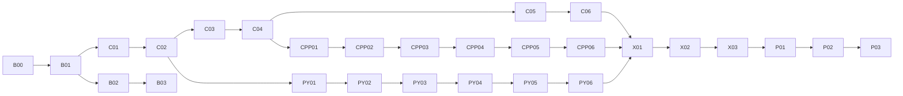

# 6-1 编程基础与独立开发大地图

## 我现在在哪里

| 项目 | 当前记录 |
| --- | --- |
| 学习背景 | C、C++、Python 都学过一轮，保留少量概念；理解深度和独立动手能力不足 |
| 当前目标 | 不以“看完语法”为完成，而是能独立把一个小需求变成可运行、可调试、可测试的程序 |
| 当前据点 | B00 基线任务，未开始 |
| 当前可进入 | B00；不需要先做长篇理论复习 |
| 已有证据 | 尚无本轮独立编程证据，旧印象不自动记为通过 |
| 主线语言分工 | C 建立内存与过程模型；C++ 建立类型、资源管理与标准库能力；Python 建立快速实现、脚本和工程组织能力 |
| 下一步 | 闭卷完成一个 60–90 分钟的小程序，记录卡点后进入 C01 |

本图只负责语言基础、工具和独立开发能力。数据结构、算法思想和算法题训练统一进入 [数据结构与算法学习大地图](../数据结构与算法/数据结构与算法_学习大地图.md)，不在两张图中重复维护。

## 重新整理后的学习需求

1. **恢复不是重看。** 先做最小任务暴露缺口，再针对缺口学习；能独立完成的语法直接通过。
2. **每个概念必须落到程序。** 每个据点至少有一个闭卷小程序、一次调试记录和一个边界测试。
3. **三门语言不追求同样深度。** C 重点是内存、指针和数据表示；C++ 重点是 STL、抽象和资源管理；Python 重点是表达、模块、文件处理、自动化与科学计算入口。
4. **“会编程”用作品判断。** 能拆需求、设计数据、分函数/模块、实现、测试、定位错误、说明取舍，才算达到目标。
5. **数据结构与算法同步迁移。** 同一核心结构先用 Python 解释和快速实现，再选择代表内容用 C/C++ 强化底层理解。

## 深度与状态

| 标记 | 含义 |
| --- | --- |
| 主线 | 达到独立编程目标必须完成 |
| 选学 | 与当前目标有关但不阻断主线 |
| 未开始 / 进行中 / 通过 / 待复习 / 跳过 | 教学状态；“跳过”不等于掌握 |
| 红 / 黄 / 绿 / 未测 | 评估状态；绿表示有独立表现证据 |

据点只有同时满足“可运行作品 + 能解释关键机制 + 独立排错或测试”才记为通过。照抄代码、只看懂答案或仅完成选择题不能作为通过证据。

## 区域总表

| 区域 | 目标 | 主线据点 | 参考学时 | 教学状态 | 评估 |
| --- | --- | --- | --- | --- | --- |
| Stage B 启动与工作流 | 建立可重复的写—跑—测—调流程 | B00–B03 | 6–10 小时 | 未开始 | 未测 |
| Stage C C 语言重建 | 建立类型、内存、指针和模块的可执行模型 | C01–C06 | 30–45 小时 | 未开始 | 未测 |
| Stage CPP C++ 迁移 | 使用 STL、类与 RAII 写可靠程序 | CPP01–CPP06 | 35–55 小时 | 未开始 | 未测 |
| Stage PY Python 重建 | 写脚本、模块、文件程序和小型应用 | PY01–PY06 | 30–45 小时 | 未开始 | 未测 |
| Stage X 跨语言迁移 | 比较实现与适用场景，巩固底层—上层联系 | X01–X03 | 15–25 小时 | 未开始 | 未测 |
| Stage P 独立项目 | 从模糊需求独立交付两个小项目 | P01–P03 | 35–60 小时 | 未开始 | 未测 |

学时是练习预算，不是期限。若每周 8–10 小时，主线通常需要约 4–6 个月；根据基线任务可缩短，不能仅按看书速度压缩。

## 外部前置与使用位置

| 外部前置 | 首次使用 | 处理方式 |
| --- | --- | --- |
| 编辑器、终端和文件路径 | B01 | 课程内补齐，不要求预先熟练 |
| Git 基本操作 | B03 | 只学项目真正使用的 add/commit/diff/log/branch |
| 基础数学 | DSA 的复杂度与算法节点 | 用到时补，不先重学整门数学 |
| 英文文档阅读 | CPP03、PY05 | 先学按示例和 API 查找，不以通读为要求 |

## 依赖图与推荐路线



推荐实际走法：

```text
B00 → B01 → C01 → C02 → C03 → C04 → C05 → C06
                         ↘ PY01–PY03（每周一小次，保持快速实现能力）
C04 → CPP01–CPP03 → 进入数据结构地图 P01/L01
CPP04–CPP06 与 PY04–PY06 → X01–X03 → P01–P03
数据结构与算法地图从 P01 起同步推进，不必等三门语言全部学完。
```

这样安排的理由：C 先补“程序如何在内存中运行”；C++ 紧接着迁移到可用于数据结构和算法题的主力语言；Python 少量并行，随后集中学习脚本与项目能力。三门语言不在同一周学习同一批基础语法，避免相互干扰。

## 据点总表

| ID | 主题 / 材料入口 | 必要前置 | 增强性前置 | 可观察通关条件 | 权重 | 学时 | 状态 | 评估 / 证据 |
| --- | --- | --- | --- | --- | --- | --- | --- | --- |
| B00 | 基线编程任务 | 无 | 无 | 独立写一个命令行通讯录或成绩统计器；保存源码、测试输入和卡点 | 主线 | 1.5–2 小时 | 未开始 | 未测 / 待记录 |
| B01 | 编译、运行与错误信息 | B00 | 无 | 分别运行一个 C、C++、Python 程序；能区分编译错误、运行错误、逻辑错误 | 主线 | 2–3 小时 | 未开始 | 未测 / 待记录 |
| B02 | 调试与最小测试 | B01 | 无 | 用断点/日志定位一个缺陷，并设计正常、边界、异常三类输入 | 主线 | 2–3 小时 | 未开始 | 未测 / 待记录 |
| B03 | Git 与项目目录 | B01 | B02 | 建立小项目，完成有意义的提交并用 diff 解释改动 | 主线 | 1–2 小时 | 未开始 | 未测 / 待记录 |
| C01 | 类型、表达式与控制流；C 教材/Hello 算法 C 版前置章节 | B01 | 无 | 独立写输入校验、分支和循环程序；解释整数除法、溢出风险和作用域 | 主线 | 4–6 小时 | 未开始 | 未测 / 待记录 |
| C02 | 函数、数组与字符串 | C01 | B02 | 用函数拆分一个字符串统计程序；不混淆数组长度与字符串终止符 | 主线 | 5–7 小时 | 未开始 | 未测 / 待记录 |
| C03 | 指针与地址 | C02 | 无 | 画出地址/值关系，写交换、数组遍历和输出参数；解释传值语义 | 主线 | 6–8 小时 | 未开始 | 未测 / 待记录 |
| C04 | struct、enum 与模块化 | C03 | B03 | 用 .h/.c 拆分一个结构体记录管理程序，接口与实现分离 | 主线 | 5–7 小时 | 未开始 | 未测 / 待记录 |
| C05 | 动态内存与生命周期 | C03 | C04 | 正确申请、扩容和释放动态数组；解释所有权、悬空指针与泄漏 | 主线 | 6–9 小时 | 未开始 | 未测 / 待记录 |
| C06 | 文件 I/O 与 C 综合任务 | C04、C05 | B03 | 完成可保存/加载的数据管理 CLI；有错误处理、边界测试和 README | 主线 | 6–8 小时 | 未开始 | 未测 / 待记录 |
| CPP01 | 从 C 到 C++：引用、string、vector、函数重载 | C04 | 无 | 把一个 C 数组程序重写为 C++，说明引用与指针、string 与 char[] 的取舍 | 主线 | 5–7 小时 | 未开始 | 未测 / 待记录 |
| CPP02 | STL 容器与迭代 | CPP01 | 无 | 用 vector/map/set/stack/queue 完成 3 个小任务，并按访问模式选容器 | 主线 | 6–8 小时 | 未开始 | 未测 / 待记录 |
| CPP03 | STL 算法、lambda 与复杂度 | CPP02 | DSA P03 | 用 sort/find/lower_bound/自定义比较器解决小题并说明复杂度 | 主线 | 5–7 小时 | 未开始 | 未测 / 待记录 |
| CPP04 | 类、封装与 const | CPP01 | C06 | 设计一个小类，保持不变式，正确区分值、引用和 const 接口 | 主线 | 6–9 小时 | 未开始 | 未测 / 待记录 |
| CPP05 | RAII、拷贝/移动与智能指针 | CPP04、C05 | 无 | 能判断资源所有权；完成一个无手写 delete 的资源管理示例 | 主线 | 7–10 小时 | 未开始 | 未测 / 待记录 |
| CPP06 | C++ 综合任务与构建 | CPP02、CPP04、CPP05 | B03 | 完成多文件 C++ CLI，小型测试通过，能从编译信息定位问题 | 主线 | 6–9 小时 | 未开始 | 未测 / 待记录 |
| PY01 | Python 表达式、控制流与函数；《像计算机科学家一样思考 Python》 | C02 | 无 | 闭卷写文本统计脚本；解释可变/不可变对象和参数绑定 | 主线 | 4–6 小时 | 未开始 | 未测 / 待记录 |
| PY02 | list/dict/set/tuple 与推导式 | PY01 | 无 | 按需求选容器，写去重、计数、分组任务并分析主要成本 | 主线 | 5–7 小时 | 未开始 | 未测 / 待记录 |
| PY03 | 模块、异常、文件与 pathlib | PY01 | B02 | 把脚本拆成模块，处理文件缺失和坏输入，不用宽泛 except 掩盖错误 | 主线 | 5–7 小时 | 未开始 | 未测 / 待记录 |
| PY04 | 类、迭代器与数据模型 | PY02、PY03 | CPP04 | 写一个小型领域对象；能判断何时函数/字典比类更简单 | 主线 | 5–8 小时 | 未开始 | 未测 / 待记录 |
| PY05 | 测试、类型提示与依赖环境 | PY03 | B03 | 为模块写单元测试和类型标注，使用独立环境复现运行 | 主线 | 5–7 小时 | 未开始 | 未测 / 待记录 |
| PY06 | Python 综合任务 | PY03、PY05 | PY04 | 完成一个批处理/数据清洗 CLI；支持参数、日志、测试和 README | 主线 | 6–10 小时 | 未开始 | 未测 / 待记录 |
| X01 | 同题三语言迁移 | C06、CPP06、PY06 | 无 | 同一需求用三门语言各实现一次，比较数据表示、错误处理和代码复杂度 | 主线 | 5–8 小时 | 未开始 | 未测 / 待记录 |
| X02 | 调试与性能比较 | X01 | DSA P03 | 对三版程序构造测试，定位一处缺陷并做一次基于测量的优化 | 主线 | 4–6 小时 | 未开始 | 未测 / 待记录 |
| X03 | API 文档与陌生库 | X01 | 无 | 只依靠官方文档完成一个未学过的小 API 接入，并记录最小示例 | 主线 | 4–6 小时 | 未开始 | 未测 / 待记录 |
| P01 | 受约束项目 | X01 | DSA Stage 1–3 | 根据给定验收条件完成项目；只在设计检查点接受提示 | 主线 | 10–15 小时 | 未开始 | 未测 / 待记录 |
| P02 | 半开放项目 | P01 | DSA Stage 4–6 | 自己拆任务、设计模块和测试，完成一轮代码复盘 | 主线 | 12–20 小时 | 未开始 | 未测 / 待记录 |
| P03 | 独立毕业项目 | P02 | DSA X02 | 从需求说明到可运行交付全程独立完成，并能演示、解释取舍和修复现场缺陷 | 主线 | 15–25 小时 | 未开始 | 未测 / 待记录 |

跨图前置 `DSA …` 指向数据结构与算法地图中的同名节点，不计为本图缺失节点。

## 原地图据点迁移

为保持旧学习记录可追溯，原 ID 不再承载重复课程内容，按下表映射：

| 原 ID | 新位置 |
| --- | --- |
| 1.1 类型、运算与流程 | C01 |
| 1.2 数组与字符串 | C02 |
| 1.3 指针 | C03、C05 |
| 1.4 函数与结构体 | C02、C04 |
| 1.5 输入输出 | C01、C06 |
| 1.S1 位运算 | 数据结构地图 J70，按需补充 |
| 2.1 C++ 基础差异 | CPP01 |
| 2.2 STL 容器 | CPP02 |
| 2.3 算法库与优先队列 | CPP03；优先队列细节见数据结构地图 R04 |
| 2.S1 lambda/比较器 | CPP03 |
| 原 3.x 数据结构 | 数据结构地图 L01–G04 |
| 原 4.x 基础算法 | 数据结构地图 S01–Q12 |
| 原第五、六章刷题与模考 | 数据结构地图 X01、X02 及本图 P01–P03 |

## 教材与资料分工

教材均来自 `D:/桌面/大三学习/计算机`，只选择与当前据点有关的章节。

| 用途 | 主材料 | 使用方式 |
| --- | --- | --- |
| C 底层与结构实现 | 《Hello 算法（C 语言版）》；Weiss《数据结构与算法分析：C 语言描述》 | 不当作完整 C 入门书通读；配合 C03–C06 和 DSA 代表实现查阅 |
| C++ 主教材 | 《C++ Primer Plus（第 6 版）》 | CPP01–CPP05 按主题选章；每章以改写程序结束 |
| Python 主教材 | 《像计算机科学家一样思考 Python（第 2 版）》 | PY01–PY04 的概念主线，跳过已用任务证明掌握的部分 |
| Python 项目 | 《Python 编程：从入门到实践》 | PY03–PY06 选择一个项目或相关章节实践 |
| Python 查阅 | 《Python 语言及其应用》《Python Cookbook》 | 遇到 API 或惯用法时查阅，不顺序通读 |
| 数据结构与算法 | 《Python 数据结构与算法分析》第 3 版、《Hello 算法》C/Python 版 | 进入数据结构地图后按节点使用 |
| 题目训练 | 《代码随想录》《Algorithmic Thinking》 | 前者做标签练习，后者放到能独立实现基础结构后训练建模 |
| Git | 桌面《Git 教程》 | B03 与项目阶段按需查阅 |

《王道数据结构》主要服务考研知识复盘，不作为本轮“独立编程”主教材；机器学习、深度学习、数据库和计算机网络暂不进入主线，等 P02 后再按实际目标开新地图。

## 每个据点的学习闭环

```text
15 分钟闭卷尝试 → 定位一个真实缺口 → 学最小必要内容 → 小程序实现
→ 主动构造边界测试 → 调试/修正 → 次日闭卷重写关键部分 → 记录证据
```

- 第一次卡住先描述“期望、实际、最小复现”，再看提示。
- 示例代码读完后必须关掉材料重写；不能重写说明尚未掌握。
- 同类基础题通常 2–3 道即可，第三道仍靠提示才追加练习。
- 每周至少保留一段 60–90 分钟“无教程编程”，训练把空白文件变成程序。
- 项目不追求界面华丽，优先保证功能、结构、测试、说明和可复现运行。

## 项目阶梯

| 阶段 | 建议项目 | 主要语言 | 必须体现 |
| --- | --- | --- | --- |
| C06 | 文件型成绩/通讯录管理器 | C | 指针、动态数组、struct、文件、错误处理 |
| CPP06 | 课程选课或任务管理 CLI | C++ | STL、类、const、RAII、多文件 |
| PY06 | 文件批处理、日志分析或学习资料整理工具 | Python | pathlib、异常、模块、参数、测试 |
| P01 | LRU 缓存演示器或表达式计算器 | C++ / Python | 数据结构选择、接口、测试、复杂度 |
| P02 | 任务依赖调度器或路线规划器 | C++ / Python | 图建模、输入校验、算法选择、结果解释 |
| P03 | 自选真实工具 | 自选，必要时混合 | 需求、里程碑、版本控制、测试、文档、演示 |

P03 选题以自己确实会使用为准。候选包括：学习资料索引器、刷题记录分析器、数值实验批处理工具。只有在 P02 后再决定，不提前搭复杂框架。

## 当前补缺安排

| 顺序 | 任务 | 结果如何改变路线 |
| --- | --- | --- |
| 1 | B00：任选熟悉语言做命令行通讯录或成绩统计器 | 若能独立完成，相关基础语法节点做短体检后通过；若卡在拆分/调试，按主线完整推进 |
| 2 | B01：在本机分别编译/运行最小 C、C++、Python 程序 | 若环境已熟练，记录证据后直接进入 C01 |
| 3 | C01：闭卷完成输入、分支、循环综合题 | 决定 C01 是快速恢复还是完整学习 |

这不是对能力的预判。当前只能确定“缺少本轮独立证据”，不能把自评直接写成红灯。

## 通关与复习记录

每次进度变化只更新对应据点的状态、评估和证据链接，并更新文首 `current_waypoint` 与 `next_action`。详细教学过程放到独立学习档案，不复制进地图。

复习默认在学后约 1 天、1 周、1 月进行：闭卷重写关键函数或完成一个变式。恢复失败时只补对应节点，不整章重学。

### 课程总通关条件

- 三门语言各有一个可独立运行、可复现构建的小项目。
- 面对 1–2 小时规模的新需求，能自己拆成数据、函数/类、模块和测试。
- 遇到错误能先构造最小复现并定位，不把“反复试代码”当成主要调试方法。
- 能说明同一需求为什么选择 C、C++ 或 Python，而不是只说“哪门更快/更简单”。
- 独立完成 P03，现场修改一个小需求或修复一个缺陷后仍能通过测试。
