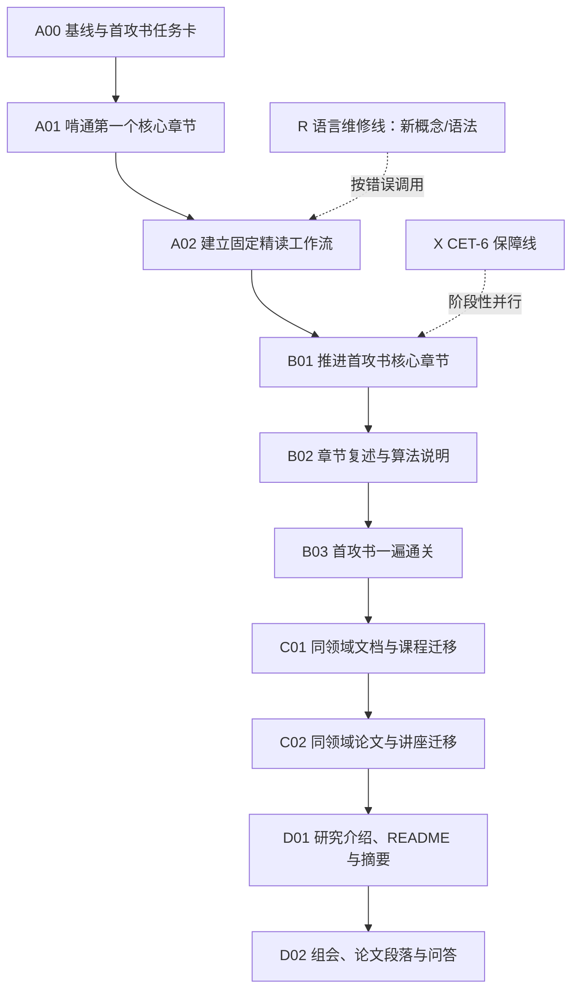

# 英语学习路线大地图

> **路线总原则：先在一个真实领域里变得熟悉，再逐步把熟悉范围向外扩张。**
>
> 当前不再把“学完《新概念英语 2》→学完《新概念英语 3》→以后再读专业材料”作为主线。新的主线是：以一本明显高于当前英语舒适区、但专业上真正需要的英文原版为核心，在反复出现的术语、句式和论证结构中建立第一个领域英语舒适圈；《新概念英语》保留为输出与基础结构的维修工具，而不是进入专业阅读前必须走完的台阶。

本地图吸收《六科学习计划》中“英语材料 = 专业原版”“一箭双雕”的设定，并对 Larry 所说的“高难度材料、单一领域重复、语法先行、回译、精听”做可执行化改造。

本地图只记录路线、据点、训练规则与通关证据。逐句讲解、用户原译、回译、复述、错题和复习日期，继续记录在对应材料的交流文档中。

---

## 1 路线改版：从语言教材阶梯改为“领域主轴 + 三条辅助线”

### 1.1 旧路线的问题

旧路线的核心顺序是：

`新概念 2 → 新概念 3 → CET/校园材料 → 专业教材/论文 → 科研交流`

它适合系统修补通用英语，却有三个风险：

1. **真实目标出现得太晚**：专业原版与论文被放在路线后段，容易长期停留在“为学英语而学英语”。
2. **领域词汇重复不足**：新概念、BBC、TED、维基、论文多路并进，主题频繁切换，词汇难以在同一语境中反复出现。
3. **会读与会用可能继续分离**：按课数推进容易产生“学完了”的感觉，但不能保证能解释专业概念、写摘要或参与讨论。

### 1.2 新路线的四层结构

| 层级 | 角色 | 时间占比 | 核心材料 | 处理原则 |
|---|---:|---:|---|---|
| **领域主轴** | 建立第一个专业英语舒适圈 | **60%–70%** | Sauer《Numerical Analysis》英文原版 | 单一主书、持续推进、允许难但不允许无产出 |
| **听说转化线** | 把书面理解变成可听、可说 | 10%–15% | 与数值分析/科学计算同主题的课程音频、自己的录音 | 同主题复听与复述，不用无关泛听凑时长 |
| **语言维修线** | 修补反复出现的语法与表达问题 | 10%–15% | 《新概念英语 2/3》精选课、语法查漏材料 | 按错误调用，不按全册顺序清场 |
| **考试保障线** | 保住 CET-6 与校内要求 | 15%–20%；考前可临时升至 35%–40% | CET-6 真题 | 真题用于体检与策略训练，不取代能力主线 |

> 百分比是普通周的参考。考试前三周允许提高真题比例，但考后立即恢复领域主轴。

### 1.3 路线的关键判断

- **难度高于当前水平，不等于完全无法处理。** 材料可以难，但专业概念必须与正在学习的课程或研究方向有关，且在工具辅助后能够恢复主干。
- **硬啃不等于逐词翻译。** 真正要啃的是章节结构、概念关系、反复出现的术语和作者的表达方式。
- **第一本书只选一本。** 在建立第一个舒适圈前，不同时精读 Sauer、奥本海姆、伯克利力学和随机论文。
- **输出从第一周开始。** 不等“输入够多”再说写；每次学习至少留下口头复述、中文结构图、英文短释义或回译中的一种。
- **基础问题在真实材料中暴露，再定点维修。** 《新概念》和语法课只修当前卡点，不重新占据主线。

---

## 2 当前能力画像

| 维度 | 当前判断 | 已有证据 | 新路线处理 |
|---|---|---|---|
| 通用阅读 | 明显强于主动输出 | 经历过较难的高考阅读；能较轻松理解《新概念 2》早期叙事 | 不再长期停留在低难度通用读物，直接进入专业原版 |
| 专业阅读 | 有学科知识支架，英语流程尚未稳定 | 已在学习数值分析、信号、力学和科学计算 | 以“专业先验 + 同域重复”降低高难材料的真实负荷 |
| 脱稿表达 | 可沟通但不稳定 | 能重建故事，并主动使用连接词；时态、冠词和搭配仍失稳 | 每节做 30–90 秒解释；每周做一次较完整复述或短写 |
| 基础语法 | 有识别直觉，尚未自动化 | 能识别时态变化，但连续输出中会回落 | 建“语法故障单”，累计出现才调用语法课或《新概念》修复 |
| 词汇 | 被动词汇高于主动词汇 | 能理解较多词，但现场表达易逐词拼接 | 词汇分为“领域术语、学术动作词、可复用词块”，按句学习 |
| 听力 | 可能弱于阅读 | 《六科学习计划》记录为跟不上语速、依赖猜测 | 先听已经读懂的同领域内容，建立声音—概念连接，再做陌生听力 |
| 写作 | 句子级表达有基础，篇章组织不足 | 旧计划记录为简单句堆叠、段落感不足 | 从“概念定义→步骤解释→章节摘要”递增，而非先写空泛议论文 |

当前最大矛盾不是“材料太简单”，而是：**专业高难输入尚未形成稳定工作流，理解也还没有稳定转化为自己的英语。**

---

## 3 第一领域与第一本书

### 3.1 第一领域：计算数学 / 科学计算

选择它的理由：

- 它与《六科学习计划》中的数学、计算机两条 S 级主线同时重合；
- 用户已经在学数值分析，专业知识可以为英语理解提供支架；
- 它的核心词汇会在教材、代码文档、GitHub README、论文和研究交流中持续复现；
- 它能自然产生真实输出：解释算法、比较方法、描述误差、写实验结果。

第一个舒适圈建成前，信号与系统、力学、泛函、AI 仍可正常作为学科学习内容推进，但**不再同时成为英语精读主线**。

### 3.2 首攻书：Sauer《Numerical Analysis》英文原版

| 项目 | 设定 |
|---|---|
| 身份 | 英语领域主轴的第一本书，同时服务数值分析课程与科学计算编程 |
| 阅读范围 | 以正在学习的课程章节为先；逐步覆盖方程求根、线性方程组、插值、最小二乘、数值积分、ODE 与 PDE 入门等核心部分 |
| 第一遍目标 | 读通主叙述、定义、算法说明、例题解释与章节总结；习题量按数学课程安排，不为英语额外刷完 |
| 暂缓内容 | 过长的证明细节、重复性例题、超出当前课程的高级小节可先标记，不因局部过深中断整本推进 |
| 输出成果 | 章节结构卡、领域词块库、口头解释录音、英文算法说明、最终全书路线图 |

### 3.3 “啃完一本”的完成口径

“啃完”不等于每句话都会翻译、每道题都做完，也不等于只把页码翻完。首攻书第一遍同时满足以下条件才算完成：

- 核心章节均完成主线阅读，并能用中文说清章节解决什么问题、方法之间如何连接；
- 每个核心章节至少完成一次闭卷结构重建；
- 能用简单英语解释至少 12 个核心概念或算法，每项 60–120 秒；
- 形成约 250–400 个高复现领域词/词块，但没有把所有生词都塞进词表；
- 能独立读懂一本书中未精读过的相邻小节，抓住主干且不过度依赖翻译；
- 能写一篇 300–500 词的英文总览，说明本书主要问题、方法谱系和自己的理解。

这里区分两种完成：

1. **英语第一遍完成**：上述标准达成，领域舒适圈初步建立。
2. **数学掌握完成**：证明、算法实现和习题达到课程要求；它由数学与计算机计划分别验收。

两者互相促进，但不强行捆成一次完成，避免一本书因“所有内容都必须彻底掌握”而无限拖延。

### 3.4 唯一允许的换书条件

连续两周按本地图使用支架后，仍出现以下情况，才考虑更换首攻书或缩小阅读范围：

- 专业知识本身完全没有学过，中文也无法解释；
- 每页都需要外部解释，始终无法恢复句子主干和段落关系；
- 书与当前课程、研究方向已不再重合。

“生词很多”“读得慢”“第一遍很痛苦”本身不是换书理由。

---

## 4 总路线图

推荐主线：

`A00 → A01 → A02 → B01 → B02 → B03 → C01 → C02 → D01 → D02`

《新概念》与 CET-6 不再是必须先走完的前置区域，而是在整条路线旁边按需并行。

---

## 5 据点明细

### A 区：高难材料登陆

| ID | 据点 | 可观察通关条件 | 状态 |
|---|---|---|---|
| A00 | 首攻书任务卡与基线 | 固定版本和章节范围；连续读 2–3 页，记录速度、查词前理解、句法卡点、已知专业概念；不因第一次困难改材料 | **进行中** |
| A01 | 第一个核心章节 | 画出章节结构；解释 5–8 个核心概念；完成一段回译或英文释义；48 小时后能恢复主线 | 未开始 |
| A02 | 固定工作流自动化 | 连续 4 次学习都能独立完成“预读—拆解—重建—复现”，工具没有替代自己的首次判断 | 未开始 |

### B 区：首攻书纵深推进

| ID | 据点 | 可观察通关条件 | 状态 |
|---|---|---|---|
| B01 | 核心章节推进 | 每周稳定推进，不因局部难句停止；每章留下结构卡与 15–30 个高价值词块 | 未开始 |
| B02 | 章节复述与算法说明 | 每两周选一个方法，用 90 秒英语说明“问题—方法—步骤—误差/限制”；能回答 3 个追问 | 未开始 |
| B03 | 首攻书一遍通关 | 达成第 3.3 节的六项完成标准，提交全书结构图、概念解释集与英文总览 | 未开始 |

### C 区：领域舒适圈扩张

| ID | 据点 | 材料 | 可观察通关条件 | 状态 |
|---|---|---|---|---|
| C01 | 相邻材料迁移 | NumPy/SciPy 文档、英文 GitHub README、另一教材相邻小节 | 不做完整预习也能抓住主干；能把首攻书词汇迁移到代码说明 | 未开始 |
| C02 | 论文与讲座迁移 | 数值分析/科学计算论文摘要、课程讲座 | 读或听后能说明问题、方法、结果和限制；能区分术语与通用学术表达 | 未开始 |
| C03 | 第二领域选择 | 信号与系统、力学或具体研究方向 | 根据未来方向只选一个次领域；复用现有工作流，而不是重新从通用英语开始 | 未开始 |

### D 区：科研表达

| ID | 据点 | 可观察通关条件 | 状态 |
|---|---|---|---|
| D01 | 真实工程输出 | 完成英文 README、算法注释、实验结果说明或 300–500 词技术总结；内容真实且自己能逐句解释 | 未开始 |
| D02 | 科研交流 | 完成 2 分钟研究介绍、图表说明并回答至少 5 个追问；能请求澄清、修正表述、说明限制 | 未开始 |
| D03 | 论文表达 | 独立起草并修改一个真实研究段落；形成个人学术词块库，但不套僵化模板 | 未开始 |

---

## 6 高难专业材料的标准训练循环

每次处理 2–6 页或一个自然小节。难度越高，单位越小；不要为了完成页数牺牲重建。

### 第 1 遍：无工具侦察（5–10 分钟）

1. 看标题、小标题、图表、公式和首尾句，预测本节回答什么问题。
2. 不查词连续读一遍，在边上只标三类符号：
   - `?`：句法或指代不清；
   - `T`：阻碍概念理解的术语；
   - `*`：值得转为主动表达的句子。
3. 用中文写 1–3 句临时概括。允许不完整，但必须先留下自己的判断。

### 第 2 遍：结构拆解（15–30 分钟）

1. 先借助专业知识判断公式、图与文字的关系。
2. 对关键长句找主干、连接词、指代对象和限定范围，不从第一个词开始逐词翻译。
3. 查词只查三类：反复出现、阻碍主线、值得主动使用。
4. 可以让 AI 解释难句，但先提供自己的拆解；AI 的职责是指出结构与误解，不是直接代读整节。

### 第 3 遍：闭卷重建（10–20 分钟）

合上原文，任选两项：

- 画“问题—方法—步骤—结论/限制”结构；
- 用中文完整讲清本节；
- 用简单英语做 30–90 秒口述；
- 写 3–5 句英文摘要；
- 根据中文提示回译一个核心段落；
- 用代码或数学例子验证作者的描述。

### 第 4 遍：延迟复现（次日或三日后，5–10 分钟）

- 不看笔记恢复章节结构；
- 随机解释 3 个术语或 1 个算法；
- 把一个原句改写到自己的课程、代码或研究场景。

如果延迟复现失败，缩小下一次单位或增加结构提示，不自动降到更简单材料。

---

## 7 查词、语法与笔记规则

### 7.1 生词分层

| 类型 | 例子 | 处理 |
|---|---|---|
| 领域术语 | convergence, interpolation, truncation error | 记录英文定义、中文概念、所在句；优先建立概念网络 |
| 学术动作词 | derive, approximate, yield, impose | 记录常见搭配与作者句子；要求迁移造句 |
| 结构词/限定词 | provided that, in contrast, at most | 记录它改变了什么逻辑；用于回译和写作 |
| 一次性低价值词 | 只出现一次且不影响主线 | 当场查完即可，不进复习库 |

词卡优先使用“短语/句子 → 含义与使用场景”，避免把所有词拆成孤立的中英对照。

### 7.2 查词上限

- 首遍禁止查词；
- 精读时每 2–3 页原则上只收 5–12 个高价值项目；
- 同一词在真实材料中再次出现时优先回忆，不立刻重查；
- 如果查词占去一半以上时间，先判断是专业概念不懂、句法不懂，还是在追求每词全懂。

### 7.3 语法故障单

语法不按教科书目录从头重学，而按真实故障记录：

| 故障类型 | 触发维修条件 | 维修材料 | 验收 |
|---|---|---|---|
| 阅读型故障 | 同类长句连续 3 次拆错 | 语法体系课对应小节 + 原书例句 | 能标出主干并解释逻辑 |
| 输出型故障 | 一周输出中同类错误出现 3 次以上 | 《新概念》对应代表课 + 变式 | 在新语境连续正确 3 次 |
| 词块型故障 | 意思对但表达长期靠中文拼装 | 原书高频句 + 回译 | 48 小时后可主动提取 |

重点关注：时态一致、冠词、介词搭配、非谓语、定语从句、名词化、被动结构、条件与限定、指代链。

---

## 8 《新概念英语》的新定位

### 8.1 不再承担的角色

- 不再是专业原版之前必须通关的总前置；
- 不要求从 Lesson 1 线性学完整册；
- 不以逐句讲完、背完整篇数或完成课数作为主进度；
- 不占据英语时间的大多数。

### 8.2 保留的价值

- 《新概念 2》：修复时态、冠词、介词、高频搭配和短篇叙事输出；
- 《新概念 3》：训练复杂句重组、段落压缩、正式与日常语域转换；
- 已开始的 `A private conversation`：保留既有档案，用作主动输出基线，不必因此顺序学完后续课文。

### 8.3 调用方法

每周最多安排一次 30–45 分钟维修课，流程为：

1. 从本周专业阅读或输出中选一个反复故障；
2. 找能集中体现该结构的新概念代表课或语法材料；
3. 做短精读、回译与 3 个新语境变式；
4. 回到 Sauer 的句子或自己的专业表达中再次使用；
5. 连续两周无复发则关闭该故障项。

这样，《新概念》不被废弃，而是从“主线教材”升级为“按需语言实验室”。

---

## 9 听力与口语：只听正在建立的领域

在第一舒适圈尚未形成时，减少 BBC、TED、新闻等随机主题输入。听力优先级如下：

1. **已经读过的教材段落或同主题短讲**：先有概念，再建立声音映射；
2. **数值分析/科学计算课程片段**：每次只取 2–5 分钟精听；
3. **自己的英语解释录音**：回听内容、停顿、语法和发音；
4. **CET-6 真题听力**：考试保障线单独训练；
5. 随机播客与泛听：仅作休闲，不计入核心训练。

同主题精听循环：

`盲听抓结构 → 对照字幕/教材 → 逐句听清 → 跟读 → 脱稿复述 → 隔日再听`

口语第一阶段不追求自然闲聊，优先练会三类动作：定义一个概念、解释一个过程、比较两种方法。

---

## 10 CET-6 保障线

CET-6 与领域英语共用词汇、阅读和写作能力，但题型策略必须单独练。

| 时期 | 占比 | 任务 |
|---|---:|---|
| 普通周 | 15%–20% | 每周一次听力或阅读小套；每两周一篇写译输出；维护真题错因表 |
| 考前 6–4 周 | 25%–30% | 增加限时训练；按听力、阅读、翻译、写作分别诊断 |
| 考前 3 周 | 35%–40% | 每周全套或半套模考 + 精确复盘；领域主线保留最低剂量 |
| 考后 | 10% 以下 | 只维护真正薄弱项，主时间立即回到专业领域 |

错因必须分为：语言理解、词汇、听辨、时间分配、题型策略和粗心。不能把所有错误都归结为“单词不够”。

---

## 11 每周节奏：嵌入六科学习计划

标准周约 5 小时，沿用原计划已有时段，不额外侵占数学与计算机深度块。

| 时段 | 内容 | 时长 |
|---|---|---:|
| 周一午间 | Sauer 无工具预读 + 标记 | 30 分钟 |
| 周三午间 | Sauer 结构拆解与高价值词块 | 30 分钟 |
| 周五午间 | 同主题精听或 CET-6 听力，隔周轮换 | 30 分钟 |
| 周三通识块 | 新概念/语法定点维修；无故障时用于回译 | 30 分钟 |
| 周六语言块 | 专业原版深读 60 分钟 + 闭卷输出 30 分钟 | 90 分钟 |
| 周日输出冲刺 | 本周章节复述或英文学习报告 | 30 分钟 |
| 每日微复习 | 领域词块与 CET 高频词混合复习，平均 10 分钟 | 约 70 分钟/周 |
| 弹性补充 | 到期复测或考前真题 | 20–40 分钟 |

普通周内容占比约为：领域主轴 65%，听说转化 10%，语言维修 10%，考试保障 15%。

### 忙碌周最低剂量

- 两次 25 分钟首攻书推进；
- 一次 15 分钟闭卷重建；
- 三次 5–10 分钟到期复习；
- 若临近 CET-6，再保留一次 25 分钟真题训练。

忙碌周允许缩量，但不把首攻书完全停掉。

---

## 12 复习系统

| 间隔 | 复习动作 | 通过标准 | 未通过处理 |
|---|---|---|---|
| 当天 | 合书写结构或口述 30 秒 | 说出问题与方法主线 | 返回标题、图表和连接词，不立刻重读全文 |
| 第 1 天 | 回忆 3 个词块 + 1 个概念 | 能用自己的句子解释 | 增加一个例子或对比项 |
| 第 3 天 | 60–90 秒章节复述 | 结构完整、关键限定不丢 | 使用关键词提示再做一次 |
| 第 7 天 | 陌生段落迁移或算法短写 | 能认出同域表达并迁移 | 查明是概念、句法还是词块问题 |
| 第 15 天 | 跨章节混合重建 | 能连接前后章节 | 生成一张更高层结构卡 |
| 每月 | 领域舒适圈审计 | 新材料速度、查词量、复述质量至少一项改善 | 调整单位大小与训练比例，不轻易换领域 |

复习库分为四类：领域概念、术语与词块、语法故障、篇章/口头输出。E→C 的识别与 C→E 的主动提取分别记录。

---

## 13 通关证据与量化指标

这些指标用于观察趋势，不要求每次全部统计。

| 指标 | 起点记录 | 改善信号 |
|---|---|---|
| 无工具主干理解 | A00 基线 2–3 页 | 能抓住问题、方法和结论，不被局部生词打断 |
| 有效阅读速度 | 记录每 30 分钟的有效页数 | 在理解与复述不下降时逐月提高 |
| 查词密度 | 每 2–3 页收录多少项目 | 随同领域重复逐步下降 |
| 延迟复述 | 第 3 天能恢复多少结构 | 从关键词依赖转向独立复述 |
| 主动词块 | 能否用于自己的算法/课程 | 不只认得，能在新句中正确使用 |
| 听辨 | 已读主题的音频能抓多少 | 从关键词发展到逻辑与限定 |
| CET-6 | 分项正确率与时间 | 错因可定位，弱项在复测中改善 |

禁止把“记了多少生词”“看了多少视频”“划了多少页”单独当作成果。

---

## 14 里程碑

| 里程碑 | 代表任务 | 通过标准 | 状态 |
|---|---|---|---|
| M0 首攻书起航 | 连续处理 Sauer 2–3 页并做基线 | 留下不查词理解、难点分类与首次复述 | 进行中 |
| M1 第一章啃通 | 完成一个核心章节闭环 | 有结构卡、词块、回译/摘要和 48 小时复述 | 未通过 |
| M2 工作流稳定 | 连续四次完成标准循环 | 能先判断后用工具；每次都有闭卷输出 | 未通过 |
| M3 半程舒适圈 | 读相邻小节或文档 | 大量核心词已熟悉，查词明显减少，能解释多个算法 | 未通过 |
| M4 首攻书通关 | 完成第 3.3 节规定成果 | 能重建全书核心结构并写英文总览 | 未通过 |
| M5 同领域迁移 | 读文档、摘要并听课程 | 能说明问题、方法、结果、限制 | 未通过 |
| M6 科研输出 | README、研究介绍与问答 | 内容真实、结构清楚、能回答追问 | 未通过 |

---

## 15 A00–A01：未来四周的启动计划

### 第 0 次：建立基线，不求好看

1. 固定 Sauer 的版本与当前课程对应章节。
2. 随机选连续 2–3 页正文；第一次完全不查词，计时阅读。
3. 写下：段落主题、理解比例、3 个最难句、阻碍主线的词、专业概念是否已知。
4. 合书用中文讲 1 分钟，再尝试用英语讲 30 秒。
5. 保存原始结果，作为一个月后的对照；不要先让 AI 改写得很漂亮。

### 第 1 周：啃通一个小节

- 只处理一个自然小节；
- 完成三遍循环；
- 收录不超过 12 个高价值词/词块；
- 输出一张“问题—方法—步骤—限制”结构卡；
- 做一次 30–60 秒英文解释。

### 第 2 周：连接两个相邻小节

- 继续相邻内容，不换主题；
- 找出前后概念的依赖关系；
- 选一个核心段落做回译；
- 从本周暴露的错误中选择一个语法故障定点维修。

### 第 3 周：加入声音与算法输出

- 找 2–5 分钟同主题课程讲解，完成一次精听循环；
- 用英语说明一个算法的输入、步骤、输出和误差来源；
- 回听自己的录音，只改最影响理解的 2–3 个问题。

### 第 4 周：首次月度审计

- 读一段同书中未精读过的相邻材料；
- 与 A00 比较主干理解、查词密度、阅读速度和复述完整度；
- 写 150–250 词英文月总结；
- 决定下月是保持单位、适度加页，还是缩小单位加强重建；**不因仍然读得慢而换书。**

---

## 16 工具与 AI 的使用边界

允许使用词典、语法资料、AI 和翻译工具，但顺序必须保护自己的理解能力。

### 推荐提示方式

- “这是我对本段主干的拆解，请指出我在哪个从句、指代或逻辑关系上判断错了。”
- “不要直接翻译全文。先问我三个问题，检查我是否理解作者的问题、方法和限制。”
- “请根据这段材料生成中文结构提示，我将闭卷回译；随后只标出影响准确性和自然度的问题。”
- “请围绕这个算法追问我 5 个由浅入深的问题，并等待我逐题回答。”
- “从我的本周输出中找反复出现的语法故障，只选择最值得修的一个。”

### 禁止替代

- 未读原文就让 AI 总结；
- 直接复制翻译作为“精读笔记”；
- 让 AI 生成英文总结后背诵，却不能解释其中句子；
- 一遇到长句就立刻查整句翻译；
- 用不断收藏新材料代替推进首攻书。

---

## 17 当前错误池与第一轮维修候选

这些来自既有输出，只作为初始候选；新的专业输出会决定实际优先级。

| 错误模式 | 已观察证据 | 维修动作 |
|---|---|---|
| 过去叙事时态不一致 | 过去故事中重复使用 `can not` | 用《新概念 2》叙事段落做现在—过去—过去反事实变式 |
| 冠词不稳定 | `in library`、`a empty seat`、`beside window` | 在定义、首次提及和特指三种专业句中做变式 |
| 比较级与自然搭配 | `more early`、`there was rain` | 结合算法比较练 `faster/more stable/more accurate than` |
| 拼写不稳定 | `behide`、`loudyly`、`grammer`、`konw` | 不孤立抄词；放回完整句后延迟提取 |
| 过去反事实未形成 | `If I went... I could...` 表达昨天未发生情况 | 事实时间线 → `If I had...` → `I might have...` 三步变式 |

若某项没有在当前专业表达中反复出现，就不抢占主线时间。

---

## 18 当前进度与恢复入口

| 项目 | 当前记录 |
|---|---|
| 路线状态 | 已从“新概念线性主线”改为“专业原版领域主轴” |
| 第一领域 | 计算数学 / 科学计算 |
| 首攻书 | Sauer《Numerical Analysis》英文原版 |
| 当前据点 | A00 基线与首攻书任务卡 |
| 新概念状态 | `A private conversation` 档案保留；改为输出基线与按需维修材料 |
| 下一动作 | 用 Sauer 连续 2–3 页完成无工具基线阅读，随后做中文 1 分钟 + 英语 30 秒复述 |
| 下一验收 | 保存阅读时间、主干理解、查词前判断、难句分类与原始复述 |

通关记录按以下格式追加：

`日期｜据点 ID｜材料位置｜教学状态｜独立程度｜输出证据｜主要故障｜下一动作`

路线只在以下三类证据出现时调整：目标改变、可用时间长期改变、连续两周按支架训练仍无法进入材料。一次读得慢、一次复述失败或一次考试波动，不触发换线。

---

## 19 一句话执行口令

> **先读自己的难材料，先做自己的判断；用工具拆开它，合上书重建它；在同一领域反复遇见，直到陌生词变成熟悉概念，熟悉概念变成自己的英语。**
